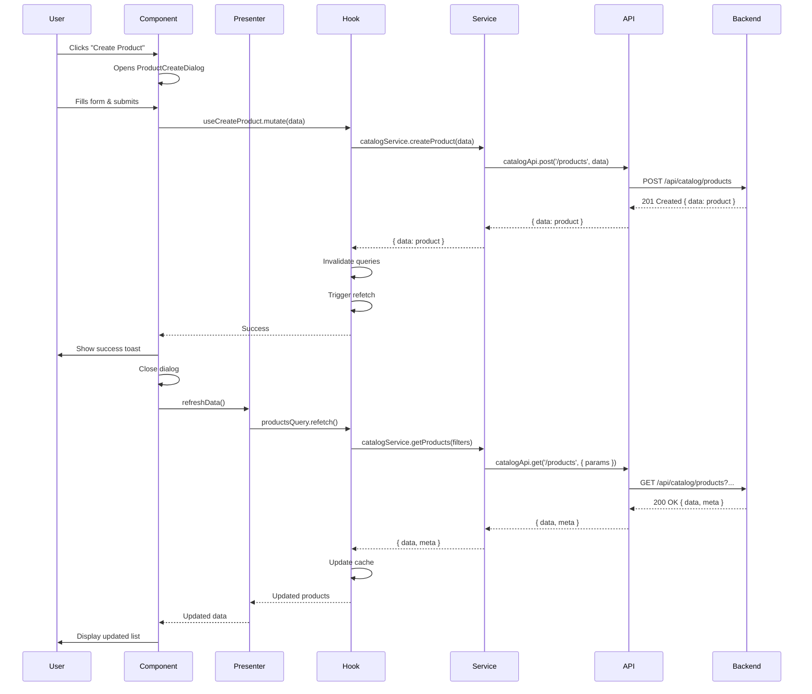
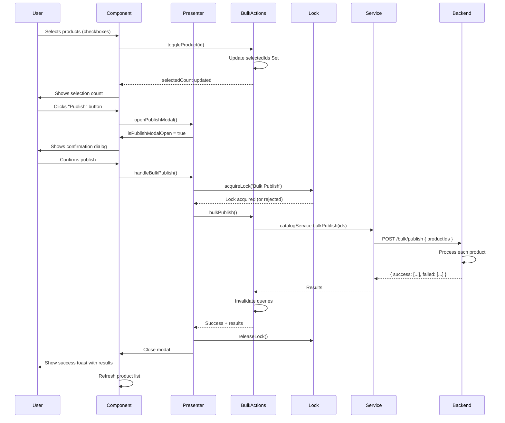

# Admin Portal Catalog - Architecture Documentation

**Comprehensive technical architecture for the Admin Portal Catalog system**

**Version 1.0** | **Last Updated: 2025-10-19**

---

## Table of Contents

1. [Overview](#overview)
2. [Technology Stack](#technology-stack)
3. [Architecture Patterns](#architecture-patterns)
4. [Component Hierarchy](#component-hierarchy)
5. [Data Flow](#data-flow)
6. [State Management](#state-management)
7. [File Structure](#file-structure)
8. [Type System](#type-system)
9. [API Integration](#api-integration)
10. [Performance Optimizations](#performance-optimizations)
11. [Security Considerations](#security-considerations)

---

## Overview

### System Purpose

The Admin Portal Catalog is a comprehensive product management system built for Patina platform administrators to create, edit, organize, and publish products. It follows modern React patterns with a clean separation of concerns.

### Key Features

- **Product CRUD**: Create, read, update, delete products
- **Bulk Operations**: Publish, unpublish, delete multiple products
- **Advanced Filtering**: Multi-criteria filtering with saved presets
- **View Modes**: Grid, list, and table displays
- **Real-time Validation**: Client and server-side validation
- **Responsive Design**: Mobile, tablet, and desktop support
- **Keyboard Shortcuts**: Power user productivity features

### Design Principles

1. **Separation of Concerns**: Clear boundaries between data, business logic, and presentation
2. **Type Safety**: Comprehensive TypeScript types throughout
3. **Performance First**: Optimizations at every layer
4. **Accessibility**: WCAG 2.1 AA compliance
5. **Testability**: Unit, integration, and E2E test support
6. **Maintainability**: Clear patterns and documentation

---

## Technology Stack

### Core Technologies

```typescript
{
  "framework": "Next.js 15 (App Router)",
  "runtime": "React 19",
  "language": "TypeScript 5.5",
  "styling": "Tailwind CSS 3.x",
  "components": "Radix UI",
  "forms": "React Hook Form + Zod",
  "data-fetching": "TanStack Query v5",
  "state": "React hooks + localStorage",
  "notifications": "Sonner",
  "icons": "Lucide React"
}
```

### Development Tools

```typescript
{
  "testing": {
    "unit": "Jest + React Testing Library",
    "e2e": "Playwright",
    "visual": "Playwright with snapshots"
  },
  "linting": "ESLint + Prettier",
  "type-checking": "TypeScript strict mode",
  "bundler": "Next.js built-in (Turbopack)"
}
```

---

## Architecture Patterns

### Presenter Pattern

The catalog uses the **Presenter Pattern** to separate business logic from UI components.

```
┌─────────────────────────────────────────┐
│           Catalog Page                  │
│  (apps/admin-portal/src/app/.../page)   │
└──────────────┬──────────────────────────┘
               │
               │ uses
               ▼
┌─────────────────────────────────────────┐
│      useAdminCatalogPresenter           │
│   (Orchestration & Business Logic)      │
│                                          │
│  ┌────────────────────────────────────┐ │
│  │  - Search State                    │ │
│  │  - Filter State                    │ │
│  │  - Pagination State                │ │
│  │  - View Mode State                 │ │
│  │  - Modal State                     │ │
│  └────────────────────────────────────┘ │
│                                          │
│  ┌────────────────────────────────────┐ │
│  │  Data Hooks:                       │ │
│  │  - useAdminProducts                │ │
│  │  - useProductBulkActions           │ │
│  │  - useCatalogStats                 │ │
│  │  - useBulkOperationLock            │ │
│  └────────────────────────────────────┘ │
│                                          │
│  ┌────────────────────────────────────┐ │
│  │  Computed Properties & Actions     │ │
│  └────────────────────────────────────┘ │
└──────────────┬──────────────────────────┘
               │
               │ provides presenter
               ▼
┌─────────────────────────────────────────┐
│         UI Components                   │
│  - AdminCatalogSearchBar                │
│  - AdminCatalogFilters                  │
│  - AdminCatalogResults                  │
│  - BulkActionToolbar                    │
│  - BulkActionDialogs                    │
└─────────────────────────────────────────┘
```

**Benefits:**
- **Testable**: Business logic isolated from UI
- **Reusable**: Presenter can be used across different views
- **Maintainable**: Clear separation makes changes easier
- **Type-safe**: Strong typing throughout the chain

### Service Layer Pattern

API calls are abstracted through a service layer:

```
Component → Hook → Service → API Client → Backend
```

**Example:**
```typescript
// Component
const { mutate } = useCreateProduct();
mutate(productData);

// Hook (use-admin-products.ts)
export function useCreateProduct() {
  return useMutation({
    mutationFn: (data) => catalogService.createProduct(data)
  });
}

// Service (services/catalog.ts)
export const catalogService = {
  async createProduct(data: Partial<Product>) {
    return catalogApi.createProduct(data);
  }
};

// API Client (lib/api-client.ts)
export const catalogApi = createApiClient({
  baseURL: '/api/catalog'
});
```

### Optimistic Updates

For better UX, mutations use optimistic updates:

```typescript
useMutation({
  mutationFn: updateProduct,
  onMutate: async (newData) => {
    // Cancel outgoing refetches
    await queryClient.cancelQueries(['products']);

    // Snapshot current value
    const previous = queryClient.getQueryData(['products']);

    // Optimistically update cache
    queryClient.setQueryData(['products'], (old) =>
      updateProductInCache(old, newData)
    );

    return { previous };
  },
  onError: (err, variables, context) => {
    // Rollback on error
    queryClient.setQueryData(['products'], context.previous);
  },
  onSettled: () => {
    // Refetch after success or error
    queryClient.invalidateQueries(['products']);
  }
});
```

---

## Component Hierarchy

### Page-Level Structure

```
CatalogPage (Client Component)
│
├── Page Header
│   ├── Title & Description
│   └── Create Product Button
│
├── BulkActionToolbar (conditional on selection)
│   ├── Selection Count
│   ├── Publish Button
│   ├── Unpublish Button
│   ├── Delete Button
│   └── Clear Selection Button
│
├── AdminCatalogSearchBar
│   ├── Search Input (debounced)
│   ├── Filter Button
│   └── View Mode Toggle (Grid/List/Table)
│
├── AdminCatalogResults
│   ├── Loading State
│   ├── Error State
│   ├── Empty State
│   ├── No Results State
│   └── Product Display
│       ├── AdminProductGrid (grid mode)
│       ├── AdminProductList (list mode)
│       └── AdminProductTable (table mode)
│
├── AdminCatalogFilters (Drawer)
│   ├── Status Filter
│   ├── Category Filter
│   ├── Brand Filter
│   ├── Price Range Filter
│   ├── Features Filter
│   ├── Date Filters
│   └── Apply/Clear Buttons
│
├── BulkActionDialogs
│   ├── PublishConfirmDialog
│   ├── UnpublishConfirmDialog
│   └── DeleteConfirmDialog
│
└── ProductCreateDialog
    └── ProductForm
        ├── Basic Information Section
        ├── Pricing Section
        ├── Categorization Section
        └── Attributes Section (MultiInput)
```

### Atomic Component Design

Components follow atomic design principles:

**Atoms** (Smallest building blocks)
- `Button`, `Input`, `Label`, `Badge`, `Checkbox`

**Molecules** (Simple combinations)
- `MultiInput`, `SearchBar`, `FilterChip`

**Organisms** (Complex combinations)
- `ProductCard`, `ProductCreateDialog`, `BulkActionToolbar`

**Templates** (Page layouts)
- `CatalogPage`, `ProductEditPage`

---

## Data Flow

### Complete Request Flow



### Search Flow with Debouncing

```typescript
// User types in search box
User Input → setSearchQuery('modern sofa')
             ↓
// Component state updates
searchQuery = 'modern sofa'
             ↓
// useEffect with 300ms debounce
setTimeout(300ms)
             ↓
// After debounce, update debounced query
debouncedSearchQuery = 'modern sofa'
             ↓
// Filters recompute (useMemo)
filters = { q: 'modern sofa', page: 1, ... }
             ↓
// TanStack Query reacts to filter change
useAdminProducts(filters) detects new queryKey
             ↓
// Service called
catalogService.getProducts(filters)
             ↓
// API request
GET /api/catalog/products?q=modern+sofa&page=1
             ↓
// Results returned and cached
products = [...]
             ↓
// UI updates
Display filtered products
```

### Filter Application Flow

```typescript
// User selects status filter
handleStatusChange('published')
  ↓
setSelectedStatus('published')
  ↓
setCurrentPage(1) // Reset pagination
  ↓
filters = useMemo(() => ({
  ...existingFilters,
  status: 'published',
  page: 1
}))
  ↓
useAdminProducts(filters) // New queryKey
  ↓
catalogService.getProducts(filters)
  ↓
Backend returns filtered results
  ↓
UI updates with filtered products
```

### Bulk Operation Flow



---

## State Management

### State Distribution

The application uses a **distributed state management** approach:

```typescript
// Server State (TanStack Query)
useAdminProducts()      // Product list data
useProduct(id)          // Single product data
useCatalogStats()       // Statistics

// Local UI State (React State + Presenter)
searchQuery            // Search input
selectedStatus         // Filter selections
currentPage            // Pagination
viewMode               // Grid/List/Table
selectedIds            // Bulk selection

// Persistent State (localStorage)
viewMode               // User preference
pageSize               // User preference
sortBy                 // User preference
sortOrder              // User preference

// Global State (None - intentionally avoided)
// No Redux, Zustand, or similar for this feature
// Presenter pattern provides sufficient state coordination
```

### TanStack Query Configuration

```typescript
// Query configuration
const productsQuery = useQuery({
  queryKey: ['admin-products', filters],
  queryFn: () => catalogService.getProducts(filters),
  staleTime: 5 * 60 * 1000,     // 5 minutes
  cacheTime: 10 * 60 * 1000,    // 10 minutes
  refetchOnWindowFocus: true,    // Refresh on tab focus
  refetchOnReconnect: true,      // Refresh on reconnect
  retry: 2,                      // Retry failed requests
  retryDelay: (attemptIndex) => Math.min(1000 * 2 ** attemptIndex, 30000)
});

// Mutation configuration
const createMutation = useMutation({
  mutationFn: catalogService.createProduct,
  onSuccess: () => {
    queryClient.invalidateQueries(['admin-products']);
    toast.success('Product created');
  },
  onError: (error) => {
    toast.error('Failed to create product');
  }
});
```

### Query Key Strategy

```typescript
// Query key factory pattern
const adminProductsKeys = {
  all: ['admin-products'] as const,
  lists: () => [...adminProductsKeys.all, 'list'] as const,
  list: (filters?: AdminProductFilters) =>
    [...adminProductsKeys.lists(), filters] as const,
  details: () => [...adminProductsKeys.all, 'detail'] as const,
  detail: (id: string) =>
    [...adminProductsKeys.details(), id] as const,
};

// Usage
useQuery({ queryKey: adminProductsKeys.list(filters) })
useQuery({ queryKey: adminProductsKeys.detail(productId) })

// Invalidation
queryClient.invalidateQueries(adminProductsKeys.lists())
queryClient.invalidateQueries(adminProductsKeys.detail(productId))
```

### Presenter State Coordination

The presenter hook coordinates multiple state sources:

```typescript
export function useAdminCatalogPresenter() {
  // Local state
  const [searchQuery, setSearchQuery] = useState('');
  const [selectedStatus, setSelectedStatus] = useState(null);
  // ... more local state

  // Data hooks
  const productsQuery = useAdminProducts(filters);
  const bulkActions = useProductBulkActions();
  const stats = useCatalogStats();
  const lock = useBulkOperationLock();

  // Computed values
  const products = productsQuery.products || [];
  const selectedCount = bulkActions.selectedCount;
  const isEmpty = products.length === 0;

  // Actions
  const handleSearchChange = useCallback((query) => {
    setSearchQuery(query);
    setCurrentPage(1);
  }, []);

  // Return unified interface
  return {
    // State
    searchQuery,
    products,
    selectedCount,
    isEmpty,
    // Actions
    handleSearchChange,
    handleBulkPublish,
    // ... more
  };
}
```

---

## File Structure

### Directory Organization

```
apps/admin-portal/
└── src/
    ├── app/
    │   └── (dashboard)/
    │       └── catalog/
    │           ├── page.tsx                    # Main catalog page
    │           ├── layout.tsx                  # Catalog layout
    │           └── [productId]/                # Product editor (future)
    │
    ├── components/
    │   ├── catalog/                            # Catalog-specific components
    │   │   ├── admin-catalog-search-bar.tsx
    │   │   ├── admin-catalog-filters.tsx
    │   │   ├── admin-catalog-results.tsx
    │   │   ├── admin-product-card.tsx
    │   │   ├── admin-product-list.tsx
    │   │   ├── admin-product-table.tsx
    │   │   ├── bulk-action-toolbar.tsx
    │   │   ├── bulk-action-dialogs.tsx
    │   │   ├── product-create-dialog.tsx
    │   │   └── index.ts                       # Barrel export
    │   │
    │   └── ui/                                 # Reusable UI components
    │       ├── button.tsx
    │       ├── input.tsx
    │       ├── dialog.tsx
    │       ├── drawer.tsx
    │       └── ...
    │
    ├── features/
    │   └── catalog/
    │       └── hooks/
    │           ├── useAdminCatalogPresenter.ts # Main presenter
    │           ├── useCatalogUrlSync.ts        # URL synchronization
    │           ├── useKeyboardShortcuts.ts     # Keyboard handlers
    │           └── __tests__/                   # Hook tests
    │
    ├── hooks/                                  # Shared hooks
    │   ├── use-admin-products.ts               # Product data hook
    │   ├── use-product-bulk-actions.ts         # Bulk operations hook
    │   ├── use-catalog-stats.ts                # Statistics hook
    │   ├── useBulkOperationLock.ts            # Concurrency control
    │   └── index.ts
    │
    ├── services/                               # API service layer
    │   ├── catalog.ts                          # Catalog service
    │   └── catalog/                            # Service modules (future)
    │
    ├── types/                                  # TypeScript types
    │   ├── index.ts                            # Re-exports from @patina/types
    │   ├── admin-catalog.ts                    # Admin-specific types
    │   ├── catalog-service.ts                  # Service types
    │   ├── catalog-hooks.ts                    # Hook types
    │   └── catalog-utils.ts                    # Utility types
    │
    ├── lib/                                    # Utilities
    │   ├── api-client.ts                       # API client wrapper
    │   ├── utils.ts                            # General utilities
    │   ├── validation/                         # Zod schemas
    │   │   └── bulk-operations.ts
    │   └── security/                           # Security utilities
    │       └── rate-limiter.ts
    │
    └── __tests__/                              # Component tests
        └── catalog/
```

### Naming Conventions

**Components:**
- PascalCase: `AdminProductCard.tsx`
- Prefix admin-specific: `admin-catalog-filters.tsx`
- Co-locate styles: N/A (using Tailwind)

**Hooks:**
- camelCase with 'use' prefix: `useAdminProducts.ts`
- Descriptive names: `useProductBulkActions.ts`

**Types:**
- PascalCase interfaces: `AdminProductFilters`
- Descriptive names: `BulkActionResult`
- Co-locate with usage when specific

**Services:**
- kebab-case files: `catalog.ts`
- camelCase exports: `catalogService`

---

## Type System

### Type Hierarchy

```typescript
// Base types from @patina/types
import type {
  Product,           // Core product type
  Variant,           // Product variant
  Category,          // Category type
  UUID,              // UUID type
  Timestamps,        // Common timestamps
  PaginatedResponse  // Pagination wrapper
} from '@patina/types';

// Admin-specific extensions
import type {
  AdminProduct,           // Product + admin metadata
  AdminProductFilters,    // Filter criteria
  BulkActionResult,       // Bulk operation results
  CatalogStats,          // Statistics
  ProductValidationIssue // Validation issues
} from '@/types/admin-catalog';

// Hook return types
import type {
  UseProductsResult,       // useAdminProducts return
  UseCreateProductResult,  // useCreateProduct return
  AdminCatalogPresenter    // Presenter interface
} from '@/types/catalog-hooks';

// Service types
import type {
  CatalogServiceResponse,  // API response wrapper
  CreateProductRequest,    // Product creation payload
  UpdateProductRequest     // Product update payload
} from '@/types/catalog-service';
```

### Key Type Definitions

**AdminProductFilters:**
```typescript
export interface AdminProductFilters extends Omit<SearchQuery, 'sort'> {
  // Search
  q?: string;

  // Status filters
  status?: ProductStatus | ProductStatus[];
  isPublished?: boolean;

  // Validation filters
  hasValidationIssues?: boolean;
  validationSeverity?: 'error' | 'warning' | 'info';

  // Feature flags
  hasVariants?: boolean;
  has3D?: boolean;
  arSupported?: boolean;

  // Date ranges
  createdAfter?: Date;
  createdBefore?: Date;

  // Catalog metadata
  categoryId?: string | string[];
  brand?: string | string[];
  tags?: string[];

  // Pricing
  priceMin?: number;
  priceMax?: number;

  // Sorting & pagination
  sortBy?: 'name' | 'price' | 'createdAt' | 'updatedAt';
  sortOrder?: 'asc' | 'desc';
  page?: number;
  pageSize?: number;
}
```

**BulkActionResult:**
```typescript
export interface BulkActionResult {
  success: BulkActionItemResult[];  // Successful items
  failed: BulkActionItemResult[];   // Failed items
  skipped: BulkActionItemResult[]; // Skipped items
  total: number;                    // Total attempted
  duration?: number;                // Execution time (ms)
  metadata?: {
    action: BulkActionType;
    timestamp: Date;
    affectedFields?: string[];
  };
}

export interface BulkActionItemResult {
  id: string;
  success: boolean;
  error?: string;
  errorCode?: string;
  warnings?: string[];
}
```

**AdminCatalogPresenter:**
```typescript
export interface AdminCatalogPresenter {
  // State
  searchQuery: string;
  viewMode: 'grid' | 'list' | 'table';
  products: ProductListItem[];
  selectedCount: number;
  // ... more state

  // Actions
  handleSearchChange: (query: string) => void;
  handleBulkPublish: () => Promise<any>;
  // ... more actions
}
```

### Type Guards

```typescript
// Type guard for product status
export function isProductStatus(value: any): value is ProductStatus {
  return ['draft', 'in_review', 'published', 'archived'].includes(value);
}

// Type guard for validation issue
export function hasValidationIssues(
  product: Product | AdminProduct
): product is AdminProduct {
  return 'validation' in product &&
         product.validation !== undefined;
}

// Type guard for bulk action result
export function isBulkActionSuccess(
  result: BulkActionResult
): boolean {
  return result.failed.length === 0;
}
```

---

## API Integration

### API Client Architecture

```typescript
// Base API client (lib/api-client.ts)
export function createApiClient(config: ApiClientConfig) {
  const client = axios.create({
    baseURL: config.baseURL,
    timeout: 30000,
    headers: {
      'Content-Type': 'application/json'
    }
  });

  // Request interceptor: Add auth token
  client.interceptors.request.use((config) => {
    const token = getAuthToken();
    if (token) {
      config.headers.Authorization = `Bearer ${token}`;
    }
    return config;
  });

  // Response interceptor: Error handling
  client.interceptors.response.use(
    (response) => response.data,
    (error) => {
      if (error.response?.status === 401) {
        // Handle unauthorized
        redirectToLogin();
      }
      throw transformError(error);
    }
  );

  return client;
}

// Catalog API client
export const catalogApi = createApiClient({
  baseURL: process.env.NEXT_PUBLIC_CATALOG_SERVICE_URL
});
```

### Service Methods

```typescript
// services/catalog.ts
export const catalogService = {
  // Products
  async getProducts(params?: AdminProductFilters): Promise<ApiResponse<PaginatedResponse<Product>>> {
    return catalogApi.get('/products', { params });
  },

  async getProduct(id: string): Promise<ApiResponse<Product>> {
    return catalogApi.get(`/products/${id}`);
  },

  async createProduct(data: Partial<Product>): Promise<ApiResponse<Product>> {
    return catalogApi.post('/products', data);
  },

  async updateProduct(id: string, data: Partial<Product>): Promise<ApiResponse<Product>> {
    return catalogApi.patch(`/products/${id}`, data);
  },

  async deleteProduct(id: string): Promise<ApiResponse<void>> {
    return catalogApi.delete(`/products/${id}`);
  },

  // Publishing
  async publishProduct(id: string): Promise<ApiResponse<void>> {
    return catalogApi.post(`/products/${id}/publish`);
  },

  async unpublishProduct(id: string): Promise<ApiResponse<void>> {
    return catalogApi.post(`/products/${id}/unpublish`);
  },

  // Bulk operations
  async bulkPublish(productIds: string[]): Promise<ApiResponse<BulkActionResult>> {
    return catalogApi.post('/bulk/publish', { productIds });
  },

  async bulkUnpublish(productIds: string[], reason?: string): Promise<ApiResponse<BulkActionResult>> {
    return catalogApi.post('/bulk/unpublish', { productIds, reason });
  },

  async bulkDelete(productIds: string[]): Promise<ApiResponse<BulkActionResult>> {
    return catalogApi.post('/bulk/delete', { productIds });
  },

  // Categories
  async getCategories(): Promise<ApiResponse<Category[]>> {
    return catalogApi.get('/categories');
  },

  // Statistics
  async getProductStats(filters?: any): Promise<ApiResponse<CatalogStats>> {
    return catalogApi.get('/stats', { params: filters });
  }
};
```

### Error Handling

```typescript
// Error transformation
function transformError(error: AxiosError): ApiError {
  const response = error.response;

  return {
    message: response?.data?.message || error.message,
    code: response?.data?.code || 'UNKNOWN_ERROR',
    statusCode: response?.status || 500,
    details: response?.data?.details,
    timestamp: new Date().toISOString()
  };
}

// Error display in components
const { mutate, error } = useCreateProduct();

if (error) {
  toast.error('Failed to create product', {
    description: error.message
  });
}
```

---

## Performance Optimizations

### 1. React Optimizations

**useMemo for expensive computations:**
```typescript
const filters = useMemo<AdminProductFilters>(() => {
  return {
    page: currentPage,
    pageSize,
    sortBy,
    sortOrder,
    q: debouncedSearchQuery,
    status: selectedStatus,
    // ... more filters
  };
}, [currentPage, pageSize, sortBy, sortOrder, debouncedSearchQuery, selectedStatus]);
```

**useCallback for stable function references:**
```typescript
const handleSearchChange = useCallback((query: string) => {
  setSearchQuery(query);
  setCurrentPage(1);
}, []);
```

**React.memo for expensive components:**
```typescript
export const AdminProductCard = React.memo(function AdminProductCard(props) {
  // Component implementation
}, (prevProps, nextProps) => {
  // Custom comparison
  return prevProps.product.id === nextProps.product.id &&
         prevProps.product.updatedAt === nextProps.product.updatedAt;
});
```

### 2. Search Debouncing

```typescript
const [searchQuery, setSearchQuery] = useState('');
const [debouncedSearchQuery, setDebouncedSearchQuery] = useState('');

useEffect(() => {
  const timer = setTimeout(() => {
    setDebouncedSearchQuery(searchQuery);
  }, 300);

  return () => clearTimeout(timer);
}, [searchQuery]);

// Only the debounced query triggers API calls
const filters = useMemo(() => ({
  q: debouncedSearchQuery
}), [debouncedSearchQuery]);
```

### 3. TanStack Query Caching

```typescript
// Stale-while-revalidate pattern
useQuery({
  queryKey: ['products', filters],
  queryFn: () => fetchProducts(filters),
  staleTime: 5 * 60 * 1000,      // 5 min: data fresh
  cacheTime: 10 * 60 * 1000,     // 10 min: keep in cache
  refetchOnWindowFocus: true,     // Refresh on tab switch
  refetchOnReconnect: true        // Refresh on reconnect
});
```

### 4. Image Optimization

```typescript
// Next.js Image component with optimization
import Image from 'next/image';

<Image
  src={product.coverImage}
  alt={product.name}
  width={400}
  height={400}
  loading="lazy"
  placeholder="blur"
  blurDataURL={product.blurHash}
/>
```

### 5. Virtual Scrolling (Future)

For very large lists (1000+ products):
```typescript
import { useVirtualizer } from '@tanstack/react-virtual';

const virtualizer = useVirtualizer({
  count: products.length,
  getScrollElement: () => parentRef.current,
  estimateSize: () => 350, // Product card height
  overscan: 5
});
```

### 6. Code Splitting

```typescript
// Dynamic imports for heavy components
const ProductEditor = dynamic(
  () => import('@/components/catalog/product-editor'),
  { loading: () => <LoadingSkeleton /> }
);
```

### 7. Request Batching

```typescript
// Batch multiple requests
const results = await Promise.all([
  catalogService.getProducts(filters),
  catalogService.getCategories(),
  catalogService.getProductStats()
]);
```

---

## Security Considerations

### 1. Input Validation

**Client-side with Zod:**
```typescript
const createProductSchema = z.object({
  name: z.string().min(3).max(255),
  price: z.number().positive().max(1000000),
  // ... more fields
});

// In form
const { register, handleSubmit } = useForm({
  resolver: zodResolver(createProductSchema)
});
```

**Server-side validation** (backend enforces same rules)

### 2. Rate Limiting

```typescript
// lib/security/rate-limiter.ts
export const rateLimiter = {
  canProceed(key: string, limit: RateLimit): boolean {
    const now = Date.now();
    const windowStart = now - limit.windowMs;

    // Get recent requests
    const requests = this.getRequests(key, windowStart);

    return requests.length < limit.maxRequests;
  }
};

// In service
if (!rateLimiter.canProceed('bulk-publish', RATE_LIMITS.bulkOperations)) {
  throw new Error('Rate limit exceeded');
}
```

### 3. XSS Prevention

**Automatic escaping** in React (JSX)
**Sanitization** for rich text (DOMPurify)

```typescript
import DOMPurify from 'isomorphic-dompurify';

const sanitizedHTML = DOMPurify.sanitize(userInput);
```

### 4. CSRF Protection

**Automatic in Next.js** for API routes
**Token validation** for mutations

### 5. Authentication & Authorization

```typescript
// API client adds auth token
client.interceptors.request.use((config) => {
  const token = await getSession()?.accessToken;
  if (token) {
    config.headers.Authorization = `Bearer ${token}`;
  }
  return config;
});

// Backend validates token and permissions
// Uses @patina/auth package
```

### 6. SQL Injection Prevention

**Parameterized queries** in backend (Prisma)
**No raw SQL** in service layer

### 7. Secure File Uploads

```typescript
// Validate file type and size
const ALLOWED_TYPES = ['image/jpeg', 'image/png', 'image/webp'];
const MAX_SIZE = 10 * 1024 * 1024; // 10MB

function validateFile(file: File): boolean {
  return ALLOWED_TYPES.includes(file.type) &&
         file.size <= MAX_SIZE;
}
```

---

## Conclusion

This architecture provides:

✅ **Scalability**: Patterns support growth
✅ **Maintainability**: Clear separation of concerns
✅ **Performance**: Optimized at every layer
✅ **Type Safety**: Comprehensive TypeScript types
✅ **Testability**: Isolated, testable units
✅ **Security**: Multiple layers of protection
✅ **Developer Experience**: Clear patterns and documentation

---

## Related Documentation

- **User Guide**: [USER_GUIDE.md](./USER_GUIDE.md)
- **API Reference**: [API_REFERENCE.md](./API_REFERENCE.md)
- **Component Documentation**: [COMPONENTS.md](./COMPONENTS.md)
- **Contributing Guide**: [CONTRIBUTING.md](./CONTRIBUTING.md)
- **Testing Guide**: [TESTING_GUIDE.md](./TESTING_GUIDE.md)

---

**Last Updated:** 2025-10-19 | **Version:** 1.0
