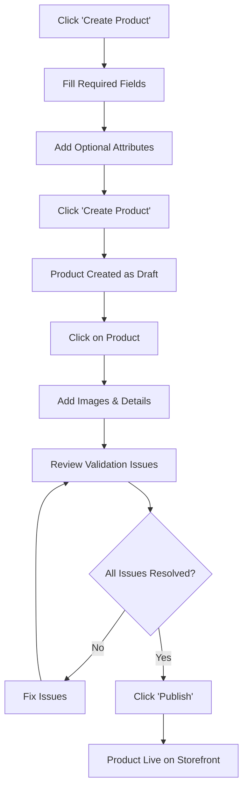
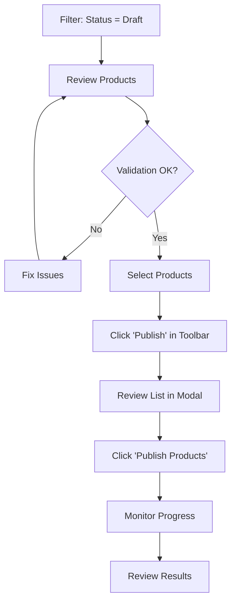
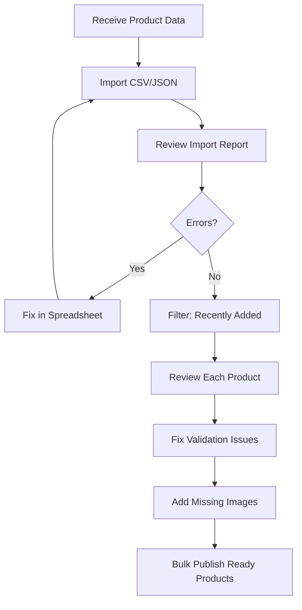
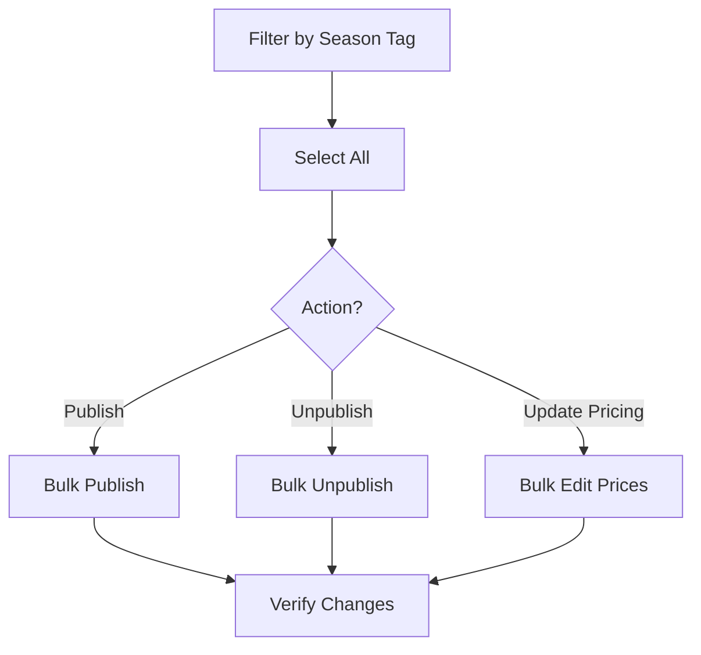

# Admin Portal Catalog - Quick Reference Guide

**Quick access to keyboard shortcuts, workflows, and field validation rules**

---

## Keyboard Shortcuts

### Navigation
| Shortcut | Action |
|----------|--------|
| `Cmd/Ctrl + K` | Focus search bar |
| `Cmd/Ctrl + F` | Open filters panel |
| `Escape` | Close modal/drawer/panel |
| `←` or `PageUp` | Previous page |
| `→` or `PageDown` | Next page |
| `Home` | First page |
| `End` | Last page |
| `G then H` | Go to catalog home |

### Selection
| Shortcut | Action |
|----------|--------|
| `Cmd/Ctrl + A` | Select all on current page |
| `Cmd/Ctrl + D` | Deselect all |
| `Shift + Click` | Range select (table view) |
| `Space` | Toggle selection on focused item |

### Actions
| Shortcut | Action |
|----------|--------|
| `Cmd/Ctrl + S` | Save changes |
| `Cmd/Ctrl + N` | Create new product |
| `Delete` | Delete selected (with confirmation) |
| `Cmd/Ctrl + Z` | Undo last change |
| `Cmd/Ctrl + Shift + Z` | Redo |

### View Modes
| Shortcut | Action |
|----------|--------|
| `1` | Switch to grid view |
| `2` | Switch to list view |
| `3` | Switch to table view |
| `Cmd/Ctrl + +` | Increase grid columns |
| `Cmd/Ctrl + -` | Decrease grid columns |

### Multi-Input Fields
| Shortcut | Action |
|----------|--------|
| `Enter` or `,` | Add tag/material/color |
| `Backspace` (empty input) | Remove last item |
| `Tab` | Move to next field |

---

## Common Workflows

### Create and Publish a Product



**Time Estimate:** 5-10 minutes per product

### Bulk Publish Workflow



**Time Estimate:** 2-3 minutes for 20 products

### Weekly Product Upload



**Time Estimate:** 30-60 minutes for 50 products

### Seasonal Product Update



**Time Estimate:** 5-10 minutes

---

## Field Validation Rules

### Product Name
| Rule | Value |
|------|-------|
| **Required** | Yes |
| **Min Length** | 3 characters |
| **Max Length** | 255 characters |
| **Allowed** | Letters, numbers, spaces, hyphens, parentheses |
| **Pattern** | Must not start/end with space |
| **Example** | ✅ "Modern Sectional Sofa (Left Chaise)" |
| **Invalid** | ❌ "ab" (too short) |

### Brand
| Rule | Value |
|------|-------|
| **Required** | Yes |
| **Min Length** | 2 characters |
| **Max Length** | 100 characters |
| **Allowed** | Letters, numbers, spaces, ampersands |
| **Example** | ✅ "Herman Miller" |
| **Invalid** | ❌ "H" (too short) |

### Short Description
| Rule | Value |
|------|-------|
| **Required** | Yes |
| **Min Length** | 10 characters |
| **Max Length** | 500 characters |
| **Allowed** | Any printable characters |
| **Example** | ✅ "Luxurious 3-seater sofa..." |
| **Invalid** | ❌ "Great!" (too short) |

### Price
| Rule | Value |
|------|-------|
| **Required** | Yes |
| **Type** | Number (decimal) |
| **Min Value** | 0.01 (must be positive) |
| **Max Value** | 1,000,000.00 |
| **Decimal Places** | Up to 2 |
| **Example** | ✅ 2495.99 |
| **Invalid** | ❌ -100 (negative), ❌ 2495.999 (3 decimals) |

### MSRP (Manufacturer's Suggested Retail Price)
| Rule | Value |
|------|-------|
| **Required** | No (optional) |
| **Type** | Number (decimal) |
| **Min Value** | 0.01 (if provided) |
| **Max Value** | 1,000,000.00 |
| **Relation** | Should be ≥ Price |
| **Example** | ✅ 3199.00 |

### Category ID
| Rule | Value |
|------|-------|
| **Required** | Yes |
| **Type** | UUID (v4) |
| **Format** | `xxxxxxxx-xxxx-4xxx-yxxx-xxxxxxxxxxxx` |
| **Validation** | Must exist in categories table |
| **Example** | ✅ `550e8400-e29b-41d4-a716-446655440000` |
| **Invalid** | ❌ "furniture" (not a UUID) |

### Status
| Rule | Value |
|------|-------|
| **Required** | Yes |
| **Type** | Enum |
| **Allowed Values** | `draft`, `in_review`, `published`, `archived` |
| **Default** | `draft` |
| **Example** | ✅ "draft" |
| **Invalid** | ❌ "pending" (not in enum) |

### SKU (Stock Keeping Unit)
| Rule | Value |
|------|-------|
| **Required** | Yes (for variants) |
| **Min Length** | 3 characters |
| **Max Length** | 100 characters |
| **Allowed** | Letters, numbers, hyphens, underscores |
| **Unique** | Must be unique across all products/variants |
| **Pattern** | `^[A-Z0-9-_]+$` (uppercase recommended) |
| **Example** | ✅ "SOFA-MOD-001-NVY-L" |
| **Invalid** | ❌ "ab" (too short), ❌ "sofa mod" (space) |

### Tags, Materials, Colors, Style Tags
| Rule | Value |
|------|-------|
| **Required** | No (optional) |
| **Type** | Array of strings |
| **Max Items** | 50 per array |
| **Item Length** | 1-50 characters each |
| **Allowed** | Letters, numbers, spaces, hyphens |
| **Duplicates** | Not allowed |
| **Example** | ✅ `["modern", "scandinavian", "leather"]` |

### Images
| Rule | Value |
|------|-------|
| **Required** | At least 1 (for publishing) |
| **Max Count** | 20 images per product |
| **Format** | JPEG, PNG, WebP |
| **Max Size** | 10 MB per file |
| **Min Resolution** | 800x800 pixels |
| **Recommended** | 2000x2000 pixels |
| **Aspect Ratio** | Square (1:1) preferred |

### Dimensions (Width, Height, Depth)
| Rule | Value |
|------|-------|
| **Required** | No |
| **Type** | Number (decimal) |
| **Min Value** | 0.1 |
| **Max Value** | 10,000 |
| **Unit** | Inches (default) |
| **Decimal Places** | Up to 2 |
| **Example** | ✅ 84.5 (inches) |

### Weight
| Rule | Value |
|------|-------|
| **Required** | No |
| **Type** | Number (decimal) |
| **Min Value** | 0.1 |
| **Max Value** | 10,000 |
| **Unit** | Pounds (default) |
| **Decimal Places** | Up to 2 |
| **Example** | ✅ 125.75 (lbs) |

---

## Status Definitions

### Product Status

| Status | Definition | Can Edit? | Visible to Customers? | Can Transition To |
|--------|------------|-----------|----------------------|-------------------|
| **Draft** | Work in progress, not ready for review | ✅ Yes | ❌ No | In Review, Published |
| **In Review** | Submitted for approval by admin/QA | ✅ Yes | ❌ No | Draft, Published |
| **Published** | Live on storefront, visible to customers | ✅ Yes | ✅ Yes | Draft, Archived |
| **Archived** | Historical/discontinued, kept for records | ✅ Limited | ❌ No | Draft |

### Availability Status

| Status | Definition | Stock Level | Customer Action |
|--------|------------|-------------|----------------|
| **In Stock** | Available for immediate purchase | > Threshold | Can purchase |
| **Low Stock** | Limited quantity available | ≤ Threshold | Can purchase (shows "Only X left") |
| **Out of Stock** | Temporarily unavailable | 0 | Can backorder or wishlist |
| **Discontinued** | No longer available | 0 | Cannot purchase |

### Validation Issue Severity

| Severity | Icon | Color | Meaning | Blocks Publishing | Auto-Fixable |
|----------|------|-------|---------|-------------------|--------------|
| **Error** | 🔴 | Red | Critical issue, must fix | ✅ Yes | Sometimes |
| **Warning** | 🟡 | Yellow | Should fix, but not blocking | ❌ No | Sometimes |
| **Info** | 🔵 | Blue | Informational, suggestion | ❌ No | N/A |

---

## Filter Combinations

### Common Filter Presets

#### Products Needing Review
```
Status: Draft
Has Validation Issues: Yes
```

#### Ready to Publish
```
Status: Draft
Has Validation Issues: No
Has Images: Yes
```

#### Recently Added
```
Created After: [7 days ago]
Sort By: Created Date (Newest)
```

#### Low Stock Items
```
Availability: Low Stock OR Out of Stock
Status: Published
```

#### Incomplete Products
```
Has Images: No
OR
Has Validation Issues: Yes (Errors Only)
```

#### High-Value Products
```
Price Min: 5000
Status: Published
Sort By: Price (High to Low)
```

#### Seasonal Products (Example: Summer)
```
Tags: summer, outdoor, patio
Status: Any
```

---

## Bulk Operation Limits

| Operation | Max Items | Rate Limit | Cooldown |
|-----------|-----------|------------|----------|
| **Bulk Publish** | 100 | 10/minute | 60 seconds |
| **Bulk Unpublish** | 100 | 10/minute | 60 seconds |
| **Bulk Delete** | 50 | 5/minute | 120 seconds |
| **Bulk Update Status** | 100 | 10/minute | 60 seconds |
| **Bulk Export** | 1000 | 3/hour | 1200 seconds |

**Notes:**
- Limits are per user account
- Cooldown applies after hitting the rate limit
- Progress is shown during bulk operations
- Partial success is acceptable (some may fail)

---

## Error Codes Quick Reference

| Code | Meaning | Common Cause | Solution |
|------|---------|--------------|----------|
| **VALIDATION_FAILED** | Input validation error | Invalid data format | Check field requirements |
| **NOT_FOUND** | Resource doesn't exist | Wrong ID or deleted item | Verify ID, refresh page |
| **DUPLICATE_SKU** | SKU already exists | Reused SKU | Use unique SKU |
| **RATE_LIMIT_EXCEEDED** | Too many requests | Exceeded rate limit | Wait for cooldown |
| **UNAUTHORIZED** | Authentication failed | Session expired | Sign in again |
| **FORBIDDEN** | Insufficient permissions | Role restrictions | Contact admin |
| **CONFLICT** | Resource state conflict | Simultaneous edits | Refresh and retry |
| **SERVER_ERROR** | Backend error | Service issue | Retry, contact support |

---

## Product Export Formats

### CSV Export

**Columns Included:**
- ID, SKU, Name, Brand, Category
- Price, MSRP, Currency
- Status, Availability
- Tags, Materials, Colors, Style Tags
- Dimensions, Weight
- Created At, Updated At, Published At

**Use Cases:**
- Bulk editing in spreadsheet
- Data analysis
- Migration to other systems

### JSON Export

**Structure:**
```json
{
  "products": [
    {
      "id": "uuid",
      "name": "Product Name",
      "brand": "Brand Name",
      "price": 2495.00,
      "variants": [...],
      "images": [...]
    }
  ],
  "meta": {
    "total": 100,
    "exported_at": "2025-10-19T10:30:00Z"
  }
}
```

**Use Cases:**
- API integration
- Backup and restore
- Advanced data processing

---

## Performance Tips

### Optimize Loading Times

| Action | Impact | How |
|--------|--------|-----|
| **Reduce page size** | ⚡⚡⚡ High | Use 20 items/page for large datasets |
| **Clear filters** | ⚡⚡ Medium | Remove unnecessary filters |
| **Use grid view** | ⚡⚡ Medium | Faster than table view for many items |
| **Enable caching** | ⚡ Low | Preference setting |

### Optimize Bulk Operations

| Action | Impact | How |
|--------|--------|-----|
| **Batch size 50** | ⚡⚡⚡ High | Process in smaller batches |
| **Off-peak hours** | ⚡⚡ Medium | Perform during low traffic |
| **Sequential ops** | ⚡⚡ Medium | Wait for completion before next |
| **Clear selection** | ⚡ Low | After each operation |

---

## Mobile & Tablet Support

### Responsive Breakpoints

| Device | Width | View Mode | Features |
|--------|-------|-----------|----------|
| **Desktop** | ≥ 1024px | All modes | Full features |
| **Tablet** | 768-1023px | Grid, List | Limited bulk ops |
| **Mobile** | < 768px | List only | View and edit only |

### Touch Gestures

| Gesture | Action |
|---------|--------|
| **Tap** | Select item |
| **Long press** | Open context menu |
| **Swipe left** | Delete (in list view) |
| **Swipe right** | Archive (in list view) |
| **Pinch** | Zoom (on images) |
| **Pull down** | Refresh |

---

## API Response Times (SLA)

| Endpoint | Expected | Warning | Critical |
|----------|----------|---------|----------|
| **GET /products** | < 200ms | > 500ms | > 1000ms |
| **GET /products/:id** | < 100ms | > 300ms | > 500ms |
| **POST /products** | < 500ms | > 1000ms | > 2000ms |
| **PATCH /products/:id** | < 300ms | > 800ms | > 1500ms |
| **DELETE /products/:id** | < 200ms | > 500ms | > 1000ms |
| **POST /bulk/publish** | < 2s | > 5s | > 10s |

**If response times exceed critical:**
- Check network connection
- Verify backend service status
- Contact support team

---

## Browser Compatibility

| Browser | Min Version | Notes |
|---------|-------------|-------|
| **Chrome** | 90+ | ✅ Fully supported |
| **Firefox** | 88+ | ✅ Fully supported |
| **Safari** | 14+ | ✅ Fully supported |
| **Edge** | 90+ | ✅ Fully supported |
| **Opera** | 76+ | ✅ Fully supported |
| **IE** | N/A | ❌ Not supported |

**Recommended:** Latest version of Chrome or Firefox for best performance.

---

## Quick Links

- **User Guide**: [USER_GUIDE.md](./USER_GUIDE.md)
- **FAQ**: [FAQ.md](./FAQ.md)
- **Architecture**: [CATALOG_ARCHITECTURE.md](./CATALOG_ARCHITECTURE.md)
- **API Reference**: [API_REFERENCE.md](./API_REFERENCE.md)
- **Support**: support@patina.com
- **Slack**: #admin-portal

---

**Last Updated:** 2025-10-19 | **Version:** 1.0
