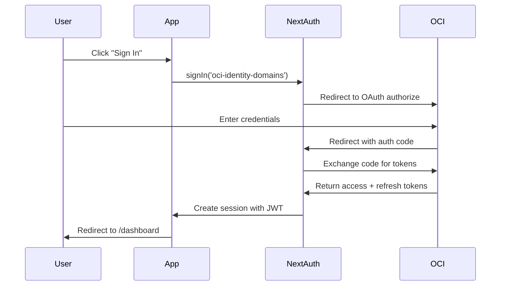
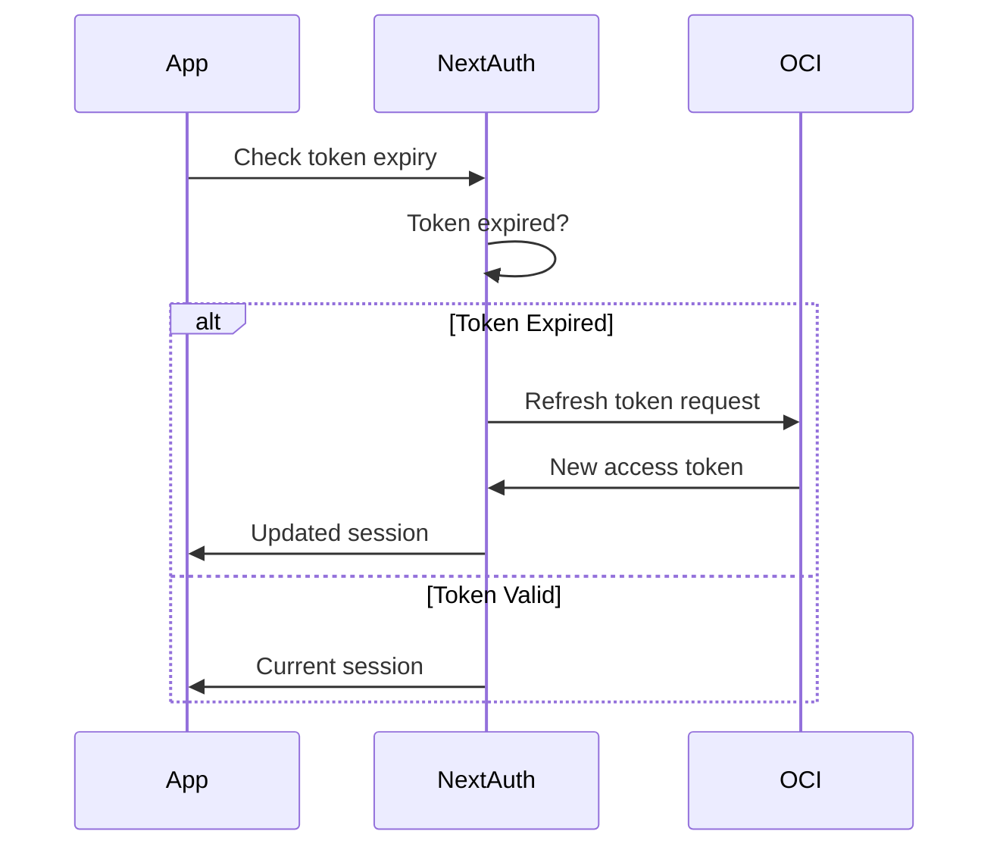

# Designer Portal - Authentication & Authorization

Complete guide to authentication and authorization in the Patina Designer Portal.

## Table of Contents

- [Overview](#overview)
- [Architecture](#architecture)
- [Setup Guide](#setup-guide)
- [Authentication Flow](#authentication-flow)
- [Role-Based Access Control (RBAC)](#role-based-access-control-rbac)
- [API Integration](#api-integration)
- [Session Management](#session-management)
- [Security Best Practices](#security-best-practices)
- [Troubleshooting](#troubleshooting)

## Overview

The Designer Portal uses **NextAuth v5** with **OCI Identity Domains** (OIDC) for authentication, providing:

- **Secure Authentication**: OAuth 2.0 / OIDC with OCI Identity Domains
- **JWT Sessions**: Stateless session management with automatic refresh
- **Role-Based Access Control**: Fine-grained permissions for designers, admins, and clients
- **Token Management**: Automatic token refresh and expiry handling
- **Protected Routes**: Middleware-based route protection
- **Session Monitoring**: Real-time session expiry warnings

## Architecture

### Authentication Stack

```
┌─────────────────────────────────────┐
│     OCI Identity Domains (OIDC)     │
│         Identity Provider            │
└────────────────┬────────────────────┘
                 │ OAuth 2.0 / OIDC
                 ↓
┌─────────────────────────────────────┐
│          NextAuth v5                │
│   - JWT Strategy                    │
│   - Token Refresh                   │
│   - Session Management              │
└────────────────┬────────────────────┘
                 │
                 ↓
┌─────────────────────────────────────┐
│         Middleware Layer            │
│   - Route Protection                │
│   - Role-Based Redirects            │
└────────────────┬────────────────────┘
                 │
                 ↓
┌─────────────────────────────────────┐
│      Application Components         │
│   - Protected Pages                 │
│   - RBAC Components                 │
│   - API Client with Auth            │
└─────────────────────────────────────┘
```

### Key Components

1. **Authentication** (`/src/lib/auth.ts`)
   - NextAuth configuration
   - OIDC provider setup
   - Token refresh logic
   - Session callbacks

2. **Middleware** (`/src/middleware.ts`)
   - Route protection
   - Role-based redirects
   - Session error handling

3. **RBAC** (`/src/lib/rbac.ts`)
   - Permission definitions
   - Role assignments
   - Authorization utilities

4. **Hooks** (`/src/hooks/use-auth.ts`)
   - `useAuth()` - Authentication state
   - `usePermissions()` - Permission checks
   - `useRequireAuth()` - Protected routes

5. **Components** (`/src/components/auth/`)
   - `ProtectedComponent` - Conditional rendering
   - `UserAvatar` - User display
   - Session expiry warnings

## Setup Guide

### 1. Environment Variables

Create a `.env.local` file with the following variables:

```env
# NextAuth Configuration
NEXTAUTH_URL=http://localhost:3000
NEXTAUTH_SECRET=your-secret-key-min-32-chars

# OCI Identity Domains (OIDC)
NEXT_PUBLIC_OIDC_ISSUER=https://your-domain.identity.oraclecloud.com
NEXT_PUBLIC_OIDC_CLIENT_ID=your-client-id
OIDC_CLIENT_SECRET=your-client-secret

# API URLs
NEXT_PUBLIC_CATALOG_API_URL=http://localhost:3003
NEXT_PUBLIC_SEARCH_API_URL=http://localhost:3002
NEXT_PUBLIC_STYLE_PROFILE_API_URL=http://localhost:3001
NEXT_PUBLIC_ORDERS_API_URL=http://localhost:3005
NEXT_PUBLIC_COMMS_API_URL=http://localhost:3006
NEXT_PUBLIC_PROJECTS_API_URL=http://localhost:3007
```

### 2. Generate NEXTAUTH_SECRET

```bash
openssl rand -base64 32
```

### 3. Configure OCI Identity Domains

1. **Create OAuth Client** in OCI Identity Domains:
   - Application Type: Web Application
   - Grant Types: Authorization Code, Refresh Token
   - Redirect URI: `http://localhost:3000/api/auth/callback/oci-identity-domains`
   - Scopes: `openid`, `profile`, `email`, `offline_access`

2. **Configure User Attributes**:
   - Ensure `roles` attribute is included in the ID token
   - Map roles to appropriate groups in OCI

3. **Add Custom Claims** (if needed):
   ```json
   {
     "roles": ["designer", "admin", "client"]
   }
   ```

### 4. Start Development Server

```bash
cd apps/designer-portal
pnpm dev
```

## Authentication Flow

### Sign In Flow



### Token Refresh Flow



### Session Lifecycle

1. **Initial Sign In**
   - User authenticates with OCI Identity Domains
   - Receives access token, refresh token, and ID token
   - Session created with 24-hour expiry

2. **Active Session**
   - Token automatically refreshed when expired
   - Session checked on every API request
   - Refreshed on window focus

3. **Session Expiry Warning**
   - Warning shown 5 minutes before expiry
   - User can extend session or sign out

4. **Sign Out**
   - Tokens revoked on OCI side
   - Local session cleared
   - Redirect to landing page

## Role-Based Access Control (RBAC)

### Roles

```typescript
enum Role {
  DESIGNER = 'designer',
  ADMIN = 'admin',
  CLIENT = 'client',
}
```

### Permissions

```typescript
enum Permission {
  // Client Management
  CREATE_CLIENT = 'create:client',
  VIEW_CLIENT = 'view:client',
  UPDATE_CLIENT = 'update:client',
  DELETE_CLIENT = 'delete:client',

  // Proposals
  CREATE_PROPOSAL = 'create:proposal',
  VIEW_PROPOSAL = 'view:proposal',
  UPDATE_PROPOSAL = 'update:proposal',
  DELETE_PROPOSAL = 'delete:proposal',
  SEND_PROPOSAL = 'send:proposal',

  // Projects
  CREATE_PROJECT = 'create:project',
  VIEW_PROJECT = 'view:project',
  UPDATE_PROJECT = 'update:project',

  // Teaching
  SUBMIT_TEACHING = 'submit:teaching',
  MANAGE_RULES = 'manage:rules',

  // Admin
  MANAGE_USERS = 'manage:users',
  VIEW_ANALYTICS = 'view:analytics',
}
```

### Role-Permission Mapping

| Role | Permissions |
|------|------------|
| **Designer** | All client, proposal, project, and teaching permissions |
| **Admin** | All permissions |
| **Client** | View proposals and projects only |

### Using RBAC

#### In Components

```tsx
import { ProtectedComponent } from '@/components/auth/protected-component';
import { Permission } from '@/lib/rbac';

function ClientManagement() {
  return (
    <ProtectedComponent
      permission={Permission.CREATE_CLIENT}
      fallback={<p>You don't have permission to create clients</p>}
    >
      <CreateClientButton />
    </ProtectedComponent>
  );
}
```

#### In Hooks

```tsx
import { usePermissions } from '@/hooks/use-auth';
import { Permission } from '@/lib/rbac';

function MyComponent() {
  const { checkPermission } = usePermissions();

  const canCreateClient = checkPermission(Permission.CREATE_CLIENT);

  return (
    <>
      {canCreateClient && <CreateClientButton />}
    </>
  );
}
```

#### Server-Side (API Routes)

```tsx
import { auth } from '@/lib/auth';
import { hasPermission, Permission } from '@/lib/rbac';

export async function POST(request: Request) {
  const session = await auth();

  if (!hasPermission(session, Permission.CREATE_CLIENT)) {
    return new Response('Forbidden', { status: 403 });
  }

  // Process request
}
```

#### Higher-Order Components

```tsx
import { withPermission } from '@/components/auth/protected-component';
import { Permission } from '@/lib/rbac';

const ProtectedButton = withPermission(
  CreateButton,
  Permission.CREATE_CLIENT,
  <span>No permission</span>
);
```

## API Integration

### Automatic Token Injection

The API client automatically:
- Injects access token in Authorization header
- Refreshes session on 401 errors
- Retries failed requests after refresh
- Handles network errors with exponential backoff

```typescript
import { catalogApi } from '@/lib/api-client';

// Token automatically added
const products = await catalogApi.getProducts();
```

### Manual Session Access

```tsx
import { useAuth } from '@/hooks/use-auth';

function MyComponent() {
  const { session } = useAuth();

  // Access token directly
  const token = session?.accessToken;
}
```

## Session Management

### Session Provider

The `SessionProvider` automatically handles:
- Session refresh every 5 minutes
- Refresh on window focus
- Expiry warnings (5 minutes before expiry)
- Automatic redirect on expiry

### Session Hooks

```tsx
import { useAuth } from '@/hooks/use-auth';

function MyComponent() {
  const {
    session,           // Full session object
    user,             // User data
    isAuthenticated,  // Boolean auth status
    isLoading,        // Loading state
    signIn,           // Sign in function
    signOut,          // Sign out function
    refreshSession,   // Manual refresh
  } = useAuth();
}
```

### Protected Routes

```tsx
import { useRequireAuth } from '@/hooks/use-auth';
import { Role, Permission } from '@/lib/rbac';

function ProtectedPage() {
  // Automatically redirects if not authenticated/authorized
  useRequireAuth({
    requiredRole: Role.DESIGNER,
    requiredPermission: Permission.CREATE_CLIENT,
    redirectTo: '/auth/error',
  });

  return <div>Protected Content</div>;
}
```

## Security Best Practices

### 1. Token Security

- ✅ Tokens stored in HTTP-only cookies (NextAuth handles this)
- ✅ Tokens never exposed to client JavaScript
- ✅ Automatic token rotation
- ✅ Secure token revocation on sign out

### 2. Session Security

- ✅ 24-hour session expiry
- ✅ Automatic refresh with refresh tokens
- ✅ Session invalidation on logout
- ✅ CSRF protection (NextAuth built-in)

### 3. Route Protection

- ✅ Middleware-level protection
- ✅ Role-based redirects
- ✅ API route authorization
- ✅ Component-level guards

### 4. API Security

- ✅ Bearer token authentication
- ✅ Automatic retry with fresh token
- ✅ Request tracing with X-Request-Id
- ✅ Error handling without token exposure

## Troubleshooting

### Common Issues

#### 1. "Session Expired" Error

**Cause**: Refresh token failed or expired

**Solution**:
- Check OCI Identity Domains configuration
- Verify `offline_access` scope is enabled
- Ensure refresh token is being returned

#### 2. Infinite Redirect Loop

**Cause**: Middleware misconfiguration

**Solution**:
- Check middleware matcher excludes static files
- Verify auth pages are in exclusion list
- Check role-based redirect logic

#### 3. "Access Denied" on Valid Route

**Cause**: Missing permissions or incorrect role

**Solution**:
- Verify user roles in OCI Identity Domains
- Check RBAC configuration in `/src/lib/rbac.ts`
- Inspect session data: `console.log(session)`

#### 4. Token Not Included in API Requests

**Cause**: API client not using session

**Solution**:
- Ensure using clients from `/src/lib/api-client.ts`
- Check session provider is wrapping app
- Verify middleware is running

### Debug Mode

Enable debug logging:

```env
# .env.local
NEXTAUTH_DEBUG=true
NEXT_PUBLIC_ENABLE_DEBUG=true
```

### Inspect Session

```tsx
import { useAuth } from '@/hooks/use-auth';

function DebugSession() {
  const { session } = useAuth();

  return <pre>{JSON.stringify(session, null, 2)}</pre>;
}
```

### Check Middleware

Add logging to middleware:

```typescript
// src/middleware.ts
export default auth((req) => {
  console.log('Path:', req.nextUrl.pathname);
  console.log('Authenticated:', !!req.auth);
  console.log('Roles:', req.auth?.user?.roles);

  // ... rest of middleware
});
```

## Testing

### Unit Tests

```bash
# Run auth tests
pnpm test src/lib/__tests__/rbac.test.ts
pnpm test src/hooks/__tests__/use-auth.test.tsx
```

### E2E Tests

```bash
# Run E2E auth flow tests
pnpm test:e2e tests/e2e/auth/
```

### Manual Testing Checklist

- [ ] Sign in with OCI Identity Domains
- [ ] Verify role-based dashboard redirect
- [ ] Test protected route access
- [ ] Verify session refresh works
- [ ] Test session expiry warning
- [ ] Test manual sign out
- [ ] Verify token revocation
- [ ] Test API requests with auth
- [ ] Test 401 retry logic
- [ ] Test permission-based UI

## References

- [NextAuth.js Documentation](https://next-auth.js.org/)
- [OCI Identity Domains](https://docs.oracle.com/en-us/iaas/Content/Identity/home.htm)
- [OAuth 2.0 Specification](https://oauth.net/2/)
- [OIDC Specification](https://openid.net/connect/)

## Support

For authentication issues:
1. Check this documentation
2. Review the troubleshooting section
3. Check NextAuth debug logs
4. Contact the platform team

---

**Last Updated**: 2025-10-04
**Maintained By**: Designer Portal Team
