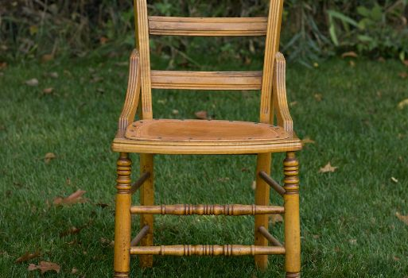

# KIT.md — Patina iOS mock kit reference

**Files.** `kit.css` (the kit) · `kit-demo.html` (every component light + dark, plus pixel replicas of the
shipped Today home and browse grid) · `img/` (real seed photography cropped from this review's simulator
shots) · `render-kit.cjs` (`node render-kit.cjs` → `kit-demo-light.png`, `kit-demo-dark.png`,
`cal-today.png`, `cal-browse.png` + `render-report.json`; borrows Playwright from `apps/designer-portal`,
and needs the command sandbox off — headless Chromium cannot claim its mach port inside it) ·
`calibrate/` (the pixel-measuring scripts and the ref-vs-kit comparison sheets behind §3's table).

**Source of truth.** `apps/mobile/PatinaDesignKit/Sources/PatinaDesignKit/` and
`apps/mobile/Patina/Patina/Features/…` at `main @ 3cd84ecb3` (2026-08-26). Paths below are relative to one of
those two roots; the root is named the first time each file appears. The token table this builds on is
`research/16-token-table.md`.

**Scale.** Mocks are drawn at **402 × 874 CSS px** — iPhone 17 Pro logical points, 1 pt = 1 px, no transform.
Nothing in the kit uses `rem`; everything is `px` so a measured point value from a shot maps straight across.

**Fonts.** `kit.css` line 1 imports Playfair Display (400/500/400i), Inter (400/500/600) and DM Mono
(300/400/500) from `https://fonts.googleapis.com` — the only external host an Artifact's CSP allows. Every
family carries a real fallback stack (`--pat-serif`, `--pat-sans`, `--pat-mono`). The app itself registers the
bundled TTFs at launch (`Support/PatinaFonts.swift:20-26`, called from `Patina/PatinaApp.swift:64`); the
Google faces are the same designs and render within ~2 pt of the shipped metrics at these sizes.

---

## 1. Tokens

Every value below is a CSS custom property on `:root` in `kit.css`. **Use the semantic role, not the raw
palette**, unless the app's own call site uses the raw colour (noted). A role with one value is *static by
design* — draw it identically in both themes.

### 1.1 Colour — semantic roles

All lines are `Tokens/PatinaColors.swift` unless shown otherwise. Dark resolution in the app is a trait-aware
`UIColor` provider (`Color.patinaDynamic(light:dark:)`, `:154-166`), not a media query.

| CSS var | Light | Dark | Swift | Meaning |
|---|---|---|---|---|
| `--pat-bg` | `#FAF7F2` | `#211E1B` | `:94-96` (`offWhite` `:17`; `DarkPalette.background` `:77`) | the canvas |
| `--pat-bg-2` | `#F5F2ED` | `#2C2926` | `:98-100` (`softCream` `:37`; `:79`) | cards, chips, group surfaces |
| `--pat-bg-3` | `#FAF7F2` | `#211E1B` | `:102-104` (`warmWhite` `:40`) | hero bands |
| `--pat-bg-dark` | `#2C2926` | `#2C2926` **static** | `:105-106` | camera / AR / Companion shell |
| `--pat-text` | `#2C2926` | `#F2EDE6` | `:110-112` (`charcoal` `:32`; `:81`) | primary text |
| `--pat-text-2` | `#5C4A3C` | `#D8C9B4` | `:113-115` (`mocha` `:29`; `:83`) | secondary text |
| `--pat-text-muted` | `#8B7355` | `#B5A487` | `:116-118` (`agedOak` `:26`; `:85`) | muted text, mono labels |
| `--pat-text-inv` | `#FAF7F2` | `#211E1B` | `:121-123` | labels on filled controls |
| `--pat-text-link` | `#9F7E48` | `#C4A57B` | `:124-126` (`clayDeep` `:23`; `:87`) | links, tappable text |
| `--pat-accent` | `#C4A57B` | `#C4A57B` **static** | `:131` | brand accent (`Interactive.default`) |
| `--pat-accent-hover` | `#8B7355` | `#B5A487` | `:132-134` | `Interactive.hover` |
| `--pat-active-fill` | `#2C2926` | `#F2EDE6` | `:136-138` | filled control surface; pair with `--pat-text-inv` |
| `--pat-strata-1` | `#5C4A3C` | `#D8C9B4` | `:144-146` | Strata line 1 |
| `--pat-strata-2` | `#C4A57B` | `#C4A57B` **static** | `:147` | Strata line 2 |
| `--pat-strata-3` | `#C4A57B` @ 50% | same **static** | `:148` | Strata line 3 |
| `--pat-glass` | `rgba(250,247,242,.55)` | `rgba(60,55,50,.55)` | *kit-only* | CSS stand-in for `.ultraThinMaterial` over artwork (`Features/Recommendations/Views/RecommendationsView.swift:219,347,367`) |
| `--pat-sys-grey` | `#88878A` | `#98979C` | **not a Patina token** | SwiftUI `.secondary`, sampled off `shots/g-12`; used only by `.home-header__title-help` |

### 1.2 Colour — raw palette (**no dark variants** — draw as-is in both themes)

| CSS var | Hex | Swift | Where it is used raw |
|---|---|---|---|
| `--pat-off-white` | `#FAF7F2` | `:17` | text on dark chrome, Strata capsules |
| `--pat-clay` | `#C4A57B` | `:20` | accent, chips, unread dot, tile washes at 12–15 % |
| `--pat-clay-deep` | `#9F7E48` | `:23` | accessible interactive text (light) |
| `--pat-aged-oak` | `#8B7355` | `:26` | muted text, Companion row chevron |
| `--pat-mocha` | `#5C4A3C` | `:29` | secondary text; **every shadow colour** |
| `--pat-charcoal` | `#2C2926` | `:32` | primary text, filled controls, dark chrome |
| `--pat-soft-cream` | `#F5F2ED` | `:37` | card surface |
| `--pat-warm-white` | `#FAF7F2` | `:40` | hero surface (identical to `offWhite`) |
| `--pat-pearl` | `#E5E2DD` | `:43` | **every hairline, in both themes** |
| `--pat-sage` | `#A8B5A0` | `:46` | spatial pills @ 15 %, settings glyph |
| `--pat-dusty-blue` | `#8B9CAD` | `:49` | `.info` badge, designer-response icon |
| `--pat-terracotta` | `#D4A090` | `:52` | warm accent, notifications glyph |
| `--pat-golden` | `#E8C547` | `:55` | AR light slider, emergence icon |
| `--pat-success` | `#7A9B76` | `:60` | match label, `.success` badge |
| `--pat-warning` | `#D4A574` | `:63` | `.warning` badge |
| `--pat-error` | `#C77B6E` | `:66` | `.error` badge, destructive button, field error |

> ⚠ `--pat-pearl` is the hairline **including in dark**, where it is a *light* line on `#211E1B`
> (`Features/Profile/Views/StudioHubView.swift:174,183`, `Features/Notifications/Views/NotificationFeedView.swift:241`).
> Reproduce it as drawn; do not "correct" it to a dark line.

### 1.3 Typography roles — `Tokens/PatinaTypography.swift`

Utility classes are `.t-<role>`; the CSS shorthand is `font: <weight> <size>/<line-height> <family>`.
There is **no line-height token in the app** — SwiftUI's per-face default leading plus ad-hoc `.lineSpacing()`
at call sites. `1.2` on Playfair headings and `1.45` on Inter body reproduces the render; anything tighter
will not match.

| Class | Family / weight | Size | Swift |
|---|---|---|---|
| `.t-display1` | Playfair 500 | 56 | `:21` |
| `.t-display2` | Playfair 500 | 40 | `:23` |
| `.t-display-sm` | Playfair 500 | 28 | `:25` |
| `.t-h1` | Playfair 500 | 32 | `:27` |
| `.t-h2` | Playfair 400 | 26 | `:29` |
| `.t-h3` | Playfair 400 | 24 | `:31` |
| `.t-h4` | Playfair 400 | 22 | `:33` |
| `.t-h5` | Playfair 500 | 18 | `:35` |
| `.t-headline-serif` | Playfair 500 | 24 | `:39` |
| `.t-headline-md` | Inter 600 | 18 | `:41` |
| `.t-body-lg` | Inter 400 | 18 | `:45` |
| `.t-body` | Inter 400 | 16 | `:47` |
| `.t-body-md` | Inter 500 | 16 | `:49` |
| `.t-body-sm` | Inter 400 | 14 | `:51` |
| `.t-body-sm-md` | Inter 500 | 14 | `:53` |
| `.t-caption` | Inter 500 | 12 | `:55` |
| `.t-caption-md` | Inter 600 | 12 | `:57` |
| `.t-caption-sm` | Inter 400 | 10 | `:63` |
| `.t-mono` | DM Mono 400, UPPERCASE, +0.5 | 10 | `:68` |
| `.t-mono-sm` | DM Mono 400, UPPERCASE, +0.4 | 9 | `:71` |
| `.t-mono-tiny` | DM Mono 400, UPPERCASE, +0.3 | 8 | `:75` — deprecated, still live (`TodayModules.swift:189`, `NotificationFeedView.swift:225`) |
| `.t-mono-label` | DM Mono 400, UPPERCASE, +0.5 | 10 | `:78` |
| `.t-mono-med` | DM Mono 500, UPPERCASE | 10 | `:81` |
| `.t-eyebrow` | Inter 600, UPPERCASE, +1.5 | 12 | `:86`, modifier `:137-143` |
| `.t-voice` | Playfair *italic* 400 | 18 | `:89` |
| `.t-voice-lg` | Playfair *italic* 400 | 22 | `:92` |
| `.t-wordmark` | Playfair 500, +6 | 38 | `:95` |
| `.t-ui-action` | Inter 500 | 15 | `:101` |
| `.t-ui-small` | Inter 500 | 13 | `:104` |

**Rule of thumb:** every DM Mono label is uppercase with 0.3–0.6 tracking. Playfair headings never track.
The only wide tracking in the app is the `PATINA` wordmark (+6) and the splash (+8).

Also shipped as components: `.mono-label` (`Components/MonoLabel.swift:11-51` — DM Mono 10, uppercase,
`Text.muted`, tracking 0.5; the app's universal metadata label), `.mono-label--sm` (the 9 pt `monoSmall`
variant used inside cards), `.mono-label--clay` (`ProductDetailView.swift:143-146`), `.eyebrow`.

### 1.4 Spacing — `Tokens/PatinaSpacing.swift:11-24`

`--pat-s-xxxs 2` · `--pat-s-xxs 4` · `--pat-s-xs 4` (duplicate, `:13`) · `--pat-s-sm 8` · `--pat-s-xsm 12` ·
`--pat-s-md 16` · `--pat-s-mdl 20` · `--pat-s-lg 24` · `--pat-s-xl 32` · `--pat-s-xxl 48` · `--pat-s-xxxl 64`.

Non-token layout constants that matter more than the scale does:

| CSS var | px | Swift |
|---|---|---|
| `--pat-gutter-home` | 20 | `Features/Home/Views/DailyRoomView.swift:120,138` |
| `--pat-gutter-push` | 24 | `Features/Recommendations/Views/RecommendationsView.swift:49,144` |
| `--pat-push-top` | 56 | pushed screens start their content here |
| `--pat-hearth-inset` | 120 | the Companion owns the bottom 120 pt — `ContentView.swift:166`, `DailyRoomView.swift:142` |
| `--pat-safe-top` | 59 | iPhone 17 Pro top safe area (measured against `shots/g-12`) |
| `--pat-safe-bottom` | 34 | home-indicator safe area |

### 1.5 Radii — `Tokens/PatinaSpacing.swift:27-34`

`--pat-r-sm 4` · `--pat-r-md 8` · `--pat-r-lg 12` · `--pat-r-xl 16` · `--pat-r-xxl 24` · `--pat-r-full 9999`.
Non-token radii in live use, also tokenised here: `--pat-r-card14 14` (browse card, profile action row, maker
story), `--pat-r-bubble18 18` (Companion intro), `--pat-r-tile11 11` (notification icon tile),
`--pat-r-match6 6` (`MatchPill`). Every SwiftUI `RoundedRectangle` uses `style: .continuous`; plain CSS
`border-radius` is the closest available approximation.

### 1.6 Shadows — `Tokens/PatinaShadows.swift:11-62`

All shadows are mocha `#5C4A3C` at varying alpha. SwiftUI `radius` is a Gaussian σ; CSS blur ≈ 2 × radius.

| CSS var | CSS | Swift |
|---|---|---|
| `--pat-sh-sm` | `0 2px 8px rgba(92,74,60,.06)` | `:13-18` |
| `--pat-sh-md` | `0 4px 16px rgba(92,74,60,.08)` | `:20-25` — the workhorse |
| `--pat-sh-lg` | `0 8px 32px rgba(92,74,60,.12)` | `:27-32` |
| `--pat-sh-xl` | `0 16px 64px rgba(92,74,60,.16)` | `:34-39` |
| `--pat-sh-daily` | `0 4px 48px rgba(92,74,60,.18)` | `:42-47` |
| `--pat-sh-companion` | `0 4px 24px rgba(92,74,60,.20)` | `:50-55` |

Only `PatinaCard(style: .elevated)` carries one by default (`Components/PatinaCard.swift:66-76`).
**The Today cards on the home are flat** — surface fill only (`TodayModules.swift:26-27,142-143`).

### 1.7 Gradients — `Tokens/PatinaGradients.swift:12-131`

`--pat-g-warm` `:14-17` · `dusk` `:19-22` · `earth` `:24-27` · `sage` `:29-32` · `leather` `:34-37` ·
`linen` `:39-42` · `stone` `:44-47` · `wood` `:49-52` · `metal` `:54-57` · `rattan` `:59-62` ·
`hero` `:65-68` · `hero2` `:71-74` · `walnut` `:77-80` · `cherry` `:83-86` · `sunrise` `:88-91`.
Utility classes `.g-warm … .g-sunrise` set them as a background.

**Room-type mapping** (verbatim in three views — `TodayModules.swift:202-211`,
`Features/Rooms/Views/RoomProjectView.swift:193-202`, `Features/Profile/Views/ProfileView.swift:372-381`):
living → `warm` · bedroom → `dusk` · office → `sage` · dining → `earth` · kitchen → `rattan` · default → `linen`.

**Product-category placeholder mapping** (`Core/Models/ProductModel.swift:115-124`):
seating → `leather` · tables → `wood` · lighting → `metal` · storage → `rattan` · decor → `linen` ·
textiles → `warm`.

---

## 2. Light / dark switching rules

The kit defines the **complete light palette on bare `:root`**, then redefines *only* the flipping tokens in
three places, so one page can host a system-dark viewer, an explicit toggle, and a single dark phone beside a
light one:

```css
:root { /* every token, light values */ }

@media (prefers-color-scheme: dark) {
  :root:not([data-theme="light"]) { /* dark overrides */ }
}
:root[data-theme="dark"]  { /* dark overrides — an explicit toggle wins in both directions */ }
[data-scheme="dark"]      { /* dark overrides — scoped to one element and its subtree */ }
[data-scheme="light"]     { /* light overrides — forces light inside a dark page */ }
```

Usage:

- **Whole page follows the viewer** — do nothing; `:root` plus the media query handle it.
- **Explicit page toggle** — set `data-theme="dark"` / `"light"` on `<html>`.
- **One light and one dark phone side by side** — put `data-scheme="light"` on one `.frame` and
  `data-scheme="dark"` on the other. `data-scheme` is attribute-only (not `.frame[data-scheme]`), so it also
  works on a deck panel, a widget, or any wrapper — see the demo's `.panel--dark`.

Rules the kit enforces, and you must not undo:

1. **Only the flipping tokens are redefined.** `--pat-bg-dark`, `--pat-accent`, `--pat-strata-2/3`,
   `--pat-pearl` and the whole raw palette are static — the app does not flip them, so neither does a mock.
2. **Never give a colour its only definition inside a media or `[data-scheme]` block.** Everything is
   declared on `:root` first.
3. **Always paint `background` explicitly** on `body` and on `.frame__screen`; a transparent ground borrows
   the host page's theme.
4. Four rules key off dark for a *material* rather than a token, because the app uses a system material there:
   `.detail-bar`, `.sheet__handle`, `.notif-row--unread`, `.sys-alert`. Keep them paired if you fork the kit.

---

## 3. The phone frame

```html
<div class="frame" data-scheme="light" data-battery="charging">
  <div class="frame__screen">

    <div class="screen-body screen-body--scroll">
      …screen content…
      <div class="pad-hearth"></div>   <!-- the Companion owns the bottom 120 pt -->
    </div>

    <!-- overlays, in z order -->
    <div class="screen-chrome"><span class="back-chevron"><svg><use href="#i-chev-l"/></svg></span></div>
    <div class="companion-dock">
      <span class="orb"><span class="strata"><i></i><i></i><i></i></span></span>
      <span class="companion-hint">Next steps</span>
    </div>

    <div class="statusbar">
      <span class="statusbar__time">9:41</span>
      <span class="statusbar__right">
        <span class="sb-signal"><i></i><i></i><i></i><i></i></span>
        <span class="sb-wifi"></span><span class="sb-battery"></span>
      </span>
    </div>
    <div class="island"></div>
    <div class="home-indicator"></div>

  </div>
</div>
```

- `.frame` — 402 × 874 **content box** (`box-sizing:content-box`), 13 px bezel, 68 px outer radius,
  55 px screen radius. iPhone 17 Pro proportions.
- `.island` — 125 × 37 at top 11, centred. Omit it when a `.live-pill` replaces it.
- `.statusbar` — reads **9:41**; time is Inter 600/17 with cap band measured to land at 26–39 pt, matching
  `shots/g-12` exactly (measured time bbox x 56.7–88.3, y 26.3–38.7; right cluster x 288.3–366.3, y 26–38.7).
  Signal is four CSS bars; wifi and battery are tiny inline-SVG `mask-image` data URIs painted with
  `background-color` so they inherit the theme. `data-battery="charging"` swaps in the green charging
  battery seen in every simulator shot; omit the attribute for a neutral one.
- `.home-indicator` — 139 × 5, `--pat-text` @ 28 %, bottom 8.
- `.frame--bare` — no bezel, island, status bar or home indicator; a 24 px-radius screen with `--pat-sh-md`.
  Use for deck strips and crops where the device chrome is noise.
- Safe areas are `--pat-safe-top: 59px` / `--pat-safe-bottom: 34px`. `.home-header` adds
  `calc(var(--pat-safe-top) + 57px)` of top padding and `.screen-head` `+ 60px`; the app writes
  `.padding(.top, 56)` in both, and the extra 1–4 px is the web line-box tax measured back out of the
  simulator shots (§3 calibration).
- **Overlay order matters**: `.screen-chrome` (z 20) → sheet scrim/sheet (24/25) → `.companion-dock` (z 30)
  → toast (35) → `.island` / `.statusbar` (40/41) → `.live-pill` (42) → `.sys-alert-scrim` (44).

**Calibration note.** `mock/render-kit.cjs` renders `kit-demo.html` at 1400 px / dsf 2 and cuts element
shots of the two replica frames (`#cal-today` → `cal-today.png`, `#cal-browse` → `cal-browse.png`). Those
were measured pixel-for-pixel against `shots/g-12-home-discovering-top.png` and
`shots/g-15-browse-pieces-grid.png` and the kit was moved to match. Every landmark below is now within
~1 pt of the shipped screen:

| landmark | shipped (pt) | kit (pt) |
| --- | --- | --- |
| date line ink top | 121.0 | 121.0 |
| "Today" ink | 142.7–163.7, w 58.3 | 143.0–163.5, w 58.0 |
| header bell / help / monogram centre y | 135.9 | 135.9 |
| Next Move card | 202.7–325.3 | 202.5–325.5 |
| Next Move icon tile | 238–290 | 238–290 |
| story card top | 344.7 | 345.0 |
| Companion bubble | 554.3–709.3 | 553.5–708.5 |
| hearth orb | 724–787.7 | 724–787.5 |
| Browse title ink top | 124.7 | 125.0 |
| Browse chip row | 179.3–205.7 | 180.0–205.5 |
| Browse card art bottom | 378.7 | 378.0 |

Two things the replica deliberately does **not** copy. (1) In `g-15`/`g-15b`/`g-16` the shipped Browse grid
puts its **first column off the left edge** — card 1 bleeds past x = 0 while card 2 lands exactly where the
kit's `grid-2` puts it (art left 207 pt in both). That is an app-side layout defect, logged as such, not a
kit deviation. (2) The story card draws `--pat-g-hero`, not a crop of the shipped hero photograph, per the
honest-placeholder rule in §4.

Known residual: `.next-move__arrow` ink measures 11.5 pt wide against the shipped 10.0, and sits ~2 pt
high. Closing it needs the arrow narrower, which widens the detail column past the point where "…the
Companion a real" stops wrapping. Wrap fidelity won.

---

## 4. Components

Each row gives the class, the markup skeleton, and the Swift view it mirrors. App paths are relative to
`apps/mobile/Patina/Patina/`; kit paths to `apps/mobile/PatinaDesignKit/Sources/PatinaDesignKit/`.

### 4.1 Chrome

**Home header** — `Features/Home/Views/DailyGreetingHeader.swift:31-103`; monogram `:108-131`;
unread badge `:136-150`.

```html
<div class="home-header">
  <div class="home-header__stack">
    <div class="home-header__date">Wednesday · Aug 26</div>
    <div class="home-header__titlerow">
      <span class="home-header__title">Today</span>
      <span class="home-header__title-help"><svg><use href="#i-qcircle"/></svg></span>
    </div>
  </div>
  <div class="home-header__actions">
    <span class="icon-btn"><svg><use href="#i-bell"/></svg><span class="icon-btn__dot"></span></span>
    <span class="icon-btn"><svg><use href="#i-qcircle"/></svg></span>
  </div>
  <span class="monogram">G</span>
</div>
```

The `.home-header__titlerow` is **42 px tall** and top-aligned (`padding-top:3px`) — that row is the help
icon's tap target and is what puts the Next Move card at 202.5 pt rather than 181. Its `gap` is **18 px**:
the shipped help glyph sits 22 pt clear of the "Today" y, not tucked against it.

`.home-header__title-help` is that glyph and is **not** `.icon-btn--sm`: 20 pt box, 15.5 pt `questionmark
.circle`, vertically centred on the title row, and painted `--pat-sys-grey` (`#88878A` / `#98979C`). That
grey is the one place the shipped screen steps outside the Patina palette — it is SwiftUI's `.secondary`,
measured straight off `g-12` at `rgb(136,135,137)`. Do not "correct" it to `--pat-text-muted`.

`.icon-btn` glyphs are **21 pt** inside the 36 pt tap target (bell ink 15.3 × 16.7 on the shipped screen);
the actions cluster and the monogram carry `margin-top:1.5px` so they ride just below the date line, and
`.home-header`'s own `gap` is **8 px**, which lands the bell at centre x 280 and the help at 320.
`.icon-btn__badge` is the numeric variant (`:141-146`, capped at "9+", clay capsule); `.icon-btn__dot` is
the 7 px dot form. `.monogram` is a 36 pt circle filled with `--pat-g-earth`, Playfair 500/14, `offWhite`
(`:110-118`); `.monogram--sm` is the 20 pt/9 pt variant.

**Pushed-screen chrome** — `Design/Components/PatinaScreenChrome.swift:27-53`, chevron
`Design/Animations/PatinaTransitions.swift:22-55`.

```html
<div class="screen-chrome">
  <span class="back-chevron"><svg><use href="#i-chev-l"/></svg></span>
  <span class="screen-chrome__title">Living Room</span>   <!-- optional -->
</div>
```

Pinned top 11 / leading 18 *below the safe area* (the shipped chevron ink centres on y 88).
`.back-chevron` = 36 pt circle with an **18 pt** chevron, `offWhite` @ 92 % with a
`pearl` hairline; `.back-chevron--dark` = `offWhite` @ 12 %, no stroke, `offWhite` chevron. Screens that
already carry an in-body header pass no title — use `.screen-head` for those
(`Features/Recommendations/Views/RecommendationsView.swift:37-50`,
`Features/Collections/Views/CollectionsView.swift:44-73`).

### 4.2 The Companion

| Class | Mirrors |
|---|---|
| `.companion-dock` | `Features/Companion/Components/CompanionHearthView.swift:121-171` |
| `.orb` | 64 pt circle, `Background.dark`, `Features/Companion/Models/CompanionState.swift:176-190` |
| `.strata` | `Features/Companion/Components/CompanionMarkView.swift:179-180, 223-240` — 20/16/12 × 1.5, gap 3, `offWhite` at 100/70/40 % |
| `.strata--spec` | `Components/StrataMarkView.swift:26-112` — 24/18/12 × 3, gap 4, spec colours (`Strata.line1/2/3`) |
| `.strata--clay` | the `PatinaAsyncImage` placeholder mark — same geometry, clay at 100/70/50 % |
| `.companion-hint` | `CompanionHearthView.swift:173-183` — DM Mono 9, uppercase, +0.4, `Text.muted`, centred |
| `.companion-panel` | `CompanionHearthView.swift:310-338` — dark shell, radius 26 (30 full-sheet), padding 20, gap 16, max-width 380 |
| `.companion-panel__head/__title/__detail` | `:340-357` — Playfair italic 18 `offWhite`; detail Inter 500/13 at 72 % |
| `.companion-panel__btn` | `:405-431` — 32 pt circle, white @ 10 %, `pearl` glyph |
| `.companion-row` | `Features/Companion/Views/CompanionOverlay.swift:666-702` — radius 14, white @ 6 %, padding 14 × 12, gap 14 |
| `.companion-row--suggested` | same, clay @ 15 % fill, clay icon tile |
| `.companion-row__icon` | 36 pt, radius 10, white @ 8 % (clay when suggested) |
| `.companion-row__meta` | DM Mono 9 uppercase in **clay** |
| `.companion-progress` | `CompanionHearthView.swift:296-306` — 3 pt track, white @ 15 %, clay fill |
| `.companion-intro` | `CompanionOverlay.swift:580-608` — the first-run bubble: 300 px, radius 16, padding `16 16 20`, gap 5, `Background.primary`, `PatinaShadows.md`, Playfair italic **18** title over **15** body, `.companion-intro__acts` pushed down 14. In the replica it is pinned `bottom:165px`. At 18 px the body ran to three lines; the shipped bubble is two |

Panel skeleton:

```html
<div class="companion-panel">
  <div class="companion-panel__head">
    <span class="companion-panel__mark"><span class="strata"><i></i><i></i><i></i></span></span>
    <span class="companion-panel__copy">
      <span class="companion-panel__title">Where to begin?</span>
      <span class="companion-panel__detail">A considered next move, based on where you are.</span>
    </span>
    <span class="companion-panel__btn"><svg><use href="#i-q"/></svg></span>
    <span class="companion-panel__btn"><svg><use href="#i-x"/></svg></span>
  </div>
  <div class="companion-panel__rows">
    <div class="companion-row companion-row--suggested">
      <span class="companion-row__icon">…</span>
      <span class="companion-row__copy">
        <span class="companion-row__title">Add your first space</span>
        <span class="companion-row__meta">Capture your first room</span>
      </span>
      <span class="companion-row__chev"><svg><use href="#i-chev-r"/></svg></span>
    </div>
    <!-- ≤ 6 rows total -->
  </div>
</div>
```

> The collapsed orb is `Background.dark` `#2C2926` in **both** themes, so on a dark screen it is a low-contrast
> disc on `#211E1B`. That is the shipped behaviour, not a kit bug — keep it, and say so if a direction wants it
> changed.

### 4.3 Today modules — `Features/Home/Views/`

| Class | Mirrors | Notes |
|---|---|---|
| `.next-move` | `TodayModules.swift:10-102` | flat `Background.secondary`, radius 16, padding `16 11 16 16`, gap 14, gutter 20, `margin-top:22`. The 11 px trailing padding is what makes the detail line wrap after "…the Companion a", as shipped |
| `.next-move__icon` | `:64-74` | 54 pt tile, radius 14, clay @ 14 %, glyph `Text.interactive` 20 pt. **`align-self:center`** — the shipped tile centres on the card, it does not top-align with the label |
| `.next-move__title` / `__detail` | `:85-92` | `h5` Playfair **18/1.35** 500 · `caption` Inter **12/1.22** 500 `Text.secondary`. iOS sets 12 pt text on a ~14.6 pt line, not 1.4 em — measured twice off `g-12` |
| `.next-move__arrow` | `:96-101` | `arrow.up.right`, **22 pt** svg (ink ≈ 11.5), `align-self:center`, `margin-top:2px`, `Text.interactive` |
| `.story-card` | `DailyStoryCard.swift:13-94` | fixed **180 pt**, radius 16, gutter 20, `margin-top:16` |
| `.story-card::after` | `:29-40` | 135 pt bottom scrim, charcoal .88 → .2 → 0 |
| `.story-card__pill` | `:64-77` | DM Mono 9 uppercase +0.3, charcoal @ 50 %, radius 8, inset 12 |
| `.story-card__dot` | `:80-87` | **7 pt clay dot — the unread mark** |
| `.story-card__tag` | `:44-49` | DM Mono 9 uppercase +0.6, `Text.interactive` |
| `.story-card__title` / `__sub` | `:50-58` | Playfair 18/500 `offWhite` · Inter 12/500 `pearl` |
| `.room-card` | `TodayModules.swift:104-164` | flat, radius 16, gutter 20, `margin-top:20` |
| `.room-card__art` | `:166-200` | 150 pt tall; room-type gradient when there is no photo |
| `.room-card__chip` | `:186-198` | **"ROOM SCAN"** — DM Mono 8 uppercase +0.6, charcoal @ 60 %, capsule, inset 10 |
| `.room-card__name` / `__meta` / `__latest` | `:116-129` | `h4` Playfair 22 · `caption` `Text.secondary` · `caption` `Text.muted` |

Order and spacing on the home come from `DailyRoomView.swift:104-145`: header → Next Move (`top 22`) →
story (`top 16`) → Active Room (`top 20`) → 120 pt hearth spacer.

### 4.4 Product card and grid — `Features/Recommendations/Views/RecommendationsView.swift`

```html
<div class="grid-2">
  <div class="product-card">
    <div class="product-card__art">
      
      <span class="match-pill">46% match</span>
      <span class="product-card__actions">
        <span class="circ-btn"><svg><use href="#i-heart"/></svg></span>
        <span class="circ-btn"><svg><use href="#i-dots"/></svg></span>
      </span>
    </div>
    <div class="product-card__info">
      <span class="product-card__maker">Lee Industries</span>
      <span class="product-card__name">Live-Edge Coffee Table</span>
      <span class="product-card__price">$2,100</span>
      <span class="product-card__why">Its style tags connect to your Warm Modern portrait.</span>
    </div>
  </div>
</div>
```

`.grid-2` = two flexible columns, gap 12, gutter 24 (`:134-147`). `.product-card` radius **14**, fill
`Background.secondary` (`:188-195`). `.product-card__art` 160 pt (`:197-211`). `.match-pill` is
`monoSmall` +0.3 on `.ultraThinMaterial`, radius 6, inset 8 — **not uppercased** at this call site
(`:213-221`), unlike the design-kit `MatchPill` (`Components/MatchPill.swift:10-31`). `.circ-btn` is the
30 pt glass circle used for both the heart and the visible ⋯ menu (`:337-379`); `.circ-btn--lg` is the 36 pt
detail-screen variant (`Features/ProductDetail/Views/ProductDetailView.swift:286-295`).
`.product-card__info` (`:236-261`): maker `monoSmall` uppercase muted · name `uiSmall` Inter 13/500 ·
price `h5` Playfair 18/500 · why-copy `caption` muted.

`.saved-row` mirrors the list variant `Features/Shared/Views/ProductCard.swift:99-134` (72 pt thumb at
radius 8, card radius 16); `.board-tile` / `.board-tile__cell` / `.board-tile__price` mirror the tile variant
`:138-155` and the board grid at `Features/Collections/Views/CollectionsView.swift:182-200`.

`.chip` / `.chip--active` — `Components/FilterChip.swift:11-36`: capsule, `caption` Inter **12/1.2**/500
(26.4 pt pill, matching the shipped 26.3),
padding 14 × 6, active = `Interactive.active` fill + `Text.inverse`, inactive = `Background.secondary` +
`Text.secondary`, **no border in either state**. `.chip-row` scrolls horizontally at gutter 24
(`RecommendationsView.swift:70-82`).

`.tile-placeholder` — `Components/PatinaAsyncImage.swift:14`. `Background.secondary` fill with a centred clay
Strata mark; **this, not a grey box, is what an unloaded product image looks like**.
`.tile-placeholder--gradient` is the *no image URL at all* fallback: the category gradient with no mark (the
kit hides `.strata` inside it). `.tile-placeholder__label` is the honest maker + material caption — see §6.

### 4.5 Piece detail — `Features/ProductDetail/Views/ProductDetailView.swift`

| Class | Swift | Notes |
|---|---|---|
| `.detail-hero` | `:70-90` | 340 pt; category gradient is the deliberate no-URL fallback |
| `.detail-hero__bar` | `:86-138` | back / help / share / save as `.circ-btn--lg`, top 56, inset 16 |
| `.detail-maker` | `:143-147` | `MonoLabel` in **clay**, `"maker · location"` |
| `.detail-name` | `:150-153` | `h2` Playfair 26/400 |
| `.detail-materials` | `:156-161` | `bodySmall` muted, materials joined with ` · ` |
| `.detail-price` | `:169-171` | `displaySmall` Playfair 28/500 |
| `.match-pill--detail` | `:177-184` | `mono` DM Mono 10 in `success`, on `success` @ 12 %, capsule — **the detail screen renders its own pill, not `MatchPill`** |
| `.spatial-pill` | `:214-222` | `caption`, `sage` @ 15 %, capsule |
| `.prov-head` + `.mono-label` | `:232-246` | eyebrow reads **"Provenance"** |
| `.prov-badge` | `:297-306` | `caption` `Text.secondary`, `Background.secondary`, capsule |
| `.spec-list` / `.spec-row` | *kit-only* | dimensions / materials / lead-time rows on `pearl` hairlines. `dimensions` and `lead_time_weeks` exist server-side but are never returned or decoded for the catalog layer (C28) — a mock that shows them is proposing, not reporting |
| `.acts-row` / `.act` | *kit-only* | the visible verbs on a piece; today the app has save, share, AR (`hasARModel` is always false) and one bottom-bar CTA |
| `.maker-story` | `:309-336` | radius 14, `Background.secondary`, padding 20; 44 pt `earth` avatar; quote in italic `bodySmall` `Text.secondary` |
| `.detail-bar` | `:338-401` | glass action bar, `.5` `pearl` top hairline, padding 16/24/36; 50 pt AR circle + full-width capsule CTA |

### 4.6 Saved — `Features/Collections/Views/CollectionsView.swift`

`.tabs` / `.tab` / `.tab--active` (`:76-101`): two equal tabs, label `bodySmall` (medium when active),
2 pt **clay** underline on the active tab, 1 pt `pearl` rule under the whole row.
`.empty-state` mirrors both `Components/PatinaEmptyState.swift:12-59` (40 pt light glyph, `h4` title,
`bodySmall` message, optional secondary button) and the local Saved empty state (`:149-180`).
`.board-head` / `.board-tile` (`:182-200`).

### 4.7 Controls

| Class | Swift | Spec |
|---|---|---|
| `.btn` | `Components/PatinaButton.swift:25-125` | capsule, **height 52**, full width, label `uiAction` Inter 15/500 |
| `.btn--primary` | `:96` | `Interactive.active` fill, `Text.inverse` label |
| `.btn--secondary` | `:98` | `Background.primary` fill, `pearl` 1.5 border, `Text.primary` |
| `.btn--ghost` | `:100` | clear, intrinsic width, `Text.interactive` |
| `.btn--clay` | `:102` | `clay` fill, `offWhite` label |
| `.btn--destructive` | `:104` | `error` fill, `offWhite` label |
| `.btn.is-disabled` | `:79-81` | opacity 0.5 |
| `.btn--auth` | `:135-179` | height **50**, radius **12** (not a capsule) |
| `.btn--compact` / `.btn--pill-sm` | `CollectionsView.swift:166-176`, `CompanionOverlay.swift:587-597` | 44 pt and inline-pill variants that exist at real call sites. `.btn--pill-sm` is 14/1.2 → a 32.8 pt pill (shipped 32.7) |
| `.field` group | `Components/PatinaTextField.swift:20, 60-112` | `Background.secondary` fill, radius 12, padding 16; border clay @ 20 % resting, `Text.interactive` @ 50 % focused (`.field__box--focused`), `error` 1.5 on error (`.field__box--error`); label + helper are `caption` |
| `.status-badge` | `Components/PatinaStatusBadge.swift:11-61` | capsule, glyph + `captionMedium` uppercase +0.5, tint at 14 % ground. `--info` dustyBlue · `--success` success · `--warning` warning · `--error` error |
| `.tier-pill` | `Design/Components/TierPill.swift:10` | designerSelection / editorPick / standard |
| `.card` | `Components/PatinaCard.swift:22-76` | `.surface` default; `.card--elevated` = `Background.primary` + `--pat-sh-md`; `.card--outline` = clear + `pearl` 1 |

### 4.8 Sheets and toast

`.sheet` mirrors the **de-facto** Patina sheet, `Features/Home/Views/AddToRoomSheet.swift:16-59` — *not* the
design-system `PatinaSheetHeader`, which has **zero call sites** anywhere in either app
(`Components/PatinaSheetHeader.swift:12,83`; a mock that draws it depicts something the app has never
rendered).

```html
<div class="sheet-scrim"></div>
<div class="sheet sheet--medium">
  <span class="sheet__handle"></span>
  <div class="sheet__head">
    <span class="sheet__title">Add to Room</span>       <!-- h5 Playfair 18/500 — TITLE FIRST -->
    <span class="sheet__eyebrow">Choose destination</span> <!-- monoSmall 9 uppercase — EYEBROW SECOND -->
  </div>
  <div class="sheet__body">
    <div class="sheet-row sheet-row--selected">
      <span class="sheet-row__thumb g-warm"></span>
      <span class="sheet-row__copy">
        <span class="sheet-row__name">Living Room</span>
        <span class="sheet-row__meta">3 items · 218 sq ft</span>
      </span>
      <span class="sheet-row__plus">+</span>
    </div>
  </div>
  <div class="sheet__foot"><span class="btn btn--ghost btn--pill-sm">+ New Room</span></div>
</div>
```

- Drag handle is hand-drawn: 36 × 4, radius 2, `Text.muted` @ 25 %, top 18 / bottom 14 (`:18-22`).
- **Title first, eyebrow second** — inverted versus the design-system component (`:24-33`).
- `.sheet--medium` = `.presentationDetents([.medium])` (`:58`); `.sheet--full` is the full-height variant.
- Corners are 24 (`ContentView.swift:125,131`). No divider under the header.
- `.sheet-row` = radius 12, `Background.secondary`, 44 pt thumb at radius 9, padding 11, gap 11 (`:61-93`);
  selected swaps the fill to `Interactive.active` and the labels to inverse/interactive.
- `.toast` — dark pill above the hearth; the app auto-dismisses at **2.4 s**
  (`Features/Home/ViewModels/DailyRoomViewModel.swift:348`).

### 4.9 Studio, notifications, money, lists

| Class | Swift |
|---|---|
| `.studio-row` (+ `__icon`, `__copy`, `__title`, `__meta`, `__count`, `__chev`) | `Features/Home/Views/StudioHubSection.swift:301-355` — title `h5`, meta `monoLabel` uppercase +0.4 muted, count capsule `captionMedium` on `Interactive.default` |
| `.studio-row--locked` + `.studio-row__lock` | `:361-389` — no icon, no badge, a `lock.fill` where the chevron goes, meta reads **"Opens with your first project"**, whole row at **opacity 0.45** |
| `.hr--soft` | `:391-395` — `Text.muted` @ 18 %, 1 pt |
| `.action-row` | the profile action rows in `shots/g-36b` — radius 14, `Background.secondary`, 44 pt clay-@12 % tile |
| `.section-card` / `.section-card__head` | `Features/Profile/Views/StudioHubView.swift:169-212` — radius 16, `Background.secondary`, `pearl` 1 pt stroke, 28 pt clay-@12 % icon tile |
| `.notif-row` | `Features/Notifications/Views/NotificationFeedView.swift:187-243` — 40 pt tile at radius 11 on tint @ 15 %; title `bodySmallMedium`, body `caption` muted; unread row tinted `Text.interactive` @ 8 %; 8 pt unread dot above a `monoTiny` timestamp; hairline inset **78** |
| `.summary-card` | `Features/Invoices/Views/InvoiceListView.swift:120-148` and `Features/Proposals/Views/ProposalListView.swift:120-160` — radius 16, padding 16; status stamp `monoLabel` uppercase muted, title `h5`, amount, then the due / expiry line |
| `.list-row` | settings-style rows with a 24 pt-inset `pearl` hairline |
| `.hr` | 1 pt `pearl` |

### 4.10 iOS system set (return surfaces)

Drawn to **Apple's** metrics, not Patina's — only the app icon and the copy inside a widget use Patina tokens.
None of it ships today: the client app has no widget extension, App Intent, Live Activity or
associated-domains entitlement, and the only notification prompt fires after a design request with no
pre-permission copy (C28).

| Class | What it is |
|---|---|
| `.lockscreen`, `.push-banner` (+ `__icon/__app/__title/__body/__time`) | Lock Screen push banner, 368 px wide, 22 px radius, translucent dark |
| `.widget`, `.widget--sm` (170 × 170), `.widget--md` (364 × 170) | Home Screen widget frames at the iOS 22 px corner radius; `.widget__mark` is the app icon glyph |
| `.live-pill` | compact Live Activity wrapped around the Dynamic Island (37 px tall, 20 px radius) — omit `.island` when you use it |
| `.live-card` | expanded Live Activity, 38 px radius, clay progress bar |
| `.sys-alert-scrim`, `.sys-alert` (+ `__title/__msg/__actions/__btn`) | Apple's exact two-button permission alert: 270 px wide, 14 px radius, hairline-split buttons, `#007AFF` labels, the right-hand button semibold |

### 4.11 Deck utilities

- `.frame-wrap` — `position:relative` wrapper so callouts can sit *on* a frame.
- `.callout-n` — 24 px numbered disc, DM Mono, charcoal (or `.callout-n--clay`), ringed in `offWhite`
  (`.callout-n--ondark` rings in charcoal instead). Position it with `top/left/right` inside `.frame-wrap`.
- `.sheet-table` — the screen sheet that runs beside every mock: `<caption>` + `<tr><th>key</th><td>value</td>`.
  `th` is DM Mono uppercase muted at a fixed 132 px; `td` is Inter 14. `.is-new` marks the "new vs today" row
  in `--pat-text-link`. Wrap it in an `overflow-x:auto` container if a value can be wide.
- Layout helpers: `.stack-4/8/12/16/20/24`, `.pad-home` (20), `.pad-push` (24), `.row`, `.row--top`, `.grow`.

---

## 5. Do not

1. **No rounded-card accent rails.** Patina cards are a flat fill and a radius. A coloured left edge, top
   stripe or gradient border on a rounded card is not in the app and reads as a different product.
2. **No emoji.** Not as icons, not as list markers, not as status glyphs. Use the SVG symbol set in
   `kit-demo.html` (`#i-bell`, `#i-chev-r`, `#i-heart`, …) or an SF-Symbol-shaped path of your own. The app's
   two emoji leaks — the `✉️` on "Continue with email" (`shots/g-02`) and the badge names in
   `ProductDetailView.swift:440+` — are findings, not licence.
3. **No shadow heavier than the app's own.** The six `--pat-sh-*` values are the whole vocabulary. Nothing
   darker than `rgba(92,74,60,.20)`, nothing spread wider than 64 px, and **Today cards carry no shadow at
   all** — they are surface fill only.
4. **No invented fonts.** Playfair Display, Inter, DM Mono. No system-UI headline, no third display face, no
   variable-weight axis the app does not bundle. `DMMono-Light` is bundled but referenced by no token and no
   call site — treat it as unavailable.
5. **No grey box for a missing image.** Use `.tile-placeholder` (Strata mark on `Background.secondary`) or a
   category gradient. See §6.
6. **No hard-coded hexes in a mock.** Every colour comes from a `--pat-*` token. If you need a value the token
   set does not have, you have found something the app does not do — say so instead of inventing it.
7. **Do not "fix" the pearl hairline in dark mode.** It stays `#E5E2DD` in both themes because the app draws
   it that way.
8. **Do not draw `PatinaSheetHeader`.** Zero call sites; the app hand-rolls every sheet header (§4.8).
9. **Do not uppercase the match pill.** The grid and detail call sites do not (`RecommendationsView.swift:213-221`,
   `ProductDetailView.swift:177-184`), even though the design-kit `MatchPill` does.
10. **Do not centre everything.** The app is leading-aligned almost everywhere; the only centred blocks are
    `PatinaEmptyState`, the Companion hint, and the taste-portrait result.
11. **No tab bar.** The client app has none (ruled R29). A mock that grows one is proposing a navigation
    change and must say so.
12. **Do not change the token values to make a mock look better.** If a direction needs a new value, add it as
    a labelled proposal in the deck, not as a silent edit to `kit.css`.

---

## 6. Product imagery — real crops or an honest placeholder, never stock

Three options, in order of preference.

**(a) A real seed image, cropped from this review's own shots.** `mock/img/` already holds five, cut from the
2026-08-26 simulator walk at 3× and saved at native resolution:

| File | Piece | Maker | Cropped from |
|---|---|---|---|
| `img/heirloom-oak-dining-table.jpg` | Heirloom Oak Dining Table · $4,200 | Room & Board | `shots/g-15b-browse-grid-settled.png` (0, 781)–(585, 1131) |
| `img/live-edge-coffee-table.jpg` | Live-Edge Coffee Table · $2,100 | Lee Industries | same shot, (621, 781)–(1134, 1131) |
| `img/pendant-lamp.jpg` | pendant (name clipped in-shot) · $480 | Mitchell Gold + Bob Williams | same shot, (519, 1699)–(1032, 2049) |
| `img/planter-set.jpg` | planter (name clipped in-shot) | Unknown maker | same shot, (0, 1699)–(513, 2049) |
| `img/heirloom-thumb.jpg` | Heirloom Oak Dining Table thumbnail | Room & Board | `shots/g-22b-saved-all-items.png` (102, 767)–(324, 989) |

Each crop starts ~130 px below the card's top edge so the app's own match pill, heart and ⋯ are **not** baked
in — the kit draws those itself. To cut another:

```bash
python3 - <<'PY'
from PIL import Image
im = Image.open('shots/g-15b-browse-grid-settled.png').convert('RGB')   # 3x, 1206x2622
im.crop((621, 781, 1134, 1131)).save('mock/img/<slug>.jpg', quality=80, optimize=True)
PY
```

Reference them relatively: `.jpg" alt="…">` inside `.product-card__art`,
`.detail-hero`, `.saved-row__thumb`, `.board-tile__cell` or `.widget__art` — all of which already apply
`object-fit:cover`.

**If the deck must be a single self-contained Artifact**, inline the crop as a `data:` URI at build time
(`base64 -i img/x.jpg`). Budget for it: the five crops total ~128 KB raw, ~171 KB base64. Keep the demo page
itself free of base64 — `kit-demo.html` links the files instead, which is why it stays at ~91 KB.

**(b) The app's own placeholder.** A piece whose image is loading or failed renders
`.tile-placeholder` — a clay Strata mark on `Background.secondary` (`Components/PatinaAsyncImage.swift:14`).
A piece with no image URL at all renders its bare category gradient (`ProductModel.swift:115-124`):

```html
<span class="tile-placeholder tile-placeholder--gradient g-leather"></span>
```

**(c) An honest labelled tile** where a mock needs a piece the seed has no photo of. Category gradient plus a
DM Mono caption naming the **maker and material**, never a product photograph:

```html
<span class="tile-placeholder tile-placeholder--gradient g-leather">
  <span class="tile-placeholder__label">Room &amp; Board · Linen</span>
</span>
```

**Never** a stock photograph, a rendered CG piece, or an image lifted from a manufacturer's site. Every image
in a Patina mock is either a real crop of the real catalog or is visibly, honestly a placeholder.

---

## 7. Real seed names available to a mock

Confirmed from the simulator walk and `research/12-backend-reality.md` §8 — use these, never lorem, never an
invented product.

- **Pieces** — Heirloom Oak Dining Table (Room & Board, $4,200, 48 % match, "Weathered Oak matches the
  material you chose.") · Live-Edge Coffee Table (Lee Industries, $2,100, 46 %, "Its style tags connect to
  your Warm Modern portrait.") · Meadow Linen Sectional (Room & Board, $6,800, 43 %) · Velvet Club Chair
  (Holly Hunt, $1,250, 41 %) · one piece from Mitchell Gold + Bob Williams and one from an **Unknown maker**,
  both at 45 % (names clipped in `shots/g-15`).
- **Editorial story** — "The Grain Whisperer of Maine" / "Jonathan Chilton on 40 years of listening to wood"
  / MAKER SPOTLIGHT / 4 MIN READ. It is one of exactly **three** seeded rows, and every caller sees the same
  one until an editor changes `sort_order`.
- **Taste portrait** — "Warm Modern" (guest walk) / "Modern Warmth" (second quiz); tags Natural Materials,
  Clean Lines, Warm Tones, Lived-In; header stat row `0 ROOMS · 1 SAVED · 48% MATCH`.
- **Budget bands** — Thoughtful Starter $500–$2,000 · Curated Comfort $2,000–$5,000 · Heirloom Investment
  $5,000+ · Let's Discuss (DESIGNER LED).
- **Copy fragments** — "Bring your first room into Patina" / "A short scan gives the Companion a real space to
  work from." · "Review a project decision" / "2 decisions need your eye." · "Where to begin?" / "A considered
  next move, based on where you are." · "I'm your Companion." · "No boards yet" / "Save pieces from
  recommendations to create your first board" · "Your Studio begins with a project." · "The work around your
  home, in one place." / "Nothing needs your attention right now." · "Opens with your first project" ·
  "Couldn't load product" / "Let's try that again" · "10 pieces curated for your space" · "FIND MORE PIECES →".
- **Money** — invoice `INV-2026-0142`, $4,250, seeded open for this review (C29). The `client@patina.dev`
  account has 3 projects, 4 proposals (1 signed), 6 decisions, **0 rooms and 0 saved items**; a mock that
  shows a populated room or Saved tab for that account is proposing, not reporting.
- **People** — designer "Leah" (BOH), homeowner personas Walt / Ruth / Maya. Do not invent other names.

---

## 8. Checklist before a mock ships into the deck

- [ ] Frame is 402 × 874 and unscaled; nothing is `transform: scale()`d into place.
- [ ] Every colour resolves to a `--pat-*` token; no literal hex outside `kit.css`.
- [ ] Every text size maps to a `.t-*` role or a component class, not an ad-hoc `font-size`.
- [ ] Gutters are 20 on the home, 24 on pushed screens; pushed content starts at 56 below the safe area.
- [ ] The Companion's bottom 120 pt is reserved (`.pad-hearth`) or deliberately overlapped as the app does.
- [ ] DM Mono labels are uppercase; Playfair headings are not tracked.
- [ ] Every image is a real crop or a visibly honest placeholder.
- [ ] A dark variant exists for at least the home and the piece detail (instruments §9).
- [ ] Anything drawn that the app does not do today is labelled as new in the screen sheet's last row.
