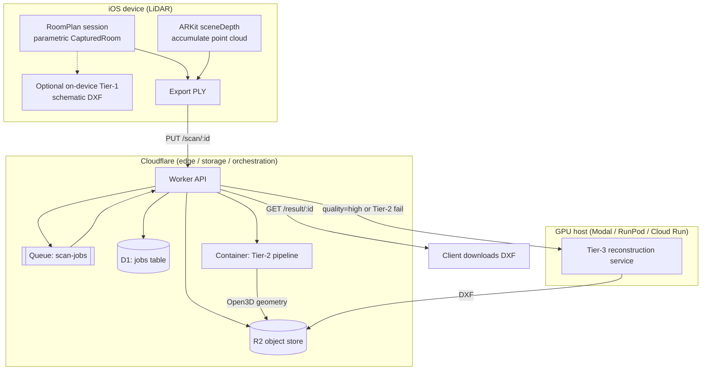

# scan2cad — Architecture Overview & Evaluation Spec

**Status:** target architecture (as designed).
**Audience:** an automated coding agent auditing an existing implementation against this spec.

---

## 0. How to use this document (instructions for the evaluating agent)

This describes the **intended** architecture of a system that scans a physical room on an
iOS device and produces a CAD floor plan (DXF, optionally DWG). Your job is to compare the
**actual repository** against this spec and report divergences.

When you evaluate:

1. **Map each numbered component (§3–§7) to code in the repo.** Note where it lives, or that
   it's missing.
2. **Classify every divergence** as one of: `CORRECT` (matches spec), `DEVIATION` (differs —
   say how, and whether it looks intentional), `IMPROVEMENT` (differs and is arguably better —
   don't flag as a bug), `MISSING` (spec'd but absent), or `EXTRA` (in the repo, not in spec).
3. **Treat §8 (Constraints & Gotchas) as hard checkpoints.** These are subtle correctness items
   that are easy to get wrong and easy to miss in review. Verify each one explicitly.
4. **Do not flag anything in §9 (Out of Scope) as missing** — those are deliberately deferred.
5. **Judge quality against §10 (Fidelity Model), not against an unrealistic bar.** Tier-2 output
   is *supposed* to be schematic. "The floor plan isn't construction-grade" is not a defect for
   Tier-2; it's the design.
6. **Use §11 (Evaluation Checklist) as your actionable rubric.** Walk it item by item.

The spec may predate parts of the implementation, and the implementation may have moved past
the spec. Divergence is expected; your value is characterizing it precisely.

---

## 1. System purpose

Capture a room with the iOS LiDAR scanner and output an editable 2D floor plan in a CAD
interchange format. Reference product class: scan-to-CAD services (e.g. Twindo). Primary
consumers of the output are interior designers and architects who import the DXF/DWG into
CAD/BIM tools.

## 2. End-to-end pipeline

Three processing tiers, increasing fidelity and cost:

- **Tier 1 — on-device (optional):** RoomPlan parametric model → schematic DXF, no server.
- **Tier 2 — server, CPU:** raw point cloud → Open3D plane extraction → rectilinear floor plan.
  The default server path.
- **Tier 3 — server, GPU:** raw point cloud → ML reconstruction (or classical contour fallback)
  → floor plan. Handles curved/complex rooms Tier-2 can't. Triggered on demand.

## 3. Component: iOS capture app

**Framework:** Apple **RoomPlan** (on **ARKit**). Requires a **LiDAR** device (iPhone 12 Pro
and later Pro models; iPad Pro with LiDAR).

**Two capture surfaces — verify which the repo uses:**
- `RoomCaptureView` — Apple's turnkey guided-scan UI. Correct for an MVP.
- `RoomCaptureSession` — lower-level, custom UI, and (iOS 17+) can run on a custom
  `ARWorldTrackingConfiguration` session. **Required if the app also accumulates a point cloud**
  (see below), because you need frame access.

**Two outputs the app must produce:**
1. **Parametric model** — the `CapturedRoom` object (walls, doors, windows, openings, objects,
   each with dimensions + a `simd_float4x4` transform + category). `Codable` → serialize to JSON.
   Feeds Tier-1. Multi-room: merge per-room scans with `StructureBuilder` → `CapturedStructure`
   (iOS 17+).
2. **Raw point cloud** — accumulate `sceneDepth` / `smoothedSceneDepth` LiDAR depth maps across
   frames, unproject to world space, write a **PLY**. This is what Tier-2 and Tier-3 consume.
   **The parametric model alone cannot feed the server tiers** — confirm the app captures depth,
   not just the RoomPlan result.

**Coordinate conventions (critical — see §8):** RoomPlan/ARKit world space is **right-handed,
+Y up, meters**. The PLY is exported in this frame. Server code converts to Z-up.

**On-device Tier-1 (optional):** if present, a Swift path that turns `CapturedRoom` walls into a
DXF directly. Expected approach: wall centerlines from surface transforms → corner = intersection
of adjacent centerlines → miter-offset by half thickness → **R12/AC1009 DXF**. See §8 for the DXF
compatibility rules this must follow.

**Upload:** `PUT /scan/:id` with the PLY body, or (preferred for large clouds) request a presigned
R2 URL and PUT directly to R2 to bypass the Worker body-size limit.

## 4. Component: storage & data contracts

**Object store:** Cloudflare **R2** (S3-compatible).

| Key pattern        | Contents                    | Written by            |
|--------------------|-----------------------------|-----------------------|
| `in/<id>.ply`      | uploaded point cloud        | iOS app (via Worker)  |
| `out/<id>.dxf`     | finished floor plan         | Tier-2 or Tier-3      |

**DXF conventions (both tiers must match):**
- Units carried in the file (`$INSUNITS`); coordinates in **mm** by default.
- Layers: `WALLS`, `ROOM`, and (Tier-1) `OPENINGS` / `DIMS`.
- Walls represented as an **outer** and **inner** closed polyline (the two wall faces), i.e. the
  wall is the region between them.

## 5. Component: Cloudflare orchestration

**Runtime:** a **Worker** (HTTP + Queue consumer), with **R2**, **Queues**, **D1**, and a
**Container** binding. The Tier-2 pipeline runs in the Container; Workers cannot run it (V8
isolates, no native code).

**HTTP endpoints:**

| Method + path                         | Behavior                                                        |
|---------------------------------------|----------------------------------------------------------------|
| `PUT /scan/:id`                       | store PLY at `in/<id>.ply`                                      |
| `POST /process/:id?quality=standard\|high` | create D1 job (`queued`), enqueue, return `202` — **async**  |
| `GET /status/:id`                     | read job row from D1                                            |
| `GET /result/:id`                     | stream `out/<id>.dxf` from R2                                   |

**Async model (verify it is actually async):** `POST /process` must **enqueue and return
immediately**, not run the pipeline inline. The heavy work runs in the Worker's `queue()`
consumer. Client polls `/status` until `done`, then GETs `/result`.

**Job lifecycle (D1 `jobs` table):** states `queued → processing → done` (or `→ error`). Row
carries `status, stage, area_m2, height_m, grid_angle, wall_count, qa (JSON), dxf_key, error,
created_at, updated_at`. **D1 (not KV)** is specified because status needs read-after-write
consistency.

**Queue:** `scan-jobs` with a dead-letter queue `scan-jobs-dlq`, `max_batch_size: 1` (each job
is a heavy container/GPU call), `max_retries: 3`. Failures call `retry()`; final failures
dead-letter and leave `status=error` with the message.

**Container:** class `FloorplanContainer`, fronted by a Durable Object, `instance_type` at the
standard-4 ceiling (**4 vCPU / 12 GiB / 20 GB**), `sleepAfter` a few minutes to dodge cold starts.
The consumer forwards the PLY to the container's `POST /process` and gets back
`{ ok, area_m2, height_m, grid_angle_deg, wall_count, qa, dxf_b64 }`.

**GPU stage (Tier-3):** the consumer calls an external GPU service at `env.GPU_ENDPOINT` (bearer
`env.GPU_TOKEN`) when `quality=high` **or** when Tier-2 returned `ok:false`. See §7 for that
service and the RunPod contract caveat.

## 6. Component: Tier-2 geometry pipeline (server, CPU)

**Location:** a Python module inside the Cloudflare Container, wrapped by a FastAPI server
(`POST /process`, listening on the container's port, e.g. 8080).

**Libraries:** **Open3D** (RANSAC plane segmentation, normals, outlier removal, registration),
**Shapely** (polygon offset / booleans / validation), **ezdxf** (DXF write), **numpy**.

**The eight stages (verify each exists and in this order):**

1. **preprocess** — voxel downsample; estimate normals; statistical outlier removal; rotate
   input **Y-up → Z-up**.
2. **extract_planes** — iterative RANSAC (`segment_plane` in a loop, removing inliers each pass).
   **Must be seeded** for determinism (see §8).
3. **classify** — split planes by normal: horizontal (floor/ceiling), vertical (wall), else
   clutter. Floor/ceiling = lowest/highest horizontal planes.
4. **reject_furniture** — drop vertical planes that don't span enough of floor→ceiling height or
   don't reach the ceiling (cabinet/counter faces). Known limit in §8.
5. **dominant_grid_angle** — find the wall grid rotation using **90°-circular statistics**
   (weight by inlier count), then rotate the scene axis-aligned. (Not per-wall snapping.)
6. **walls_to_lines** — snap each wall to an axis; extract its segment extent from inlier
   projection; **merge collinear fragments** of the same physical wall.
7. **assemble_polygon** — build the room loop as a **corner-graph cycle**: corners = crossings of
   a V wall (x=const) and an H wall (y=const) where both spans reach the crossing; edges = corners
   adjacent along a wall; the boundary is the cycle. Handles L/T/U shapes. Flags non-degree-2
   topology.
8. **write_dxf** — offset the centerline polygon ±half-thickness with **Shapely** (`buffer`,
   mitre join) → outer/inner wall faces → **ezdxf** DXF; optional DWG via ODA File Converter.

**Tunable parameters (should be a config object, not magic numbers):** `voxel_size`,
`ransac_dist`, `min_plane_inliers`, orientation tolerances, `min_wall_height_frac` /
`ceiling_reach_frac` / `min_wall_length` (furniture filter), `merge_offset`, `corner_gap_tol`,
`wall_thickness`, `out_units`, `seed`.

**Honest scope:** single rectilinear rooms, both coordinate conventions, tilt correction,
short-furniture rejection, L/T/U shapes. It **returns no polygon and a QA note** (rather than
mangling) for: multi-room, curved walls, and non-simple corner topology. That is correct behavior,
not a bug.

## 7. Component: Tier-3 reconstruction service (server, GPU)

**Design principle:** a **framework-agnostic core** (`reconstruct.py`, pure Python — no web, no
cloud SDK) wrapped by **three thin deploy adapters** so the same code runs on Modal, RunPod, or
Cloud Run GPU with only the wrapper changing.

**Core contract:** `reconstruct(ply_bytes, cfg) -> (dxf_bytes, metrics)`. Metrics:
`{ ok, backend, area_m2, rooms, vertices, qa }`.

**Pipeline in the core:** load PLY (Y-up→Z-up) → `rasterize` to a top-down **floor mask** +
**density map** + pixel→world affine → backend → `polys_to_dxf` (same Shapely+ezdxf export as
Tier-2).

**Two backends behind one interface:**
- **ContourBackend** — classical: largest filled floor blob → boundary contour
  (scikit-image `find_contours`) → simplify → world polygon. CPU, no weights. **Traces the true
  boundary, so it handles curved/angled rooms** — a genuine complement to Tier-2, and the
  graceful fallback when no checkpoint is loaded. Requires **scikit-image** + **scipy**.
- **MLBackend** — a RoomFormer / PolyRoom-style transformer. **GPU + checkpoint.** This is the
  **integration point**: the body of `predict_pixels()` must be wired to the target repo's
  inference (preprocess density → forward pass → decode room-corner polygons in pixel coords).
  Everything else is shared. Selected automatically when a checkpoint + torch are available.

**Model loading:** a **module-level singleton** (`make_backend`) / a `warm()` called at container
start — weights load **once per container**, not per request (see §8).

**Deploy adapters:**
- `app.py` — FastAPI, `POST /reconstruct { scan_key, out_key }`, bearer auth via `AUTH_TOKEN`.
  Cloud Run GPU entrypoint (`uvicorn app:app`), also the plain-HTTP contract.
- `runpod_handler.py` — RunPod Serverless handler. **Contract caveat:** RunPod nests the body
  under `input` and returns under `output`; the Worker must send `{ input: {...} }` and read
  `.output`, and `GPU_TOKEN` is the RunPod API key. This is the one place the request contract
  differs.
- `modal_app.py` — Modal `@app.cls` with `@modal.enter()` (load once) + a web endpoint.

**R2 access from the GPU side:** boto3 S3 client against the R2 endpoint with an R2 API token
(`R2_ENDPOINT`, `R2_ACCESS_KEY_ID`, `R2_SECRET_ACCESS_KEY`, `R2_BUCKET`). Credential-free
alternative: Worker passes presigned R2 URLs.

## 8. Constraints & gotchas (hard checkpoints — verify each)

- **DXF compatibility:** on-device/Tier-1 hand-written DXF should target **R12 (AC1009)** — no
  handles/subclass boilerplate, opens everywhere. Line endings **CRLF**; coordinates formatted
  **fixed-point** (`%.4f`), never exponential; a real **LAYER table** must exist or entities get
  dropped; `$INSUNITS` set so the file carries its scale. (Server tiers use ezdxf, which handles
  this — but check units.)
- **Coordinate/units correctness:** input is **Y-up, meters**; server converts to **Z-up**; the
  plan-view projection maps plan-Y to **−Z** (using +Z mirrors the drawing). DXF out in **mm**.
- **RANSAC is non-deterministic:** Tier-2's plane segmentation **must seed** the RNG
  (`o3d.utility.random.seed`) or output differs run to run.
- **Wall thickness is assumed, not measured:** RoomPlan/point clouds don't give it. Confirm it's a
  parameter (~110 mm interior), not hard-coded silently.
- **Furniture-rejection limit:** the vertical-extent filter rejects short cabinets but **cannot
  distinguish a full-height wardrobe from a wall.** If accuracy matters, the fix is subtracting
  RoomPlan's object bounding boxes before segmentation, or human review — not a threshold tweak.
- **Corner-graph assumes degree-2 vertices:** Tier-2 assembly is valid for simple rectilinear
  loops; it should **flag** non-degree-2 topology rather than emit a wrong polygon.
- **Cloudflare Containers:** beta — **no GPU**, no built-in autoscaling, **no long-running/
  persistent containers** (request-scoped; orchestrate from the Worker/Queue, not an in-container
  daemon). Per-instance ceiling **4 vCPU / 12 GiB / 20 GB**. **Open3D is ~1.1 GB installed** →
  image ~1.3 GB; keep the image lean and mind the image-size limit. Open3D needs system libs
  `libgl1 libgomp1 libx11-6` (missing `libGL` is the classic headless failure).
- **GPU cold-start lever:** **bake model weights into the image**; never download from a hub at
  cold start (the difference between ~15 s and much worse). Load once per container.
- **GPU sizing:** room-scale reconstruction fits a **T4/L4**; an A100/H100 is over-provisioned and
  wasteful on scale-to-zero.
- **torch/numpy reconciliation:** in the GPU image, torch+CUDA come from the base image; don't
  reinstall. Reconcile numpy if pip conflicts.
- **RunPod `input`/`output` nesting** (see §7) — the one cross-provider contract seam.
- **Privacy:** never put user data in URL query strings; prefer presigned URLs over embedding R2
  credentials in the GPU container; decline non-essential cookies/consent if any web surface
  exists.

## 9. Out of scope / deferred (do not flag as missing)

- Multi-room boolean merging in Tier-2 (per-room export is the current answer).
- Curved-wall handling in Tier-2 (that's Tier-3's job).
- Native **DWG** generation at quality (ODA File Converter / RealDWG) — DXF is the default; DWG is
  optional and licensed.
- A trained/wired **ML checkpoint** for Tier-3 `MLBackend.predict_pixels` — the interface exists;
  the model is the pending integration. Contour fallback covers the gap.
- Straight-skeleton / T-junction wall topology (the general non-rectilinear interior-wall case).

## 10. Fidelity model (judge quality against this)

- **Tier 1 & 2** target **schematic, rectilinear** floor plans (roughly LOD 200): good for space
  planning and rough estimating. Tier-2 assumes a Manhattan-world (orthogonal walls) and squares
  the room to one grid. Slight dimensional approximation and loss of non-orthogonal detail is
  **expected**, not a defect.
- **Tier 3** lifts the ceiling: the contour backend preserves true (curved/angled) boundaries; the
  ML backend adds regularized topology. Still not construction-grade on its own.
- **Construction-grade** output (the incumbent-service bar) requires a **human-in-the-loop review**
  step. If the repo targets that, expect a review queue; if not, schematic is the correct bar.

## 11. Evaluation checklist

**iOS capture**
- [ ] Uses RoomPlan; gated to LiDAR-capable devices.
- [ ] Captures a **raw point cloud** from `sceneDepth` (not only the parametric `CapturedRoom`).
- [ ] Exports a **PLY** in the ARKit (Y-up, meters) frame.
- [ ] Multi-room merge via `StructureBuilder` if multi-room is claimed.
- [ ] Upload path (`PUT /scan/:id` or presigned-R2 direct upload) exists and handles large files.
- [ ] (If Tier-1 present) DXF follows the §8 R12/CRLF/fixed-point/layer-table rules.

**Cloudflare orchestration**
- [ ] `POST /process` is **async** (enqueues + returns `202`), not synchronous.
- [ ] `queue()` consumer does the heavy work; failures `retry()` and dead-letter.
- [ ] Job status in **D1** with the full lifecycle and fields (§5).
- [ ] Container binding is DO-fronted at the correct instance size; consumer forwards PLY and
      persists the returned DXF to `out/<id>.dxf`.
- [ ] `GET /status` and `GET /result` behave as specified.

**Tier-2 pipeline**
- [ ] All eight stages present and ordered (§6).
- [ ] RANSAC is **seeded**.
- [ ] Grid detection uses 90°-circular stats + scene rotation (not per-wall snapping).
- [ ] Assembly is the corner-graph cycle; non-degree-2 topology is flagged.
- [ ] Parameters are a config object; `wall_thickness` is a parameter.
- [ ] Returns a QA note + no polygon for multi-room / curved / non-simple cases.
- [ ] Uses the pinned libraries (Open3D, Shapely, ezdxf, numpy) with a correct system-lib install.

**Tier-3 GPU service**
- [ ] Core (`reconstruct`) is framework-agnostic; three deploy adapters wrap it unchanged.
- [ ] ContourBackend runs without weights and handles curved rooms.
- [ ] MLBackend interface exists; `predict_pixels` is the isolated integration point.
- [ ] Weights load **once per container**; weights are baked into the image.
- [ ] GPU sized T4/L4; scale-to-zero.
- [ ] R2 access via boto3 (or presigned URLs); bearer auth matches the Worker's `GPU_TOKEN`.
- [ ] RunPod adapter accounts for the `input`/`output` nesting.

**Cross-cutting**
- [ ] Coordinate conversion (Y-up→Z-up, plan-Y→−Z) correct; DXF units in mm.
- [ ] No secrets/user data in URLs; presigned URLs preferred over embedded credentials.
- [ ] Error states surface to `/status` with a message; nothing fails silently.

## 12. Tech-stack summary

| Layer            | Tech / library                         | Role                                             |
|------------------|----------------------------------------|--------------------------------------------------|
| iOS capture      | RoomPlan, ARKit (Swift)                | scan + parametric model + point cloud            |
| On-device CAD    | hand-written R12 DXF (Swift)           | optional Tier-1 schematic export                 |
| Edge / API       | Cloudflare Workers                     | HTTP, async orchestration, queue consumer        |
| Storage          | Cloudflare R2 (S3 API)                 | point clouds in, DXFs out                        |
| Queue            | Cloudflare Queues (+ DLQ)              | decouple upload from processing                  |
| Job state        | Cloudflare D1 (SQLite)                 | strongly-consistent job status                   |
| Tier-2 compute   | Cloudflare Containers                  | run the native Open3D pipeline (CPU)             |
| Tier-2 geometry  | Open3D, Shapely, ezdxf, numpy          | plane extraction → floor plan → DXF              |
| Tier-3 compute   | Modal / RunPod / Cloud Run GPU         | scale-to-zero GPU inference (T4/L4)              |
| Tier-3 geometry  | scikit-image, scipy, Shapely, ezdxf    | contour fallback + shared export                 |
| Tier-3 model     | RoomFormer / PolyRoom (torch)          | ML reconstruction (integration point)            |
| DWG (optional)   | ODA File Converter / RealDWG           | native DWG, licensed                             |
