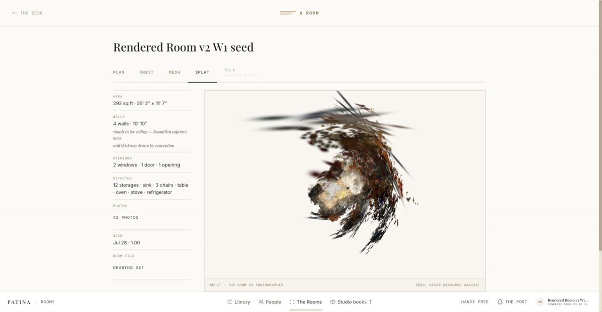
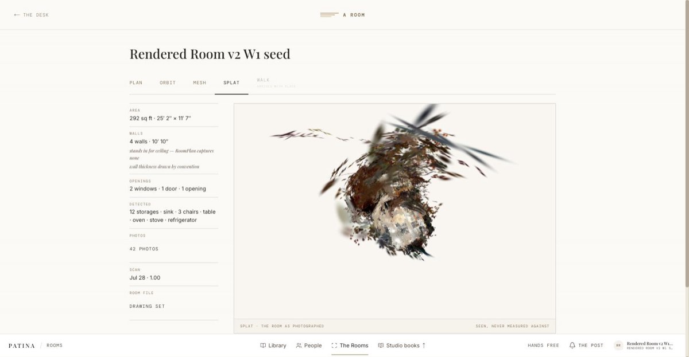

# The Rendered Room v2 — W2 staging evidence

> **Status:** staging evidence · **Date:** 2026-08-19 · **Wave:** W2 (GPU lane)
> **Companions:** `W1-EVIDENCE.md`, `DELIVERY-PLAN.md`, `ARCHITECTURE.md`, `PROPOSAL.md`
> **Format:** follows `docs/engineering/patina-cloudflare-phase-1-staging-evidence.md`

Everything below ran against **staging only** — Supabase project
`vuesoyhfrjabfxbrzekd` and Modal environment `patina-staging`. The production
ref `bkvcixdmuyejfzcijpdg` was read exactly twice, read-only and under standing
authorization, for the two things staging cannot synthesize: the posed-photo
scan bundle (§2) and one source USDZ (§8). No production Modal environment
exists.

This document is in two halves. **§1–§6 are the first pass** — what was built,
what ran, and the five defects it found. **§7 onward is the close** — those
defects fixed and the lane run to a real artifact.

**Headline.**

| Lane | Outcome |
|---|---|
| `renders` (Cycles, L40S) | **PASS**, and then re-pointed. The stage worked mechanically from the first run; its *subject* was wrong (a floor-only GLB) and is now the parametric room (§10). |
| `splat` (splatfacto, L4) | **PASS end to end** after four fixes. Real posed photos → `.spz` in R2, registered, verified, referenced (§9). First pass was BLOCKED. |

---

## 1. What is deployed

`modal deploy -m scan_modal.app --env patina-staging` — app `patina-scan`
(`ap-zLm5zIIytE9TgWWkipevm8`), functions `verify`, `splat` (L4), `renders`
(L40S), `spawn`. The three images built during W2 prep and are cached: each
redeploy in the first pass completed in **~1.9 s**.

The close redeployed once more, rebuilding only the SPZ tail (§7.1) — **51.8 s**
total, of which 44 s was the C++ build — and redeployed the
`dispatch-scan-modal` edge function to `vuesoyhfrjabfxbrzekd`. Nothing else was
deployed anywhere; in particular `services/aesthete-inference` is **committed but
not deployed** (§8, open item 3).

### `scan-r2` is real now — W1 open item 2 is CLOSED

W1 recorded the `scan-r2` Secret as "a placeholder, all three values empty".
It now carries all **four** required keys and works. Probed on CPU from inside
`patina-staging` (values never printed):

```json
{"bucket": "patina-staging-media-artifacts-us",
 "present": {"R2_ENDPOINT": true, "R2_ACCESS_KEY_ID": true,
             "R2_SECRET_ACCESS_KEY": true, "R2_ARTIFACTS_BUCKET": true},
 "list_ok": true, "key_count": 0, "rw_ok": true}
```

`rw_ok` is a full PUT → GET → DELETE round trip, so the credential has real
write scope on the right bucket, not merely read. `key_count: 0` is the
pre-run state — the bucket was empty before this wave.

---

## 2. The fixture, and the defect that came with it

`room_scans` `cd72ad9b-da14-5eee-a8c7-1f71ace9db12`
(`seed:rendered-room-v2-w2-prod-copy`), `room_files`
`5bc4cef2-44fd-5d6f-b7fc-3dfe005e99ab` v1, copied from prod by `08d7be60`.

It is a genuinely rich room. `captured_room.json` (253,804 B) carries
**4 walls, 1 floor, 2 windows, 1 door, 1 opening, 20 objects, 2 sections**
(one labelled `kitchen`), and 42 photos at 1440 × 1920.

**But it landed with zero camera poses.**

```sql
select count(*) as images, count(camera_transform) as with_transform,
       count(camera_intrinsics) as with_intrinsics
from public.room_scan_images where scan_id = 'cd72ad9b-…';
-- images = 42, with_transform = 0, with_intrinsics = 0
```

`scripts/scan-staging-seed/seed_scan.py`'s `copy-prod` **SELECTs**
`camera_transform, camera_intrinsics` from the prod rows and then omits both
from the insert dict it builds for staging. The bundle also has no
`photos_metadata.ndjson` sidecar, so those two columns were the *only* pose
carrier — and copying a real posed scan is the entire reason `copy-prod` was
written.

The pipeline refused correctly and cheaply. Dispatch, not a GPU:

```
{"claimed":2,"spawned":1,"failed":1,"deferred":0,"error":null}
agent_tasks.last_error = "scan has no photos manifest and no pose-bearing
                          room_scan_images rows"
```

`isPoseBearing` dropped all 42 rows before the cap and `resolveDispatchInputs`
threw before signing a single URL. **No GPU was allocated.** That is the
guard working exactly as designed — but it leaves the fixture untrainable.

**Fixed** in `a6d5c04f`. The remedy is one re-run of `copy-prod`, which needs a
read against prod and therefore sits outside this lane's rails.

---

## 3. `renders` — first pass: PASS end to end, on the wrong subject

### Run 1 (as dispatched)

Enqueued through `enqueue_agent_task`, dispatched by invoking
`dispatch-scan-modal` directly with the staging service-role bearer.

| | |
|---|---|
| Task | `a4bfca96-49f3-40ea-9835-2acc9b114b4b` → `done`, attempts 1 |
| Dispatch | `{"claimed":1,"spawned":1,"failed":0,"deferred":0}` HTTP 200 |
| Wall clock | **70,649 ms** for 29 frames, including cold start |
| GPU | L40S, Cycles + OptiX, 96 samples/frame, ~1.5–1.9 s per frame |
| Output | 29 JPEGs, 821,899 B total (26,427–39,219 B each) |

Ledger — the two-row shape `renders_job` promises:

| stage | event | status | duration_ms | created_at |
|---|---|---|---|---|
| renders | started | started | 0 | 03:44:29.033Z |
| renders | completed | succeeded | **70 649** | 03:45:38.957Z |

Registry, all 29 rows:

```sql
select count(*) rows, count(*) filter (where lifecycle_state='stored') stored,
       count(distinct sha256) distinct_sha, sum(size_bytes) total
from public.media_objects
where object_key like 'scan_artifacts/cd72ad9b-…/v1/%';
-- rows 29 | stored 29 | distinct_sha 29 | total 821899
-- bucket patina-staging-media-artifacts-us | mime image/jpeg
-- access_class authenticated_project
```

`room_files.artifacts.renders` carries the hoisted cover and the full manifest:

```json
{"object_id": "7ca139c2-adb7-4177-b9f6-26331244b548",
 "version": 1, "cover": "top_down", "count": 29,
 "shots": { "corner_ne": …, "corner_nw": …, "corner_se": …, "corner_sw": …,
            "top_down": …, "turntable_000" … "turntable_023" }}
```

**R2 reconciles against the registry exactly.** Listing the prefix from inside
Modal returned **29 objects, 821,899 B**, and each object's sha256 computed
over the downloaded bytes equals the `media_objects.sha256` written at upload
time. The registry describes what is actually in the bucket.

### The bug run 1 exposed, and run 2's proof

The cover plate — the one image `artifacts.renders.object_id` hoists — was
**clipped**. The floor ran off the top and the bottom-right of the frame.

`_top_down_shot` framed on `max(sx, sy)`. Blender maps `ortho_scale` onto the
**larger render dimension** (the 1280 px width), so the visible height is only
`ortho_scale × 960/1280`. The expression compared a depth measured in height
units against a width measured in width units, and cropped any room deeper
than three quarters of its width. This room is 8.23 m × 7.51 m — a 0.91 ratio
— so it framed at 9.05 m and needed 10.01 m.

The golden case is a 4 m × 3 m room. **Its 0.75 aspect is exactly the render's**,
the one shape for which the old expression is also correct, so the assertion
passed on the single fixture that could not fail.

Fixed in `e1654150`:
`ortho_scale = max(sx, sy × RENDER_WIDTH/RENDER_HEIGHT) × TOP_DOWN_PADDING`.

Redeployed and re-run over the same scan:

| | Run 1 | Run 2 (post-fix) |
|---|---|---|
| duration_ms | 70 649 | **65 087** |
| frames | 29 | 29 |
| `top_down.jpg` sha256 | `b4d6fb9d…` | `3c520ae6…` |
| cover framing | clipped top + bottom-right | **fully contained, padded on all sides** |

Verified visually: both plates were downloaded from R2 and read as images. The
post-fix plate contains the whole floor polygon with margin. The `media_objects`
row for `top_down.jpg` kept its id (`7ca139c2-…`) across the re-run and took a
new sha256 and size — register-by-key is idempotent, and a re-render updates in
place rather than orphaning a row.

### The finding the renders lane cannot fix for itself

**`scan.glb` contains a floor and nothing else.** 1,196 bytes, one mesh node:

```
meshes: ['Floor0']   nodes: ['Floor0']   materials: []
accessors: VEC3 × 24, SCALAR × 36
generator: pygltflib@v1.16.5
```

So every one of the 29 renders is a bare white slab on a grey ground. They are
correct renders of the model they were given. But the walls, windows, door,
opening and 20 objects all exist — in `captured_room.json`, which the
`renders` stage never reads. The GLB comes from `convert_usdz_to_glb`
(`services/aesthete-inference/app/usdz.py`), one node per USD mesh prim, and
for this scan the USDZ evidently carried only the floor prim.

The renders lane is mechanically complete and its output is presently
worthless as a picture of a room. Resolving that is an upstream decision — see
open item 1.

---

## 4. `splat` — first pass: training runs, the artifact tail is blocked

Because §2 left the real fixture unposed, a clearly-marked staging-only twin
was built to exercise the stage's runtime:
`room_scans` `95284896-de86-55c1-9877-3ecc12333629`
(`seed:rendered-room-v2-w2-splat-smoke-synthetic-poses`), `room_files`
`6762898e-a617-500d-8c98-6596c261f650` v1.

It reuses the **same `user_id`, the same `room_id`, and the same storage object
keys** — no bytes were copied and the real fixture's rows were never touched —
and attaches a synthetic 1 m ring of outward-looking ARKit cameras plus
intrinsics in the native landscape frame (1920 × 1440 against 1440 × 1920
pixels, so `PhotoPose.needs_right_rotation` fires — the portrait correction
that had never run on real image extents).

**The reconstruction this produces is meaningless as geometry.** Real photos
paired with fabricated poses. It is a mechanical smoke of the stage, and every
conclusion below is about machinery, not about splat quality.

### The photoRecords fallback fired — proven at the dispatcher

```json
{"ts":"2026-08-19T03:59:50.190Z","fn":"dispatch-scan-modal",
 "event":"dispatch_spawned","task_id":"90e1fbe8-…","scan_id":"95284896-…",
 "task_type":"scan_pipeline.splat","http_status":202,
 "photos_source":"rows"}
```

`photos_source: "rows"` with `http_status: 202`. The sidecar is absent, the
dispatcher read `room_scan_images`' own pose columns, inlined 42 records, and
Modal accepted the body. **The fallback path works.**

### What ran

| Run | Iterations | Started | Ended | Duration | Outcome |
|---|---|---|---|---|---|
| 1 (dispatched) | 30 000 | 03:59:56Z | 04:25:33Z | 1 537 225 ms | stopped by the operator at ~step 10 000 |
| 2 (direct) | 3 000 | 04:26:53Z | 04:31:49Z | 296 291 ms | `ns-train splatfacto exited 1` |

Run 1 got the whole head of the stage working on real inputs: 42 photos
downloaded, transcoded to JPEG, `transforms.json` written, nerfstudio loaded
the dataset, gsplat compiled its CUDA kernels, and splatfacto trained —
**1,372,643 Gaussians by step 4,600**.

### Defect A — nerfstudio's run directory is four levels, not three (FIXED)

Run 1 logged:

```
logging events to: /splat-cache/95284896-…/v1/output/splatfacto/splatfacto/patina
```

`workspace_paths` modelled `<output-dir>/<method>/<timestamp>`. nerfstudio
writes `<output-dir>/<experiment-name>/<method>/<timestamp>` — experiment and
method are separate levels even when both are `splatfacto`.

Two silent consequences: `ns-export --load-config` pointed at a `config.yml`
nerfstudio never wrote, so **every run would have failed after paying for a
full training pass**; and `resume` could never find a checkpoint, defeating the
preemption Volume the whole stage is built around.

The unit suite could not see it — every test builds its fixture directories
from `workspace_paths` and then asserts `workspace_paths`, so both sides moved
together. Fixed in `2a04a8eb`, with a test that derives the expected path from
the `ns-train` argv instead.

### Defect B — the SPZ converter does not exist in the image (HARD BLOCKER)

`core/spz.py` ships `DEFAULT_SPZ_COMMAND = "spz convert {input} {output}"`.
The binary is installed and on PATH. Its complete command surface:

```
$ which spz     → /usr/local/bin/spz
$ spz --version → spz 0.0.5
$ spz --help
SPZ file format handling for Rust, and CLI tooling.
Usage: spz [COMMAND]
Commands:
  info
  help  Print this message or the help of the given subcommand(s)

$ spz info --help
Usage: spz info [OPTIONS] <SPZ_PATH> [COORDINATE_SYSTEM]
```

**There is no `convert` subcommand.** `info` *reads* an existing `.spz`. The
crate is pinned to 0.0.5 because 0.0.6 dropped the binary target entirely, so
no version of this crate converts anything.

The documented fallback is not a fallback either — the PyPI `spz` package does
not import inside the image at all:

```
ImportError: cannot import name 'BoundingBox' from partially initialized
module 'spz' (most likely due to a circular import)
  (/usr/local/lib/python3.11/site-packages/spz/__init__.py)
```

It has no cp311 wheel and was built from sdist through maturin; the built
extension is broken.

**As built, `_SPLAT_IMAGE` has no working PLY → SPZ path.** Every splat run
would train for tens of minutes, export a `.ply`, and then fail at
`compress_ply_to_spz` with `spz exited 2`. Picking the replacement converter
(Niantic's reference C++ `nianticlabs/spz`, or something else) is a dependency
decision and is left for a ruling — see open item 2.

This was established on **CPU, for $0.00**, by running the same cached image
without a GPU. `core/spz.py`'s own docstring predicted exactly this failure
mode: "the CLI's exact argument spelling is the part most likely to move under
us". It had moved before the first run.

### Defect C — the iteration budget does not fit the time budget

Measured on the L4 at 1440 × 1920 × 42 frames:

| Step | ms/iter | Reported ETA |
|---|---|---|
| 4 550 | 48.8 | 20 m 41 s |
| 7 470 | 119.2 | 44 m 45 s |

Iteration cost more than doubles as densification proceeds. Extrapolating,
30 000 iterations is **~55 minutes**, against:

- `TRAIN_TIMEOUT_S = 3000` (50 min) — the run is killed before it finishes;
- `SPLAT_TIMEOUT_SECONDS = 3600` (60 min) — no headroom for download,
  transcode, export, compression and upload;
- `claim_agent_tasks(p_visibility_timeout: "30 minutes")` — commented in
  `index.ts` as covering "splat's 10-25min Modal run".

The lease is the sharpest of the three. A run that trains for 35 minutes and
succeeds would find its lease expired and have **every ledger write refused
with P0403** — it would burn a full L4 pass and then discard the result as
`lease_rejected`. The plan's "10–25 minutes on an L4" holds only at a much
smaller frame count or a downscaled input.

### Defect D — the checkpoint is committed only on success

`run_splat` calls `checkpoint_commit()` after `ns-train` returns 0. An
uncommitted Modal Volume write does not survive the container, so a run killed
mid-training — a preemption, the 3000 s timeout, an operator stop — loses
everything, which is precisely the case the Volume exists for. Observed: run 2
found no workspace from run 1 and re-downloaded and re-transcoded all 42
photos. `retries=modal.Retries(max_retries=2)` therefore retries from zero, not
from a checkpoint.

### Defect E — `inputs.config` is unreachable from the queue

`splat_job` reads `inputs.config.maxIterations`, but `resolveDispatchInputs`
builds each stage's `inputs` field-by-field from a deliberately **closed**
shape and never receives the task payload, so nothing enqueued can set it.
The cost knob the delivery plan will want is dead configuration today. This is
why run 2 was invoked directly against the deployed function rather than
through the dispatcher.

### What the ledger discipline did right under all of this

Worth recording, because these are the paths that cost money when they are
wrong, and all three fired correctly on real failures:

- **Operator stop → clean release.** Killing run 1's container raised
  `KeyboardInterrupt` inside the job; the `finally` wrote a `failed` event and
  `fail_task`, and the task returned to `queued` with `locked_by = null`. No
  task was left claimed.
- **Superseded lease → clean abandon.** Modal's automatic retry of run 1's
  original spawn arrived after the lease had moved, and exited without writing:
  `{"fn":"scan-modal-splat","event":"lease_rejected","taskId":"90e1fbe8-…"}`.
- **Redacted errors.** `agent_tasks.last_error` reads
  `RuntimeError: ns-train splatfacto exited 1` — no signed URL, no workspace
  path.

Run 2's own failure was `CUDA error: device-side assert triggered` inside
`gsplat/strategy/ops.py::split` during densification. That is almost certainly
the fabricated poses — real pixels against invented cameras give a nonsense
photometric loss — and is **not** offered as evidence about the real pipeline.

---

## 5. Fixes made in the first pass

| Commit | What |
|---|---|
| `a6d5c04f` | `fix(scan-staging-seed)`: copy `camera_transform` / `camera_intrinsics`, without which splat cannot run (§2) |
| `e1654150` | `fix(scan-modal)`: the top-down plate cropped every room deeper than 3:4 (§3) |
| `2a04a8eb` | `fix(scan-modal)`: nerfstudio's run directory is four levels, not three (§4 A) |

Unit suite after all three: **246 passed** (`.venv/bin/python -m pytest -q` in
`services/scan-modal`) and **44 passed** in `scripts/scan-staging-seed`.

---

## 6. Cost — first pass

| Item | Measure |
|---|---|
| Modal metered, whole wave | **$0.79** (Deployed Apps $0.79, Ephemeral $0.01) |
| Modal billed | **$0.00** — covered by credits |
| `renders`, per run | ~65–71 s on L40S ≈ **$0.035–0.038** |
| `splat`, run 1 | 25.6 min on L4 ≈ **$0.34** (stopped early, no artifact) |
| `splat`, run 2 | 4.9 min on L4 ≈ **$0.07** (failed, no artifact) |
| CPU probes (R2, spz, ns-export, artifact pulls) | ≈ **$0.01** |

Well inside the $5 abort threshold and the $42.50 workspace cap. No container
was left running; `modal container list --env patina-staging` is empty.

The two splat tasks were **cancelled** rather than left to back off, because
pg_cron sweeps every 5 minutes and each retry allocates an L4 that cannot
succeed until Defect B is resolved.

---

## 7. The close — what changed

Five defects from §2–§4, plus the floor-only GLB from §3, resolved in four
commits. Each is stated as the thing that was wrong, not the code that moved.

| Commit | What it fixes |
|---|---|
| `35aae854` | `scan-modal`: the SPZ converter, the three time budgets, the checkpoint commit, and the renders subject |
| `d4759383` | `dispatch-scan-modal`: per-task-type lease, the superseded-task guard, the renders input contract |
| `386baaad` | `aesthete-inference`: the USDZ→GLB converter dropped every wall and object |
| `a6d5c04f` | (first pass) `scan-staging-seed`: `copy-prod` selected the pose columns and dropped them |

### 7.1 The SPZ converter now exists — open item 2 CLOSED

The crates.io route could not be made to work at any version: 0.0.5's entire
CLI is `spz info`, and 0.0.6 dropped the binary target. The PyPI wheel has no
cp311 build and its maturin sdist does not import.

The converter is now **Niantic's own C++ reference implementation**, the one the
format is defined by, built from source in `_SPLAT_IMAGE`:

- repo `github.com/nianticlabs/spz`, tag **`v3.0.0`**, pinned by commit
  **`5bf2945de1a003cee07133b1e495fe9c6ffdc7e7`** — and the SHA is asserted
  after checkout, because a tag is a movable ref and "we built the tag" is not
  the same claim as "we built these bytes";
- `SPZ_BUILD_TOOLS=ON` (its default) produces `ply_to_spz`, installed at
  `/usr/local/bin/ply_to_spz`;
- zlib and zstd come from `apt` so CMake's `find_package` succeeds rather than
  `FetchContent`-ing both over the network on every rebuild;
- the last build step **runs the binary** and greps its usage line, so a
  converter that does not execute fails the image build rather than an L4.

Its argv is two positionals and nothing else — read off `ply_to_spz.cpp`, a
24-line file whose whole usage string is `Usage: ply_to_spz <input.ply>
<output.spz>`. `DEFAULT_SPZ_COMMAND` is now that, spelled as an absolute path
because the image rewrites `PATH` twice during the build.

The layers *above* this one were deliberately left alone, including the inert
PyPI `spz` install: removing them would invalidate the torch/nerfstudio layers
and force a multi-hour rebuild to delete something that does nothing. The
redeploy that shipped this took **51.8 s**.

**The escape hatch.** `SPZ_MODE=gzip-ply` skips the converter, gzips the PLY,
and stores it as `room.ply.gz` with `Content-Encoding: gzip` — so an HTTP client
inflates it in transit and receives exactly the `.ply` the portal's Spark reader
already parses. The encoding is recorded two ways on purpose: R2 gets a bare
`Content-Type` plus the encoding header, and `media_objects.mime` gets
`application/octet-stream; content-encoding=gzip`, so the row describes the
bytes without anyone fetching them. The gzip is written with `mtime=0`, because
the default header stamps the wall clock and would make two runs of an unchanged
splat differ in sha256 for no reason anyone could act on.

Both modes are unit-tested: the `spz` path with the subprocess faked (the argv
is data, and the point is that its spelling is checked), the `gzip-ply` path for
real — it must produce bytes that actually inflate back to the PLY, or it is not
a fallback.

### 7.2 The three time budgets, reconciled — open item 4 CLOSED

§4 C measured what §4's plan had guessed at. All three numbers now come from the
measurement:

| Budget | Was | Now | Why |
|---|---|---|---|
| `TRAIN_TIMEOUT_S` | 3000 s (50 min) | **4800 s** | 30k iterations is ~55 min; the old value killed a correct run |
| `SPLAT_TIMEOUT_SECONDS` | 3600 s | **7200 s** | training plus the download head and the export/compress/upload tail |
| dispatcher visibility timeout | 30 min, all stages | **90 min for splat**, 30 for the rest | the lease is the one that silently discards completed work |

`claim_agent_tasks` takes a single `p_visibility_timeout` per call, so the batch
is now claimed in **groups by lease length** — splat first and alone, then
verify/renders — with `BATCH_LIMIT` spent across the groups rather than per
group, so the split cannot double the batch.

### 7.3 The checkpoint is committed during training — open item 5 CLOSED

A `CheckpointCommitter` polls the checkpoint directory on a daemon thread and
commits the Volume each time a **new** checkpoint lands. Identity is
`(name, mtime_ns, size)`, not name alone, because nerfstudio rewrites
`step-000030000.ckpt` in place on the final save — the most valuable write of
the run, and the one a name-only marker would miss.

Two properties are the whole point and both are tested:

- the watcher's shutdown is in a `finally`, so a run killed by preemption, by
  the training timeout, or by an operator still leaves its last checkpoint
  durable — `modal.Retries` now resumes rather than restarting from zero;
- a failing commit is logged and swallowed **and does not advance the marker**,
  so a transient Volume error cannot kill a training run minutes from a usable
  result, and the next poll retries.

### 7.4 A superseded task can no longer be re-dispatched forever — open item 9 CLOSED

The guard runs before input resolution and before the spawn: if the task's
`room_file_version` is no longer the max for its scan, the task is completed as
`done` with a fixed literal `{"dispatch_outcome": "superseded"}` instead of
being dispatched. A failed `room_files` lookup is deliberately **not**
superseded — an unreadable table is a transient fault and must never park a live
task permanently.

**It fired on real data on its first invocation.** W1's verify task
`abad722d-1f97-429e-b267-66c8a74c8770` — room_files v1 against a scan at v4, and
the exact task §7's first pass recorded at `attempts` 7 against `max_attempts` 5
— was claimed and closed out:

```
{"claimed":2,"spawned":1,"failed":0,"deferred":0,"superseded":1,"error":null}
```
```sql
-- abad722d: status = done, attempts = 9, locked_by = null,
--           artifacts->>'dispatch_outcome' = 'superseded',
--           last_error = 'room_file_version superseded by a newer version for this scan',
--           completed_at = 2026-08-19 05:03:44Z
```

Nine attempts is what an unbounded loop looks like against a cap of five. It is
free on a CPU stage; on `splat` this shape would have allocated an L4 every five
minutes, indefinitely.

---

## 8. The floor-only GLB — diagnosed, and it is a converter bug

Open item 1 asked whether the USDZ was floor-only (an iOS/RoomPlan export
problem) or whether the converter dropped nodes. **It is the converter.**

The source USDZ for prod scan `83f0d63d-cc35-4320-bf80-67d473af52f3` was pulled
read-only (53,425 bytes, sha256 matching that row's own
`artifacts_sha256.usdz`) and read locally. It is an uncompressed zip of plain
ASCII `.usda`, so no USD tooling was needed to answer the question: it
references **4 walls, 1 door, 2 windows, 1 opening, 1 floor and 20 objects** —
the same inventory `captured_room.json` carries.

The cause is one line in `services/aesthete-inference/app/usdz.py`:

```python
for prim in stage.Traverse():
    if not prim.IsA(UsdGeom.Mesh):
        continue
```

RoomPlan writes exactly **one** `UsdGeom.Mesh` per capture — the floor, which it
pre-triangulates from the room outline. Every wall, door, window, opening and
object is a `UsdGeom.Cube` (`def Cube "Wall0"`, sized by a non-uniform
`xformOp:scale`), and `Cube` is a sibling `Gprim`, not a `Mesh` subclass. So the
traversal skipped all 28 of them and emitted the floor.

Fixed in `386baaad`. A `Cube`'s geometry is implicit — `size` is the edge length
of a cube on its own origin, and RoomPlan always leaves it at 1, carrying the
real dimensions in the scale — so the branch synthesizes the 8 corners and a
fixed 12-triangle index table and hands them to the existing world-transform and
accessor path unchanged. Measured on that same USDZ:

| | Before | After |
|---|---|---|
| GLB bytes | 1,196 | **23,948** |
| nodes | 1 | **29** |
| names | `Floor0` | 4 walls, 2 windows, `Door0`, `Opening0`, 20 objects, `Floor0` |

**The old fixture could not have caught this.** `tests/fixtures/box-room.usdz` is
made entirely of Meshes — the one shape for which a Mesh-only traversal is also
correct. The same failure as the top-down cropping bug in §3: a golden case
whose geometry was exactly the degenerate case. A second fixture,
`roomplan-room.usdz`, now has RoomPlan's real encoding, and the new tests assert
both that the cubes survive and that their non-uniform scale reaches the vertex
data.

**Not deployed.** `aesthete-inference` is outside this lane's rails. The fix is
committed and tested; shipping it is a separate, cheap step — and the renders
lane no longer depends on it either way (§10).

---

## 9. `splat` — the real run

### 9.0 The converter proved before the GPU, not after

The whole reason §4 B was expensive is that it was found *after* a training run.
So the pinned binary was exercised against a **nerfstudio-shaped 3DGS PLY** —
the exact property set `ns-export gaussian-splat` writes (`x,y,z`, `nx,ny,nz`,
`f_dc_0..2`, `f_rest_0..44`, `opacity`, `scale_0..2`, `rot_0..3`, all
`property float`, binary little-endian) — inside the same cached `_SPLAT_IMAGE`,
**on CPU, for $0.00**, while the real run was still training:

```json
{"binary_present": true, "gaussians": 500,
 "ply_bytes": 125528, "returncode": 0,
 "stdout": "[SPZ] Loading: /tmp/splat.ply\n[SPZ] Loading 500 points\n",
 "stderr": "", "spz_bytes": 19802, "ratio": 6.34,
 "spz_magic": "4e475350"}
```

`4e475350` is `NGSP` — SPZ's own container magic. The property names matter:
`load-spz.cc` looks up `f_dc_0`, `scale_0`, `rot_0`, `opacity` by name and
rejects any non-`float` vertex property, so "it compiles" and "it accepts our
exporter's output" are different claims and both are now made.

### 9.1 The run

Task `0ec918dd-9291-4c1f-8e7f-7697e5012df5`, enqueued through
`enqueue_agent_task`, dispatched by invoking `dispatch-scan-modal` with the
staging service-role bearer. One attempt, no retry, no resume.

| | |
|---|---|
| Dispatch | `{"claimed":2,"spawned":1,"failed":0,"deferred":0,"superseded":1}` HTTP 200 |
| Fixture | `cd72ad9b-…` v1 — the prod copy, **now posed** (§2 re-run) |
| Pose carrier | `photosSource: "rows"` — the inline `room_scan_images` fallback |
| Frames | **42** used, **0** missing |
| Iterations | 30 000 (unchanged) |
| Wall clock | **3 846 244 ms = 64.1 min** (05:03:50Z → 06:07:56Z) |
| Gaussians | **1 151 258** exported of 1 153 078 trained (1 820 dropped for low opacity, **0 NaN/Inf**) |
| `.ply` | **285 513 578 B** (272.3 MiB) |
| `.spz` | **25 798 805 B** (24.6 MiB) — **11.07×** |
| Compression | `spz` — the real converter, not the fallback |
| Checkpoint commits | **15** — one per `STEPS_PER_SAVE`, exactly as designed |

Ledger, the two-row shape:

| stage | event | status | duration_ms | created_at |
|---|---|---|---|---|
| splat | started | started | 0 | 05:03:50.423Z |
| splat | completed | succeeded | **3 846 244** | 06:07:56.416Z |

Registry and reference:

```sql
-- media_objects
-- a9b6cbb8-4d32-4967-a23d-7b4c50174657
-- bucket patina-staging-media-artifacts-us
-- key    scan_artifacts/cd72ad9b-…/v1/room.spz
-- state  stored | mime application/octet-stream | 25798805 B
-- sha256 36e27fe937e3a33474cb2c3eff20db0aa880d63fb978188e54b9d47f33536b91
-- access_class authenticated_project

-- room_files.artifacts->'splat'
-- {"version": 1, "object_id": "a9b6cbb8-4d32-4967-a23d-7b4c50174657"}
```

`artifacts.renders` **survived the write** (still `count: 29`) — 00490's
`artifacts || p_artifacts` is a merge, so a second stage adds its ref rather
than replacing the first's.

### 9.2 The three budgets, checked against the run that used them

This is the number that matters most, because every one of the old values would
have destroyed this run:

| Budget | Old value | Actual 64.1 min run | New value |
|---|---|---|---|
| `TRAIN_TIMEOUT_S` | 3000 s (50 min) | **would have been killed** at 50 min | 4800 s — held |
| `SPLAT_TIMEOUT_SECONDS` | 3600 s (60 min) | **would have been killed** at 60 min | 7200 s — held |
| dispatcher lease | 30 min | **every ledger write refused with P0403** at 30 min | 90 min — held |

The run finished at 64.1 minutes. The plan's "10–25 minutes on an L4" was wrong
by a factor of three, and all three guards were sized against the plan rather
than against a measurement. They are now sized against this row.

### 9.3 The artifact is real, and the registry describes it

Fetched through the capability URL (§9.4) and parsed locally:

```
magic     : 4e475350  = "NGSP"      (SPZ container magic)
version   : 4                        (SPZ 4 — the current generation)
numPoints : 1,151,258                (== the exporter's own count)
shDegree  : 3                        (full spherical harmonics)
sha256    : 36e27fe9…                (== media_objects.sha256, exactly)
bytes     : 25,798,805               (== media_objects.size_bytes, exactly)
```

The sha256 of the bytes a client actually receives equals the digest written at
upload time. The registry is not merely present, it is **correct**.

### 9.4 The read path — capability URL, end to end

`GET /v1/scan/room-files/{roomFileId}/artifacts/{kind}` on the staging edge
worker, authenticated with a **user** JWT (never service_role) minted by a
Supabase password grant for the staging seed account `rr2-seed@…` — the same
identity that owns the scan.

```
JWT claims : role=authenticated  sub=c9740823-…  aud=authenticated
             iss=https://vuesoyhfrjabfxbrzekd.supabase.co/auth/v1
```

| Probe | Before the run | After |
|---|---|---|
| `…/artifacts/splat` | **404** `{"error":"not_found"}` | **200** `{kind, url, expiresAt}` |
| the presigned `url` | — | **200**, `application/octet-stream`, **25 798 805 bytes** |

The 404 is worth as much as the 200: it was taken before the splat existed, on
the same room file, with the same token, so the 200 is the artifact appearing
and not a permissions accident. The URL is a 10-minute presigned R2 GET.

---

## 10. `renders`, re-pointed at the room

Task `d9ef80a0-e165-4e6e-88f3-dcd1bff4d19b`, one attempt, **97 383 ms** for 29
frames on the L40S. The scene it built:

```json
{"source": "parametric", "boxes": 29, "frames": 29, "glbMerged": true,
 "geometry": {"wall": 4, "floor": 1, "window": 2, "door": 1,
              "opening": 1, "object": 20},
 "sceneWarnings": []}
```

**29 boxes, zero warnings** — the same inventory `captured_room.json` carries and
the same inventory the fixed converter now gets out of the USDZ. The scene
builder was also run against the **full 253,804-byte** capture locally before
any GPU time was spent: identical counts, room extent 8.80 × 8.18 × 3.35 m, all
four wall bases coplanar with the floor slab, and a valid bbox that
`plan_cameras` turns into 29 shots.

`glbMerged: true` — the floor-only GLB was merged on top, contributing its floor
and nothing else, exactly as designed. It is no longer load-bearing.

### The registry replaced in place — idempotent, as claimed

```sql
select count(*) rows, count(*) filter (where lifecycle_state='stored') stored,
       count(distinct sha256) distinct_sha, sum(size_bytes) total,
       count(*) filter (where provenance->>'source'='parametric') parametric
from public.media_objects
where object_key like 'scan_artifacts/cd72ad9b-…/v1/renders/%';
-- rows 29 | stored 29 | distinct_sha 29 | total 1048981 | parametric 29
```

**29 rows, not 58.** Register-by-key updated every row in place — new sha256,
new size, same object ids — so the second render set replaced the first rather
than orphaning it. Total bytes rose from 821,899 to 1,048,981, which is what
having actual geometry costs.

### The cover verdict

**It shows a room.** Downloaded through the capability URL and read as an image:

| | Before (W2 first pass) | After |
|---|---|---|
| `top_down.jpg` | a bare white slab on grey | the room's full footprint, wall tops, an opening |
| `corner_ne.jpg` | a bare white slab on grey | a **wall** at full height, floor line, window/door/opening panels, an object |
| `turntable_006.jpg` | a bare white slab on grey | **two walls meeting at a corner**, floor slab, openings, an object |

Against the brief's question — walls visible, not a bare floor plate — the
answer is unambiguous. The turntable frames read immediately as an architectural
model of a room.

**And two honest qualifications, both new findings.**

1. **The set is exterior, not interior.** `CORNER_STANDOFF = 1.35` and
   `TURNTABLE_STANDOFF = 1.6` put every perspective camera *outside* the bounding
   box. That was invisible when the model was a flat slab — there was no shell to
   be outside of. Now there is, so the 28 perspective frames photograph the
   outside of the room, like a massing model. The camera plan was deliberately
   left unchanged this wave (it is a separate, tested module and the brief scoped
   it out), but "a picture of a room" and "a picture of the outside of a room"
   are different products and the shot plan now has to choose.

2. **The top-down plate is blown out.** The key light sits at `bbox top + 1.0 m`
   and the walls are now 3.3 m tall, so it is about a metre above the wall tops
   and burns them to white. Geometry is discernible but barely. Lighting was
   sized for a floor slab; it needs sizing for a room with a ceiling plane.

Neither is a regression — both are the first time this stage has had a shell to
light or to stand inside of. They are the next wave's work, not this one's.

---

## 10b. The viewer — why SPLAT stayed dark, and what is still in the way

The artifact was proven correct at rest (§9.3) and correct over the wire (§9.4).
It still would not draw in the staging portal, on a stage that showed nothing at
all: no console error, no network row, no CSP warning — only the canvas's quiet
"The walkthrough couldn't be loaded" line. Two separate faults were hiding under
that silence, and the first had to be removed before the second could be seen.

### The instrument that made it speak

`?splatDebug=1` (`splat/splat-debug.ts`). Every failure path in `splat-canvas.tsx`
now records its stage and its scrubbed message; the flag is what renders them and
what logs them. Unlike `?splatUrl=` it survives the production build on purpose —
the fault only reproduced in a deployed bundle, where there is no dev server and
no unminified frame. It reveals an error string and 300 characters of stack,
never data, and every URL in the text is truncated at its `?` so a screenshot of
a debug run cannot hand anyone a live SigV4 grant.

### Fault 1 — CSP `connect-src` did not name R2. FIXED.

```
initialize: Failed to fetch
TypeError: Failed to fetch
    at decodeBytesUrl (blob:https://patina-designer-portal-staging…:1003:30)
    at loadPackedSplats (blob:https://patina-designer-portal-staging…:1095:30)
```

Named exactly, by a `securitypolicyviolation` listener on the document:

```
connect-src blocked
https://be3aaeed18a81b5d90ee2263b62219ea.r2.cloudflarestorage.com/patina-staging-media-artifacts-us/scan_artifacts/cd72ad9b-…/v1/room.spz
```

The edge worker only **mints** the capability URL; the bytes come straight from
R2's S3 endpoint, and that origin was in nobody's `connect-src`. The three
earlier fixes — worker CORS preflight, `wasm-unsafe-eval`, R2 bucket CORS — were
all real and all necessary, and none of them was this one.

**Why it was invisible, which is the part worth keeping:** `@sparkjsdev/spark`
fetches the splat from inside a **blob: Web Worker**. A worker inherits the
owning document's CSP but reports its violations in its own context, so DevTools'
main-thread console and network panel both showed a clean page while the request
was being refused. Any future "silent, no network activity" failure in a
worker-backed library should be checked against CSP first.

Fixed in `apps/designer-portal/next.config.js` — a new `scanR2Origin`, read from
`NEXT_PUBLIC_SCAN_R2_ENDPOINT` and pinned in `wrangler.jsonc` to the same value
`infra/edge-api-worker/wrangler.jsonc` presigns against. Verified on the deployed
header, and by the fetch itself: **200, `application/octet-stream`, 25 798 805
bytes**, reaching the page.

### Fault 2 — the artifact is SPZ **v4**; the viewer reads SPZ **v1–v3**. FIXED (§14.1).

> **Closed 2026-08-19.** Route (2) below was taken: `tools/ply_to_spz_v3.cpp`
> pins `pack_options.version = 3`, and the artifact now on staging is a gzip
> container carrying magic `NGSP` and version 3, decoded by Spark 2.1.0's own
> reader and drawn in the portal. The diagnosis below is left standing because
> it is what made the fix a two-line change instead of a search.

With the bytes arriving, the next error is:

```
initialize: Invalid gzip header
```

The first 16 bytes of the object, read through the capability URL in the browser:

```
4e 47 53 50 | 04 00 00 00 | 1a 91 11 00 | 03 0c 00 06
NGSP        | version 4   | 1 151 258   | shDeg 3, fracBits 12, flags 0, …
```

Not gzip-wrapped (`1f 8b`), and **format version 4**. Both facts are the same
fact, and both come from the converter this wave installed:

- `ply_to_spz` (Niantic spz, v3.0.0 tag) takes two positionals and **no version
  flag** — `spz::PackOptions pack_options; spz::saveSpz(splat, pack_options,
  argv[2]);` — so it writes `LATEST_SPZ_HEADER_VERSION`.
- In that same source, `saveSpz` gzips only `if (o.version < MIN_ZSTD_SPZ_HEADER_VERSION)`
  — "legacy gzip path for versions 1–3". Version 4+ is a different container
  (`NgspFileHeader`, 12 reserved bytes) carrying **ZSTD** streams. That is also
  why 1.15 M Gaussians fit in 25.8 MB with no outer gzip.
- `@sparkjsdev/spark` 2.1.0's SPZ reader opens every file through a
  `GunzipReader` and then rejects the header outright:
  `if (this.version < 1 || this.version > 3) throw new Error("Unsupported SPZ version: …")`.

So gzipping the object would not help either — it would trade "Invalid gzip
header" for "Unsupported SPZ version: 4". **2.1.0 is the latest published Spark**
(`npm view @sparkjsdev/spark versions` → `…, 2.0.0, 2.1.0`), so there is no
upgrade to reach for. This is a format-generation mismatch between the pipeline's
converter and the viewer library, not a viewer defect and not a CSP defect.

**Three ways out, for whoever takes it:**

1. **`SPZ_MODE=gzip-ply`** — the escape hatch `35aae854` already built: skip the
   converter, gzip the PLY, store it with `Content-Encoding: gzip`. Spark's PLY
   reader is the one the dev fixture walk already proved. Zero new code; costs
   size (a gzipped PLY is several times an SPZ).
2. **Pin the converter's output version** — build `ply_to_spz` with
   `pack_options.version = 3` (a two-line patch to a CLI we already compile from
   source at image-build time). Keeps SPZ's size win and is the better long-term
   answer.
3. Wait for Spark to read v4. Not available today.

Either (1) or (2) needs a re-run of the splat export tail before SPLAT can draw
this room. **No GPU time was spent from this lane** — the diagnosis is entirely
from the artifact's own bytes and the two libraries' sources.

### What is proven now

| | Before | After |
|---|---|---|
| Stage says why it failed | never | `?splatDebug=1`, stage-labelled |
| R2 bytes reach the browser | CSP-refused, silently | **200, 25 798 805 B** |
| Console without the flag | silent | still silent (verified) |
| SPLAT draws the room | no | **yes — §14.5, fault 2 closed** |

---

## 11. Cost — the close

| Item | Measure |
|---|---|
| `splat`, the real run | 64.1 min on L4 ≈ **$0.86** |
| `renders`, parametric re-run | 97 s on L40S ≈ **$0.05** |
| Image build (spz tail only) | 44 s CPU ≈ **$0.01** |
| CPU probes (spz converter, R2, artifact pulls) | ≈ **$0.02** |
| **This close, total** | ≈ **$0.94** |
| W2 first pass (§6 of the earlier draft) | $0.79 metered |

Well inside the $10 ceiling for this lane. `modal container list --env
patina-staging` is empty; nothing is left running.

---

## 12. Open items

**Closed this wave** — 1 (§8), 2 (§7.1), 3 (§2 re-run), 4 (§7.2/§9.2),
5 (§7.3), 9 (§7.4). Six of the eleven. What remains:

1. **The `renders` camera plan photographs the room from outside** (§10). Every
   perspective shot stands 1.35–1.6× outside the bounding box, which was
   invisible while the model was a flat slab and is now the defining property of
   the set. Needs a ruling on what the render set is *for*: interior views
   (cameras inside the shell, wall culling or backface-only hiding for the near
   wall) or exterior massing (what it does today, deliberately). This is the
   single largest remaining gap between "a picture of a room" and a picture a
   designer would want.

2. **The top-down plate is blown out** (§10). The key light sits 1 m above the
   bbox top; with 3.3 m walls it is a metre off the wall tops. Lighting is sized
   for a floor slab and needs sizing for a room.

2b. ~~**SPLAT still cannot draw the room: the artifact is SPZ v4, the viewer
   reads v1–v3**~~ (§10b, fault 2). **CLOSED — §14.1/§14.5.** Route 2 was taken:
   `tools/ply_to_spz_v3.cpp` pins `pack_options.version = 3`, the image build
   asserts the output's bytes, and the re-run artifact draws in the staging
   portal.

3. **The fixed USDZ→GLB converter is committed but not deployed** (§8,
   `386baaad`). `services/aesthete-inference` is outside this lane's rails, so
   the staging scan's `scan.glb` is still the 1,196-byte floor-only artifact —
   which is now harmless, because `renders` no longer depends on it. Deploying
   the inference container and re-running `convert-room-scan-glb` for existing
   scans would make the merged GLB carry real mesh; it is an improvement, not a
   blocker. Note that every scan converted before that deploy carries a
   floor-only GLB and would need re-conversion to benefit.

4. ~~**`inputs.config` is unreachable from the queue**~~ (§4 E). **CLOSED —
   §14.2.** `agent_tasks.payload.config` now reaches the spawn body verbatim
   through `extractStageConfig`, with a `splat_config` contract variant asserted
   on both sides, and the default budget turns on the training-frame count.

5. **`media_objects.owner_user_id` is NULL on all rows**, splat's included.
   `scan_worker_register_media_object` does not set it. Still harmless — the
   read path resolves by `object_id` and authorizes through the scan's own
   ownership, proven end to end in §9.4 — but worth settling.

6. **Cycles output is not byte-reproducible.** Unchanged and now re-confirmed:
   the parametric re-render produced 29 distinct sha256s over the same camera
   plan. The *plan* is deterministic and unit-tested; the pixels are not. Any
   determinism claim for `renders` must be made about the plan.

7. **`splat` has no determinism claim at all.** splatfacto's optimizer is
   stochastic and CUDA reductions are not associative, so two runs of the same
   input will not produce the same `.spz`. Unlike `verify` (byte-identical
   across runs, W1) this stage cannot make that claim, and nothing should be
   built that assumes it.

8. **Splat quality is unassessed.** This wave proves the *pipeline* — real posed
   photos in, a valid SPZ 4 container with 1.15 M Gaussians out, registered and
   served. Nobody has looked at the reconstruction. 42 frames of a 8.8 × 8.2 m
   room is sparse for splatting, and `load_3D_points set to true but no point
   cloud found — splatfacto will use random point cloud initialization` appears
   in the log: the mesh/depth data that would seed initialization is not being
   passed, and random init on 42 views is the weakest starting point available.
   A visual pass on the splat, and a decision about seeding from `mesh.ply`, are
   both owed before anyone calls this good. **Seeding: done (§13.4). Visual
   pass: done (§14.5) — and the answer is no, the reconstruction is not a
   recognisable room. The item stays open on quality, now with a picture.**

9. **The staging fixtures persist.** Markers
   `seed:rendered-room-v2-w2-prod-copy` and
   `seed:rendered-room-v2-w2-splat-smoke-synthetic-poses` on `room_scans.name`.
   The second holds **fabricated** camera poses and must never be read as real
   capture data. Staging only; no cleanup owed unless the branch is reset.

10. **The staging seed account's password was reset** to mint the user JWT for
    the §9.4 probe (`rr2-seed@…`, staging GoTrue admin API). Staging only, and
    the account is a seed identity with no production counterpart.

11. **Production remains read-only and read-twice.** Two reads, both sanctioned:
    the posed-photo bundle (§2) and one source USDZ (§8). No production Modal
    environment, no production role, no production secret, no production write.

---

## 13. The interior turn — cameras, lighting, and a seeded splat

§12's open items 1, 2 and 8 were the three things standing between "the pipeline
works" and "the pictures are of anything". This section is those three closed,
plus one defect the first staging cycle found that no unit test could have.

Everything below ran against **staging only** — Modal environment
`patina-staging`, Supabase `vuesoyhfrjabfxbrzekd`, R2 bucket
`patina-staging-media-artifacts-us`. Three code-only redeploys of `patina-scan`
(2.8 s, 1.8 s, 4.4 s — every image layer cached), three `renders` runs and one
`splat` run, all on the same fixture. Production was not touched, read or
written.

### 13.1 The camera plan stands inside the room now

`CORNER_STANDOFF = 1.35` and `TURNTABLE_STANDOFF = 1.6` are gone.

| Shot | Was | Is |
|---|---|---|
| `corner_*` ×4 | 1.35× the bbox corner offset, **outside** the shell, aimed at the centroid | **inside**, inset 0.5 m from each wall at 1.5 m eye height, aimed diagonally at the opposite corner's mid-height |
| `top_down` | ortho, world-aligned, `max(sx, sy·4/3)·1.1` | **unchanged** — a plan view is the one shot that wants to be outside |
| `turntable_*` ×24 | a ring at 1.6× the half-diagonal, **outside**, all 24 aimed at the centroid | an interior **pan**: a small orbit near the room's centre at 1.5 m, each frame looking outward at the wall in its own heading |

Three numbers carry the interior placement, and each exists for a case a real
room produces:

- `CORNER_INSET_M = 0.5` — where a person stops before a wall, and far enough
  that the two walls behind the lens are not half the frame.
- `CORNER_MAX_REACH = 0.8` / `CORNER_MIN_REACH = 0.25` — the reach is clamped to
  that band of the half-extent. The ceiling is for a room whose bounding box is
  bigger than it is (§13.2); the floor is because 0.5 m of inset exceeds the
  half-extent of anything under a metre across, and an unclamped inset would
  send the camera through the centre and out the far side.
- `PAN_ORBIT_FRACTION = 0.25`, capped at `PAN_ORBIT_MAX_M = 1.0` — the pan is
  nominally "stand in the middle and turn", and a *small* orbit is what stops
  that being 24 renders of one point. It also covers the narrow-room case
  without a branch: in a corridor the ellipse automatically lies along the long
  axis, so the strip walks down the corridor instead of spending half its frames
  on a wall an arm's length away.

The pan's aim point is the ray/rectangle intersection with the room's own walls
(`wall_distance`), not a fixed radius — see cycle 3 in §13.5 for why.

### 13.2 A room has its own axes, and its bounding box is not them

**This is the defect the first staging cycle found, and nothing but a render
could have found it.** The plan above was correct and unit-tested against
axis-aligned fixtures. On the real capture, two of the four corner frames came
back as a flat wall filling the frame.

The staging room is a **7.77 × 3.64 m galley yawed 142°**. Its axis-aligned
bounding box is **8.80 × 8.17 m** — nearly square, and a shape the room does not
have. "Inset 0.5 m from the corner of the box" is only "stand near the corner of
the room" when the two agree. Measured, in the room's own frame (half-extents
3.887 × 1.818):

| world-aligned station | u | v | where it actually stood |
|---|---|---|---|
| `corner_ne` | −0.742 | **−4.415** | 2.6 m outside a side wall |
| `corner_nw` | **+4.809** | −0.091 | 0.9 m past an end wall |
| `corner_sw` | +0.789 | **+5.069** | 3.3 m outside a side wall |
| `corner_se` | **−4.762** | +0.746 | 0.9 m past an end wall |

All four were outside the shell, photographing a wall's outer face from close
range. That is exactly what the frames showed.

The fix is `RoomFrame` — the room's own horizontal orientation plus the extents
measured along it. `parametric_scene.room_frame` derives it from the **longest
wall**: a wall's `rotation_z` already is the direction its length runs, and the
longest wall is the least likely to be a stub, a closet return or a fragment of
a bay. It is reduced modulo π because a wall and the wall facing it report
opposite directions of the same axis, and the footprint is measured over the
walls' plan corners only — an object overhanging the shell must not move the
room's extents.

The plan plate keeps the world box on purpose: an orthographic camera looking
straight down **is** world-aligned, its frame edges run along world X and Y, and
framing it on a rotated extent would crop the room. Both readings now live in
one object, and neither can be used for the other's job by accident.

With the frame, all 28 interior stations land inside the walls — corners at
u = ±3.109 (0.78 m off the end walls) and v = ±1.318 (0.50 m off the sides).

### 13.3 Lighting: two rigs, chosen by the shot

The old rig was one key at `bbox top + 1.0 m` at 220 W per square metre of
floor, sized when the model was a flat slab. Against 3.3 m walls it sat a metre
off the wall caps and burnt the plan plate white (§10). What replaces it is a
pure planner, `blender_ops.plan_lighting(bbox, shot)`, applied per frame by
`BpyScene.render`:

| | interior frames | `top_down` |
|---|---|---|
| frame | the **room's** | the **world box's** |
| lights | 4 area lights, one per ceiling quadrant | 1 broad key |
| height | wall top **− 0.15 m**, facing down | wall top **+ 6.0 m** |
| power | **5.0 W/m²** of floor, split four ways | **8.0 W/m²** of floor |
| size | 0.8 × its quadrant, rectangular, yawed to the room | 1.5 × the box, rectangular |
| world | 0.08 | **0.35** — a bright dome does most of the work |

**Which frame each rig uses is the same split §13.2 makes, for the same
reason** — and getting that wrong was the second thing adversarial review found.
The first version of this rig planned both rigs off the world box. On the
staging capture that hung `ceiling_ne` and `ceiling_sw` 0.8 m and 1.5 m the far
side of a side wall, emitting half the rig's power into the void, and scaled the
wattage by 71.9 m² of bounding box instead of 28.3 m² of room — 2.5× nominal. A
room's exposure would have depended on how it happened to sit relative to the
world axes. The plan key stays on the world box on purpose: an orthographic
camera looking straight down genuinely is world-aligned, and its emitter has to
cover the field that frame shows.

Four more things are not arbitrary:

- **The lights are below the wall tops, not above them.** That single inversion
  is the §10 defect, and there is a test that asserts nothing else.
- **The plan key clears the caps by six metres**, so its inverse-square falloff
  across the plan is nearly flat. A light just over the wall tops is what blew
  them out.
- **Rectangular, not square.** A square emitter over an oblong room pools its
  light down the short axis.
- **Lamps are invisible to camera rays** (`visible_camera = False`). The
  interior cameras carry a 24 mm lens whose vertical field reaches metres above
  the light plane at the far wall; a camera-visible lamp renders as a white
  rectangle hanging in the room.

`INTERIOR_WATTS_PER_SQM` is measured, not derived: 8.0 rendered a legible but
hot room — floor and cabinet fronts both near white, with little tone between
them — and 5.0 is the value that separates them.

The rig is keyed on `shot.kind`, not `shot.name`: "orthographic" *is* the plan
view in this stage, and keying on the name would silently mis-light any future
ortho shot. `render()` now **refuses** to run before `setup()` rather than
defaulting to no rig — an unlit frame still uploads, registers and completes the
task, which is a failure indistinguishable from a very dark room.

### 13.4 The splat starts from the room, not from noise

§12 item 8 recorded that the real run trained from random initialisation and
that its own log said so. The mechanism was **researched against nerfstudio
1.1.5's source before anything was wired**, because "splatfacto accepts a seed
cloud" and "splatfacto accepts *this* seed cloud" are different claims.

- `nerfstudio/data/dataparsers/nerfstudio_dataparser.py`, in
  `Nerfstudio._generate_dataparser_outputs`:
  `if self.config.load_3D_points: if "ply_file_path" in meta: ply_file_path = data_dir / meta["ply_file_path"]`.
  The key is **top-level in `transforms.json`** and is resolved **relative to
  the dataset directory** — which is `--data`, i.e. the workspace base. So the
  PLY is written beside `transforms.json` and named there.
- `load_3D_points` defaults to `False` on `NerfstudioDataParserConfig`, but
  `method_configs.py` builds splatfacto with
  `NerfstudioDataParserConfig(load_3D_points=True)`. `train_argv` passes
  `--load-3D-points True` explicitly anyway: the value that decides whether the
  seed is read should be ours and visible in the argv, not a default in someone
  else's config that could move. The spelling is nerfstudio's — capital `3D`,
  an explicit `True`, no `--no-` form, because its CLI is built with tyro's
  `FlagConversionOff`.
- `_load_3D_points` reads the file with **`open3d.io.read_point_cloud`**, which
  finds coordinates by `x`/`y`/`z` and colours by `red`/`green`/`blue`. Any
  other spelling loads as a cloud with no colours, silently. `open3d>=0.16.0` is
  a hard dependency of nerfstudio 1.1.5, so it is already in `_SPLAT_IMAGE` —
  checked, because a missing import there would surface forty seconds into a
  sixty-minute L4 run.
- The dataparser applies the **same `transform_matrix` and `scale_factor` to the
  points as to the cameras**, so the two stay together whatever it does. Under
  `--orientation-method none --center-method none --auto-scale-poses False` both
  are the identity, but the seeding does not depend on that.
- The exact string §12 quoted —
  `Warning: load_3D_points set to true but no point cloud found. splatfacto will use random point cloud initialization.`
  — fires **only** when the key is absent from `transforms.json`. A present but
  unreadable PLY is a silent `return None`. So the log named our defect
  precisely: the key was never written.
- Downstream, `VanillaPipeline.__init__` lifts `points3D_xyz`/`points3D_rgb` out
  of the dataparser metadata into `seed_points=(xyz, rgb)`, and
  `SplatfactoModel.populate_modules` uses them unless `random_init` (default
  `False`). `num_random` (50 000) and `random_scale` are then never consulted —
  which is what makes the initial Gaussian count a *measurement* of whether the
  seed was read.

**The frame is the part that had to be right, and it is derived rather than
asserted.** `core/transforms.py` puts camera poses into nerfstudio world by
left-multiplying each ARKit camera-to-world by `ARKIT_TO_NERFSTUDIO`, which
sends `(x, y, z) → (x, −z, y)`. `core/parametric_scene._to_blender` sends
`(x, y, z) → (x, −z, y)`. They are the same map — Blender's glTF convention and
nerfstudio's world convention are both ARKit Y-up rotated to Z-up the same way —
so a `SceneSpec` is **already** in the frame the `transform_matrix` entries live
in, and the seed cloud is written with no further change of basis. A test fails
if those two maps ever diverge, because a seed cloud in the wrong frame does not
error: it trains, slowly, to a worse result, and looks exactly like the random
init it replaced.

`core/seed_points.py` is the sampler — pure, deterministic, no IO:

- **No RNG.** The two face coordinates come from a **Halton sequence** in bases
  2 and 3 indexed by a running global counter: reproducible on any interpreter
  without depending on a generator's internal state, better spread than uniform
  noise, and the same room always yields the same bytes.
- **Per-kind densities**, because area alone would spend nearly everything on
  the floor: objects 2.0, openings 1.4, walls and floors 1.0. Small detail is
  what 42 sparse views most need help with.
- **Shell elements are sampled on the inside only.** A wall's outward half is
  behind the shell, where no camera stands and no photo constrains it; Gaussians
  seeded there are unsupervised and can only become floaters outside the room.
  The test is whether the room's centre lies on the outward side of the face's
  **plane** — a signed distance, not the sign of a dot product, because a wall's
  end cap has a normal perpendicular to the direction of the centre and the dot
  product there is zero plus floating-point noise. (A first cut used the dot
  product, kept end caps at random, and kept every wall's bottom cap —
  duplicating the floor slab it stands on.) Objects keep all six faces: they are
  photographed from every side.

Measured on the real capture's `captured_room.json`:

```
points 100,000        ply bytes 1,500,222        sha256 7452680b3b6f068b…
wall 39,557   object 31,207   floor 19,281   opening 7,330   door 1,331   window 1,294
```

The write is a **separate step run after** the workspace build, deliberately: a
workspace left by an earlier attempt short-circuits `_prepare_workspace`
wholesale, so a seeding step folded into it would never run for exactly the runs
that already cost the most — a preempted sixty-minute L4 would resume unseeded
for ever. `ensure_seed_points` writes the PLY if absent and names it in
`transforms.json` if the key is not already there, so a fresh workspace and a
resumed one end up identical. A room whose parametric geometry is unreadable
yields no points and trains unseeded, which is what every run did before this
and is strictly better than failing a trainable scan.

### 13.5 The `renders` re-run — four cycles

Same fixture throughout: scan `cd72ad9b-…`, `room_files` `5bc4cef2-…` v1,
dual-key payload, `renders` only. Each was enqueued through `enqueue_agent_task`
and dispatched by invoking `dispatch-scan-modal` with the staging service-role
bearer; every dispatch returned
`{"claimed":1,"spawned":1,"failed":0,"deferred":0,"superseded":0}` HTTP 200, and
every run was one attempt, 29 frames, `sceneWarnings: []`.

| Cycle | Task | Duration | What changed | Verdict |
|---|---|---|---|---|
| 1 | `84b9d4c3-…` | 128 979 ms | interior cameras, two-rig lighting, 8 W/m² | top-down **PASS**, pan **PASS**, corners **FAIL** |
| 2 | `c9838454-…` | 118 286 ms | `RoomFrame`, 5 W/m² | corners **PASS**, pan target too high |
| 3 | `2f0573a7-…` | 132 995 ms | pan aims at the wall in its heading | **all PASS** |
| 4 | `b6d877f0-…` | 123 610 ms | lighting follows the cameras into the room frame | **all PASS**, no visual change |

**Cycle 1.** The top-down plate stopped being blown out on the first attempt:
the room's full footprint in mid-grey, wall tops white but holding detail, the
island and the run of base cabinets legible at thumbnail size. `turntable_000`
was unmistakably the inside of a kitchen — wall cabinets, a countertop, a window
panel, floor. And `corner_ne` and `corner_sw` were each a single flat wall
filling the frame, which is what sent §13.2 looking at the room's orientation.

**Cycle 2.** All four corners became real interior views. `corner_ne` reads as
standing in the corner of a kitchen/dining space looking down its length: a
window panel on the near wall, a tall cabinet, wall units and base cabinets on
the far wall, an island in the foreground, floor running away, and the void
above the (ceiling-less) walls reading as a dark ceiling. Tone separated
properly at 5 W/m² — floor lighter than cabinet fronts, walls lighter again,
nothing clipped.

What cycle 2 exposed was the pan. Aiming every heading at a fixed half-diagonal
radius puts the target *past* the near wall when the pan looks across a galley:
`turntable_006` centred about 1.25 m up a wall 1.8 m away, and the floor fell
off the bottom edge. `wall_distance` fixes it by landing the target on whichever
wall the heading actually points at, so the same 0.6 m drop is taken over the
real distance and the tilt steepens as the wall comes closer.

**Cycle 3 — the set as it stands.** The cover (`top_down`) is the room's plan:
a long yawed rectangle on grey, thin white wall lines, an L-shaped island near
one end, a run of counters and cabinets down one side, the door and window
reveals visible as breaks in the wall line, and hard contact shadows in the
tight gaps behind the counters. It reads as a room at thumbnail size, which is
what a cover has to do. `corner_ne` and `corner_sw` are interior views from
opposite ends. `turntable_000` is now the dining end — a table with four chairs
centred in frame, a door panel on the right wall, floor filling the lower third.
`turntable_006`, the frame that was a wall, now shows the wall/floor junction
with a cabinet at the edge.

**Cycle 4** was not a visual iteration: it is the fix from §13.3 — the lighting
moving into the room frame — verified against the shot set it could have
regressed. It did not. Composition is identical to cycle 3, the tonal separation
holds, and the plan plate is unchanged, which is what it should be: its rig
never moved.

Against the brief's question — do the corners show a room interior, with walls,
openings and objects, from inside — the answer is yes for all four, and the
top-down is evenly exposed.

**The registry replaced in place, four times.**

```sql
select count(*) rows, count(*) filter (where lifecycle_state='stored') stored,
       count(distinct sha256) distinct_sha, count(distinct id) ids, sum(size_bytes) total
from public.media_objects
where object_key like 'scan_artifacts/cd72ad9b-…/v1/renders/%';
-- rows 29 | stored 29 | distinct_sha 29 | ids 29 | total 1647926
```

29 rows and 29 object ids after five render sets, not 145. Total bytes rose
1 048 981 → 1 587 001 → 1 642 622 → 1 647 926, which is what photographing an
interior instead of a blank exterior costs.

**A verification trap worth writing down.** `wrangler r2 object get --remote`
served **stale bytes** for these keys: after cycle 2 replaced all 29 objects, it
kept returning cycle 1's, byte-identical, for at least several minutes, through
both `--file` and `--pipe` and after deleting the local copies. It was caught
because the downloaded sha256 did not match `media_objects.sha256`. Reading the
same keys through a one-off Modal function using the `scan-r2` credential — the
one that wrote them — returned bytes whose sha256 matched the registry exactly,
every time. **Any visual verdict in this lane must be taken on bytes fetched
through the writing credential, and checked against the registry's digest.** A
render verdict taken on a stale download is a verdict about the previous deploy.

### 13.6 The `splat` re-run, seeded

Task `be911028-878b-42e3-bc90-233067cf2bec`, one attempt, dispatched the same
way. The `output/` directory was removed from the `patina-scan-splat-cache`
Volume first, so `resume` was false and the comparison is a fresh 30 000-step
run against a fresh 30 000-step run; the transcoded frames and `transforms.json`
were left in place, which is also what exercised `ensure_seed_points`' repair
path on real data — the workspace predates seeding, so the PLY was written and
the key added to an existing `transforms.json`.

It was spawned from the deploy that carried the seeding and before the
robustness fixes in §13.3's commit. That does not weaken the comparison: those
fixes change when the PLY is rewritten and what happens when it cannot be, not
what it contains, and the seed cloud's sha256 is identical across both — the
partition fallback does not fire on a room whose four walls each keep exactly
one face.

**The seed was read, and there are three independent witnesses.** The
random-init run's log carries
`Warning: load_3D_points set to true but no point cloud found…`; this run's does
not. Its printed config carries `load_3D_points=True`. And the decisive one:

> **`Train Metrics Dict/gaussian_count` at step 0 is 100 000** — the seed
> cloud's own point count. The random-init run's is **50 000**, which is
> `SplatfactoModelConfig.num_random`'s default. That number is only consulted
> when `seed_points` is absent, so it is a direct measurement of which branch
> `populate_modules` took.

`provenance.seedPoints: 100000` is on the completion event and on the
`media_objects` row, so the artifact says how it was initialised.

#### What seeding actually did — and the finding that matters more

Both runs: 42 frames, 30 000 iterations, one attempt, no resume, 15 checkpoint
commits, the same photos and the same poses. Read off the two tensorboard event
files.

| | random init | seeded |
|---|---|---|
| Gaussians at step 0 | 50 000 | **100 000** |
| Wall clock | 3 846 244 ms (64.1 min) | 3 863 864 ms (**64.4 min**) |
| Training only | 3 690 s | 3 716 s |
| Gaussians exported | 1 153 080 | **1 176 100** |
| `.ply` | 285 513 578 B | **291 140 698 B** |
| `.spz` | 25 798 805 B | **27 032 708 B** (+4.8%) |
| Train loss, best | 0.006162 @ 27 210 | **0.006027** @ 27 210 |
| Train loss, final | 0.022567 | 0.024492 |
| Train PSNR, best | 45.449 @ 27 210 | **45.549** @ 27 210 |
| **Held-out PSNR, best** | 15.132 @ 9 000 | **16.360 @ 4 000** |
| **Held-out PSNR, final (29 000)** | **14.673** | 13.542 |
| Held-out LPIPS, best | 0.679 @ 28 000 | **0.610 @ 15 000** |
| Held-out SSIM, final | 0.578 | **0.604** |

**Seeding raises the ceiling and reaches it in less than half the steps.** The
best held-out PSNR the room ever achieves goes from 15.13 to **16.36 — +1.23
dB** — and the seeded run gets there by step 4 000, where the random run is
still at 15.03 and never does better than 15.13 at any point in 30 000
iterations. LPIPS, the perceptual metric, improves from 0.679 to 0.610. On the
training views the two runs are indistinguishable (best loss 0.00603 vs 0.00616,
best PSNR 45.5 vs 45.4, both at step 27 210), so the whole difference is in
generalisation, which is exactly what an initialisation on the real surfaces
should buy.

**And the artifact that was actually stored is past its best.** The seeded run's
held-out PSNR holds a plateau near 16.3 from step 4 000 to about 18 000, then
falls away to 13.54 by 29 000 — *below* where the random run ends. The random
run's curve is flat because it never fits well enough to overfit.

So the honest headline is not "seeding improved the splat". It is:

> **The initialisation is no longer the binding constraint — the iteration
> budget is.** 30 000 iterations is roughly twice too many for 42 views of an
> 8.8 × 8.2 m room. The best artifact this fixture can produce sits somewhere
> between step 4 000 and step 15 000, and this run drove past it for 45 minutes
> of L4 to arrive somewhere worse.

That promotes §12's open item 4 from a cost knob to a quality control:
`inputs.config.maxIterations` is still unreachable from the queue, and it is now
the single highest-value thing left in this stage. Cutting to ~15 000 would
improve the artifact *and* halve the L4 bill. Nothing here should be read as a
reason to keep 30 000.

**Not measured.** Nobody has looked at either splat. §12 item 8's "a visual pass
on the splat" is still owed — these are held-out reconstruction metrics on
withheld capture frames, which is a stronger claim than the pipeline had before
and a weaker one than "it looks right".

### 13.7 Cost

| Item | Measure |
|---|---|
| `renders` × 4 (129 + 118 + 133 + 124 s on L40S) | ≈ **$0.26** |
| `splat`, seeded, 64.4 min on L4 | ≈ **$0.86** |
| Redeploys (4 × code-only, every image layer cached) | ≈ **$0.00** |
| CPU probes (R2 reads through Modal, two Volume pulls) | ≈ **$0.01** |
| **This section, total** | ≈ **$1.13** |

Against a $5 ceiling for this lane, and against §11's $0.94 for the close.
`modal container list --env patina-staging` is empty; nothing is left running.

### 13.8 What this closes, and what it does not

**Closed.** §12 items **1** (the camera plan photographed the room from outside)
and **2** (the top-down plate was blown out), both proven on the fixture that
exposed them. §12 item **8**'s second half — "a decision about seeding" — is
made and implemented; its first half is addressed in §13.6.

**Promoted.** §12 item **4** (`inputs.config` is unreachable from the queue) is
no longer a cost knob. §13.6 measures the iteration budget overshooting the
best artifact by a factor of two, so `maxIterations` is now a quality control
and the highest-value thing left in this stage.

**Not closed, and unchanged.** §12 items 3 (the fixed USDZ→GLB converter is
committed but not deployed), 5 (`media_objects.owner_user_id` is NULL), 6
(Cycles output is not byte-reproducible — re-confirmed four more times here; the
*plan* is deterministic and unit-tested, the pixels are not), 7 (`splat` has no
determinism claim), 9, 10 and 11. Item **8**'s visual pass on the splat is still
owed (§13.6).

**New.**

1. **No camera station is checked for occupancy.** Corner stations and the pan
   orbit are placed from the room's extents; nothing tests whether the point
   falls inside an object or an opening panel. Measured across all 28 interior
   stations and all 15 non-floor boxes of this capture, the worst clearance is
   **0.380 m** (`corner_ne` to `opening_00`) and the nearest wall is 0.400 m —
   so nothing is inside anything here. But a tall wardrobe in a smaller room
   would put a lens inside a matte box, and Cycles renders that as a flat colour
   fill with no error anywhere. The fix is a design decision (nudge along the
   diagonal? drop the shot? shrink the reach?) and wants a ruling, not a patch.

2. **The plan plate wastes frame on a yawed room.** Framing the world box means
   a room turned 30° off the axes sits inside a much larger grey field. Fixing
   it means rotating the ortho camera to the room's yaw, which is a real change
   to what "top-down" means and wants a ruling, not a patch.

3. **Contact shadows in tight gaps go to black** on the plan plate — a counter
   0.3 m off a wall occludes both the key and most of the dome. It reads as
   depth rather than as an error, and lifting it would flatten the plate, so it
   is recorded rather than changed.

4. **Per-frame lamp rebuild costs a scene re-sync.** Building and tearing down
   four lights per frame makes Blender re-sync geometry each time. Total run
   time stayed in one band across all four cycles (118–133 s for 29 frames), so
   it has not been optimised; if the shot count grows, caching the applied plan
   between frames with the same rig is the obvious first move.

5. **`room_frame` assumes a convex rectangular plan.** `half_xy` is the bounding
   rectangle of the walls' corners in the yawed frame, so an L-shaped room or
   one with a partition can still place a corner station in the notch. Every
   fixture in the suite is rectangular; a real L-shaped capture is the missing
   test, and probably the next thing to break this.

6. **The corner shots tilt 1.4° UP.** They aim at the room's mid-height from
   1.5 m eye height, so in a ceiling-less model roughly the top third of each
   corner frame is the world-colour void. It currently reads as a dark ceiling
   and was judged good on cycle 4, but the pan was given an explicit target
   height for exactly this reason and the corners were not.

7. **`renders` still has no bpy-level test.** `BpyScene` is exercised only by a
   real Modal run: the lamp construction, the camera-ray exclusion, the
   rectangle shape and the teardown have no fake to check them against. A
   minimal stub `bpy` module in `tests/` would close it, and would have caught
   the emitter-size clamp that used to sit below the planner.

---

## 14. The close — SPLAT draws the room

Three defects stood between §13 and a walkthrough on screen: the artifact was in
a container the viewer cannot open (§10b fault 2), the cost/quality knob the run
needed had no route from the queue (§12 item 4), and the export always took the
last checkpoint even when the run's own metrics said an earlier one was better
(§13.6). All three are closed here, and the result was walked.

### 14.1 The SPZ version pin — §10b fault 2 CLOSED

`ply_to_spz` takes two positionals and no version flag, so it writes
`LATEST_SPZ_HEADER_VERSION` — 4 at the pinned v3.0.0 commit. The fix is
`services/scan-modal/tools/ply_to_spz_v3.cpp`: Niantic's own 20-line CLI with
one line added, `pack_options.version = 3`, compiled against the same pinned
library by appending three lines to its `CMakeLists.txt` **after** the SHA
assertion, so "we built these bytes" still describes every upstream file. Both
binaries are installed; `core/spz.py`'s `DEFAULT_SPZ_COMMAND` now names the v3
one, and `SPZ_COMMAND` can still reach the stock CLI for anyone who wants a v4
artifact deliberately.

**Version 3 is not a downgrade.** `MIN_SMALLEST_THREE_QUATERNIONS_VERSION` is 3
in the same source, so v3 carries the same smallest-three rotation encoding v4
does. What changes is only the container: `saveSpz`'s
`o.version < MIN_ZSTD_SPZ_HEADER_VERSION` branch writes a 16-byte
`LegacyPackedGaussiansHeader` plus one **gzip** stream, where v4 writes a
32-byte plaintext `NgspFileHeader` plus ZSTD streams.

That distinction is why the assertion had to be written from the source rather
than from the shape of a v4 file. **`NGSP` and the version field are not at
offset 0 and 4 of a v1–3 file** — they are at offset 0 and 4 of its
*decompressed* bytes, behind a gzip whose own magic is what sits at offset 0.
An assertion that read the first eight bytes of a v3 file looking for `NGSP`
would fail on a correct artifact.

`tools/spz_v3_smoke.py` runs **inside the image build**, converts a real (tiny,
64-point, SH-degree-3) splat PLY, and asserts all of it. Verbatim from the
`modal deploy` that shipped this:

```
=> Step 12: RUN python -u /opt/patina-spz/spz_v3_smoke.py --v3-binary /usr/local/bin/ply_to_spz_v3 --stock-binary /usr/local/bin/ply_to_spz
[spz-smoke] /usr/local/bin/ply_to_spz_v3: gzip container, magic NGSP, version 3, 64 points, 444 bytes — OK
[spz-smoke] /usr/local/bin/ply_to_spz: plaintext NGSP, version 4 — the v3 assertion is measuring our flag, not the library default
```

The second line is not decoration. It is what proves the first line measures
`pack_options.version = 3` and not a property the pinned library would have had
anyway; if a future bump of `SPZ_SOURCE_COMMIT` changes the stock default, that
line fails and says so.

**Proven on a laptop before any Modal time was bought**, in §9.0's discipline:
the same three pinned `src/cc/*.cc` files compiled locally against Homebrew
zlib/zstd produced byte-identical output (444 bytes, version 3), and
`@sparkjsdev/spark` 2.1.0's own `SpzReader`, run under Node against it, parsed
the header and decoded all 64 centres — while the stock binary's v4 output
failed in Spark's gunzip, exactly as §10b predicted.

### 14.2 `inputs.config` is reachable — §12 item 4 CLOSED

The Modal side had always read `inputs.config.maxIterations`; nothing could put
it there. Now `agent_tasks.payload.config` reaches the spawn body:

- `extractStageConfig(payload)` (dispatcher `lib.ts`) returns the payload's
  `config` when it is a populated plain object, and `undefined` for absent,
  empty, null, array or scalar — so a task that sets nothing produces a body
  **byte-identical** to the one it produced before this change.
- `buildModalDispatchBody` emits `inputs.config` only when present — absent, not
  null, the same rule `glbUrl` follows, because the Modal side reads it for
  truthiness.
- The dispatcher **reads nothing inside it.** `splat_job` owns every key's
  meaning and its default. A dispatcher that learned the key set would be a
  second place to change whenever a stage gains a setting, which is the
  dual-ownership that put `meshUrl`/`meshPlyUrl` on the wire in W1.
- `contract.json` gains a `splat_config` variant, and both halves of the
  lockstep assert it: the Deno test that the builder produces it and that the
  base `splat` stage still carries no `config`; the pytest that
  `parse_spawn_body` accepts it and that `splat_job` reads the knob out of it.

**The default policy changed too, and it is a measurement, not a preference.**
§13.6 recorded 42 views peaking by step 4 000 and declining past ~18 000, so
`default_max_iterations` returns **12 000 for ≤ 60 training frames and 30 000
above**. 60 is the nearest round number above the 42 that was measured; a denser
capture has not been measured and keeps splatfacto's own budget. Which branch
fired is on the artifact as `maxIterationsSource`.

### 14.3 The export takes the best checkpoint

Two facts from nerfstudio 1.1.5's source shaped this:

- **`save_only_latest_checkpoint` defaults to `True`,** and `save_checkpoint`
  unlinks every other `.ckpt` as each new one lands. "Export the best
  checkpoint" was impossible by construction — the best one was already deleted.
  `train_argv` now passes `--save-only-latest-checkpoint False`.
- **`ns-export gaussian-splat` has no checkpoint flag.** `Exporter` carries only
  `load_config` and `output_dir`; `eval_setup` → `eval_load_checkpoint` takes
  `sorted(...)[-1]` of the checkpoint directory whenever `config.load_step is
  None`. But `load_step` is read straight from the parsed yaml and — unlike
  `load_dir`, which `eval_setup` unconditionally recomputes — is never
  overwritten. So a **copy** of `config.yml` with `load_step` set is the
  supported lever, and it is non-destructive: nothing is pruned, and a resumed
  run still finds the newest checkpoint.

`core/checkpoints.py` holds the pure part — parse the step out of
`step-{step:09d}.ckpt`, restrict the search to steps that actually have a
checkpoint (eval runs every 1 000 and saves land every 2 000, so the true peak
is often at a step nothing can be exported from), pick the best held-out PSNR,
break ties toward the **earlier** step, and rewrite one anchored `load_step:`
line. `jobs/splat_job.py` holds the IO: read
`Eval Images Metrics Dict (all images)/psnr` out of the run's tensorboard event
file, write `config-best.yml` beside nerfstudio's own config, point `ns-export`
at it. Every failure path — no tensorboard, no event file, no PSNR tag, an
unrecognisable config — degrades to "export the latest" and records which,
because losing a quality improvement must never cost the artifact after the GPU
has been paid for.

Both halves are on the artifact: `exportCheckpointStep`, `exportCheckpointPsnr`,
`exportCheckpointReason`, `evalPointsConsidered`.

### 14.4 The run

Task `552ca6c4-69e1-4331-8372-3695a8292b73`, enqueued through
`enqueue_agent_task` with `payload.config = {"maxIterations": 12000}` and
dispatched by invoking `dispatch-scan-modal` with the staging service-role
bearer. `{"claimed":1,"spawned":1,"failed":0,"deferred":0,"superseded":0}`
HTTP 200. The `output/` and `exports/` directories were removed from the Volume
first, so `resumed: false` and this is a fresh run.

| | |
|---|---|
| Fixture | scan `cd72ad9b-…`, `room_files` `5bc4cef2-…` v1 (unchanged) |
| Pose carrier | `photosSource: "rows"` — 42 frames, 0 missing |
| Iterations | **12 000**, `maxIterationsSource: "config"` |
| Seed | `seedPoints: 100000` — `gaussian_count` at step 0 is 100 000, not 50 000 |
| Wall clock | **1 496 121 ms = 24.9 min** (08:38:13Z → 09:03:09Z) |
| Checkpoint commits | **6** |
| Checkpoints kept | 2 000 · 4 000 · 6 000 · 8 000 · 10 000 · 11 999 |
| Gaussians at step 11 990 | 1 194 923 |
| **Exported from** | **step 2 000**, held-out PSNR **16.116**, `best_eval_psnr` |
| Gaussians in the artifact | **499 005** |
| `.ply` | 123 754 833 B |
| `.spz` | **8 767 038 B** — 14.12× |

**The proof that the config reached the job** is not the provenance field alone
(which the job writes about itself); it is nerfstudio's own progress line,
`1590 (13.25%)` — 1590/12000 — in the training log of a run whose predecessor
printed `16460 (54.87%)` against 30 000.

**The checkpoint choice, checked against the file it was made from.** Read back
off the Volume's event file:

| step | held-out PSNR | LPIPS | checkpoint on disk |
|---|---|---|---|
| 1 000 | 15.262 | 0.8035 | — |
| **2 000** | **16.116** | 0.6728 | ✓ **exported** |
| 3 000 | 15.047 | 0.7275 | — |
| 4 000 | 16.103 | 0.6348 | ✓ |
| 5 000 | 15.970 | 0.6315 | — |
| 6 000 | 15.728 | 0.6917 | ✓ |
| 7 000 | 15.992 | 0.6278 | — |
| 8 000 | 15.865 | 0.6259 | ✓ |
| 9 000 | 15.958 | 0.6751 | — |
| 10 000 | 15.889 | 0.6178 | ✓ |
| 11 000 | 15.862 | 0.6171 | — |
| 11 999 | — | — | ✓ (no eval at this step) |

`evalPointsConsidered: 5` is exactly the count of rows that are both measured
and exportable. nerfstudio's final save lands at **11 999**, not 12 000, and the
all-images eval fires only on multiples of 1 000 — so the last checkpoint has no
metric of its own and could never have been chosen on evidence.

`config.yml` still reads `load_step: null`; `config-best.yml`, written beside
it, reads `load_step: 2000`. The lever worked and left nerfstudio's own state
file alone.

**⚠ And the metric that drove it is the weakest thing in this section.** Step
2 000 beat step 4 000 by **0.013 dB** — noise — and the tie-break toward the
earlier step then chose the sparser model. Meanwhile LPIPS, the perceptual
metric, improves almost monotonically across the whole run (0.804 → 0.617) and
would have chosen step 11 000; SSIM is flat. PSNR is the criterion this lane was
asked to implement and it is implemented faithfully, but on this fixture it is
close to uninformative, and §14.6 records that as the finding it is rather than
shipping a quiet change to the rule.

### 14.5 The artifact, and the walk

**At rest**, fetched through the capability URL and parsed locally:

```
offset 0 (at rest) : 1f 8b 08 00 00 00 00 00 00 03 …      gzip container
decompressed       : 32 435 341 B
offset 0 (inflated): 4e 47 53 50 03 00 00 00 3d 9d 07 00 03 0c 00 00
                     "NGSP"      version 3   499 005      shDeg 3, fracBits 12
```

**Through Spark's own reader** — `@sparkjsdev/spark` 2.1.0's `SpzReader` in
Node, on these exact bytes:

```
header: { version: 3, numSplats: 499005, shDegree: 3, fractionalBits: 12, flagAntiAlias: false }
centers decoded: 499005
```

**Registry and read path:**

| | |
|---|---|
| `media_objects` | `a9b6cbb8-4d32-4967-a23d-7b4c50174657`, `stored`, 8 767 038 B |
| sha256 | `de4228a58cd891a6610ce50475d14f9462feb04c2db786df320cfb2d1f3f9f4a` |
| `room_files.artifacts.splat` | `{"version": 1, "object_id": "a9b6cbb8-…"}` |
| `artifacts.renders` | survived the write — still `count: 29` |
| `…/artifacts/splat` | **200** `{kind, url, expiresAt}` |
| the presigned `url` | **200**, `application/octet-stream`, **8 767 038 B** |
| sha256 of what the client received | `de4228a5…` — **equal to the registry's** |

**The walk.** Staging designer portal, signed in as the seed identity that owns
the scan, Room View → **SPLAT**:

| | |
|---|---|
| The room draws | **yes** — Gaussians on screen, first paint within a few seconds |
| Orbit | **yes** — the view rotates under a drag; two angles below |
| Console | **clean** — no errors, no warnings, no CSP violations |
| `?splatDebug=1` | not needed |





**What the pictures show, said plainly.** The read path is finished: bytes → CSP
→ Spark → WebGL → pixels, interactive. The *reconstruction* is not a room. It is
a dense clump with long spiky Gaussians around it, and nothing in it is
recognisable as the kitchen the 42 photos were taken in. That is the first
visual answer anyone has given §12 item 8, and it is a "no". It is not a
regression this lane introduced — no earlier splat had ever been looked at — but
nobody should read `exportCheckpointReason: best_eval_psnr` on this row as "this
is the best-looking splat of the run". See §14.6.

**One route fact worth writing down**, found the slow way: `/room/[id]` takes a
**scan** id, not a `rooms.id`. Handed a room id, `useRoomScan` issues
`room_scans?id=eq.<room-id>` with `.single()`, PostgREST answers **406**, and the
page renders "This room is still being drawn." — the same empty state an unparsed
scan gets, with the real cause only in the console as
`Cannot coerce the result to a single JSON object`.

### 14.6 What this closes, and what it does not

**Closed.**

- §10b **fault 2** — the SPZ version mismatch. Fixed at the converter, asserted
  at image-build time, proven on the shipped artifact's bytes, and drawn.
- §12 item **4** — `inputs.config` unreachable from the queue. Reachable, with a
  measured default policy and a lockstep contract on both sides.
- §12 item **8**, first half — "a visual pass on the splat" is **done**. The
  answer is recorded above and it is not a good one.
- §13.6's promoted finding — the run no longer drives past its own best result
  and then ships the worse one. It now costs 24.9 minutes of L4 instead of 64.4,
  and it exports on evidence.

**Open, and sharper than before.**

1. **Held-out PSNR is close to useless as a selector on this fixture.** The
   spread across every exportable checkpoint is 16.116 → 15.728 — 0.39 dB — and
   the winning margin is 0.013 dB. LPIPS moves 0.19 over the same run and moves
   in one direction. The next lane should decide between switching the criterion
   to LPIPS, requiring a minimum margin before preferring an earlier step, or
   flipping the tie-break to the later step. All three are one-line changes in
   `core/checkpoints.py` and all three are testable at the pure seam; none should
   be made without a run that compares the pictures, because the metric is
   exactly what is in doubt.

2. **Splat quality is the wave's real remaining gap.** 42 frames over a 292 sq ft
   room, at any checkpoint, is very sparse for splatting. The candidates — more
   frames, COLMAP pose refine (scoped in the W2 plan, never exercised), masking
   the ceiling-less void, a denser seed — are a programme, not a patch, and want
   a ruling on how much reconstruction quality W2 is meant to deliver at all.

3. **`/room/[id]` fails opaquely for a bad id.** A 406 on a `.single()` renders
   as "still being drawn", which reads as a pipeline state and is not one. Not
   this lane's to fix; recorded because it cost this lane twenty minutes.

4. **The final checkpoint is never a candidate.** nerfstudio saves at
   `max_num_iterations - 1` and evaluates on multiples of
   `steps_per_eval_all_images`, so the last checkpoint has no metric and is only
   ever reached by the fallback path. Harmless today, and worth knowing before
   anyone tunes the cadences.

**Unchanged.** §12 items 3, 5, 6, 7, 9, 10, 11, and §13.8's new items 1–7.

### 14.7 W2 exit criteria

> **Exit.** A staging scan shows mesh GLB, splat, and render gallery end to end
> through the new read path. — DELIVERY-PLAN.md §W2

| Criterion | State | Evidence |
|---|---|---|
| `splat` runs on Modal L4 from ARKit poses | **met** | §9.1, §13.6, §14.4 — three real runs |
| `.ply` → SPZ, in a container the viewer reads | **met** | §14.1, §14.5 — v3 + gzip, Spark-decoded |
| Resumable across preemption | **met** | §7.3, §9.1 — checkpoint committed during training |
| `renders` on L40S — corners, top-down, turntable | **met** | §13.5 cycle 4, all PASS |
| IFC export | **met** | landed in W2, `e82271d4` |
| Artifacts + registry rows in R2 | **met** | §9.3, §14.5 — sha256 matches at rest and over the wire |
| Typed `/v1/scan/*` read routes + capability URLs | **met** | §9.4, §14.5 — 200 on a user JWT, never service_role |
| Portal reads mesh GLB through them | **met** | MESH mode, §10 |
| Portal reads renders through them | **met** | render gallery, `e74896ff` |
| **Portal draws the splat through them** | **met** | **§14.5 — the walk** |
| COLMAP pose-prior refine behind config | **deferred** | scoped in the plan; never wired, never run |
| Reconstruction quality fit to show a designer | **NOT met** | §14.5, §14.6 item 2 — needs a ruling |
| No production route, no production write | **held** | staging Supabase + `patina-staging` Modal only |

**The exit as written is met.** The exit as a designer would read it is not: the
splat draws, and what it draws is not yet a room. That gap is item 2 above and it
is the honest condition on which W2 should be reviewed.

### 14.8 Cost

| Item | Measure |
|---|---|
| Image builds (2 × ~55 s CPU, spz layer only) | ≈ **$0.01** |
| `splat`, 24.9 min on L4 | ≈ **$0.33** |
| CPU probes (Volume pulls, R2 read, capability probes) | ≈ **$0.01** |
| **This close, total** | ≈ **$0.35** |
| W2 running total (§11 $0.94 + §13.7 $1.13 + this) | ≈ **$2.42** |

Against a **$5** ceiling for this lane. `modal container list --env
patina-staging` is empty; nothing is left running.

### 14.9 Staging state left behind

- The seed account's password was reset again to mint a browser session and the
  §14.5 JWT (`rr2-seed@…`, staging GoTrue admin API) — §12 item 10, unchanged in
  kind.
- The splat cache Volume holds six checkpoints for this job key instead of one,
  which is the cost of `--save-only-latest-checkpoint False` and the point of it.
- `room.spz` at the same key is now the v3, step-2 000 artifact; the v4 bytes
  §9.3 measured are gone, replaced in place with the registry row updated.
- No fixture rows were added or removed. §12 item 9's two markers stand.
